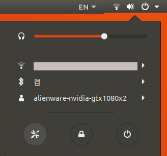
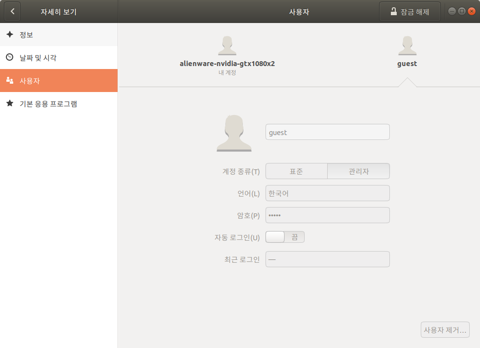

* Rev.1: 2021-08-04 (Wed)
* Rev.1: 2020-08-11 (Tue)
* Draft: 2020-06-30 (Tue)

# Create a New User on Ubuntu Linux

## Summary
```bash
NEW_USER='k8smaster'

# Create a new user account
sudo adduser $NEW_USER

# Verify the new account exists in `/etc/passwd`
cat /etc/passwd | grep "^$NEW_USER"

# Enter password twice
sudo usermod -aG sudo $NEW_USER

# Verify the sudo privilege
sudo visudo
## or equivalently
sudo nano /etc/sudoers
```

## Example: create a new user `k8smaster`
In this example, the new user account is `k8smaster`.

Step 1. Run the `adduser` command followed by the new user account.

```bash
$ sudo adduser k8smaster
```

Step 2. Enter the password.

```bash
Adding user `k8smaster' ...
Adding new group `k8smaster' (1002) ...
Adding new user `k8smaster' (1002) with group `k8smaster' ...
Creating home directory `/home/k8smaster' ...
Copying files from `/etc/skel' ...
Enter new UNIX password: 
Retype new UNIX password: 
passwd: password updated successfully
Changing the user information for k8smaster
Enter the new value, or press ENTER for the default
	Full Name []: 
	Room Number []: 
	Work Phone []: 
	Home Phone []: 
	Other []: 
Is the information correct? [Y/n] y
$
```

Now the user account and password is set.

Step 3. Verify the new account exists in `/etc/passwd`

```bash
$ cat /etc/passwd | grep "^k8smaster"
k8smaster:x:1002:1002:,,,:/home/k8smaster:/bin/bash
$
```

Step 4. Add the new user to the sudo group.

```bash
$ sudo usermod -aG sudo k8smaster
```

Step 5. Verify

```bash
$ sudo visudo
```

The `visudo` command opens `/etc/sudoers` in a text editor. Traditionally, the text editor was `vi` while `nano` is used for Ubuntu. Therefore, in Ubuntu, the above command is equivalent to

```bash
$ sudo nano /etc/sudoers
```

The`/etc/sudoer` file is below.

```bash
# This file MUST be edited with the 'visudo' command as root.
# Please consider adding local content in /etc/sudoers.d/ instead of
# directly modifying this file.
# See the man page for details on how to write a sudoers file.

Defaults        env_reset
Defaults        mail_badpass
Defaults        secure_path="/usr/local/sbin:/usr/local/bin:/usr/sbin:/usr/bin:/sbin:/bin:/snap/bin"

# Host alias specification
# User alias specification
# Cmnd alias specification
# User privilege specification
root    ALL=(ALL:ALL) ALL

# Members of the admin group may gain root privileges
%admin ALL=(ALL) ALL

# Allow members of group sudo to execute any command
%sudo   ALL=(ALL:ALL) ALL

# See sudoers(5) for more information on "#include" directives:
#includedir /etc/sudoers.d
```

The new user account should be ready by now. Log out the current accout and log in with the new user account.

## Verification with GUI
An alternative way to verify the new account is to use the GUI.

Click ▼ on the top right corner.


Click the `Settings` icon (bottom leftmost).



In the `Settings` window, click `Details` in the bottom of the menu bar and then click the `Users` menu.

You will see the new account as follows.



## References

* [How to create a user account on Ubuntu Linux](https://www.cyberciti.biz/faq/create-a-user-account-on-ubuntu-linux/)
* [How to Add and Delete Users on Ubuntu 16.04](https://www.digitalocean.com/community/tutorials/how-to-add-and-delete-users-on-ubuntu-16-04)
