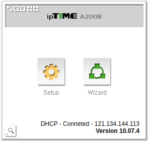
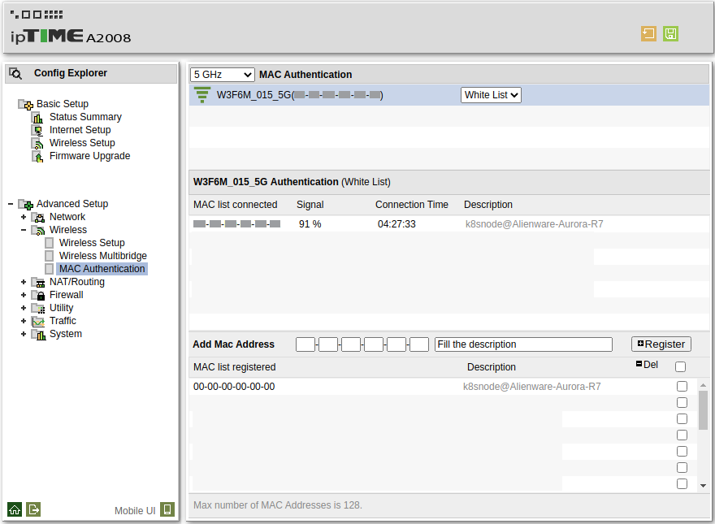
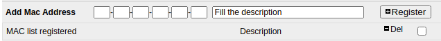

* Rev.1: 2020-07-23 (Thu)
* Draft: 2020-06-24 (Wed)
# How to Register the MAC Address to a Wi-Fi Router

## Estimated Time
It takes about 10~15 minutes.

## Steps
### Step 1. Open a web browser and enter "http://192.168.0.1/"

### 
Click "Advanced Setup", "Wireless", and then "MAC Authentication"

Register

## See also:
* [How to Get the MAC Address on Ubuntu (18.04)](get_the_mac_address.md).
* [How to Configure WiFi-"Connect to Hidden Network](https://github.com/aimldl/technical_skills/blob/master/computing_environments/linux_ubuntu/how_to/configure_wifi-connect_to_hidden_network.md)

