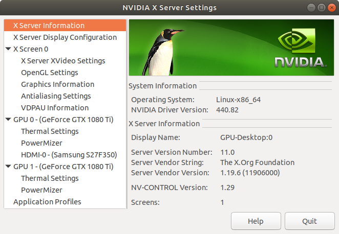

* Draft: 2020-06-12 (Fri)

# nvidia-settings

```bash
$ nvidia-settings

(nvidia-settings:21169): GLib-GObject-CRITICAL **: 11:38:46.157: g_object_unref: assertion 'G_IS_OBJECT (object)' failed
```




