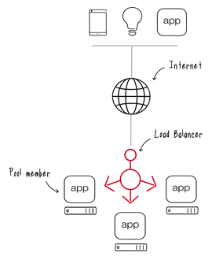
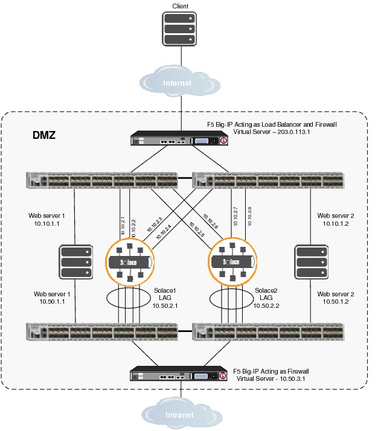

* Draft: 2020-07-30 (Thu)
TODO: This article is not done. Refine this article.

# How to Monitor Servers
There are three levels of server monitoring:
* L3 Check
* L4 Check
* L7 Check

The L3 check is done with the `fping` command.
## fping
> Google search: fping
> * [FPING](https://fping.org/fping.1.html)
> * [Fping – A High Performance Ping Tool for Linux](https://www.tecmint.com/ping-multiple-linux-hosts-using-fping/)
>
>    fping is a small command line tool to send ICMP (Internet Control Message Protocol) echo request to network hosts, similar to ping, but much higher performing when pinging multiple hosts.

> * [fping](https://fping.org/)

### Install fping
```bash
$ sudo apt install fping
```
or
```bash
$ wget https://fping.org/dist/fping-4.0.tar.gz
$ tar -xvf fping-4.0.tar.gz
$ cd fping-4.0/
$ ./configure
$ make && make install
```
### Usage
### Check the status of multiple IP addresses.
The status is either alive or unreachable.

```bash
$ fping 12.345.67.890 234.567.89.01 34.567.890.12
12.345.67.890 is alive
234.567.89.01 is alive
34.567.890.12 is unreachable
$
```
### Read the list of target IPs from a file
Say the above IP addresses are saved in `cluster_nodes.list`.
```text
12.345.67.890
234.567.89.01
34.567.890.12
```
Use `<` to read in the list of target IP addresses from the file.

```bash
$ fping < cluster_nodes.list
12.345.67.890 is alive
234.567.89.01 is alive
34.567.890.12 is unreachable
$
```
## crontab

> Google search: how to set up crontab  to use fping
> * [Testing Connectivity with fping and send mail if any hosts are unreachable](https://www.cyberciti.biz/tips/linux-unix-profiling-network-connectivity-with-fping.html)

[crontab guru](https://crontab.guru/)


## Send email
> Google search: linux shell command to send email
> * [16 Command Examples to Send Email From The Linux Command Line](https://blog.edmdesigner.com/send-email-from-linux-command-line/)


> Google search: ICMP 감시
> * [[서버] 서버 감시 기능](https://m.blog.naver.com/PostView.nhn?blogId=pjt3591oo&logNo=220547504579&proxyReferer=https:%2F%2Fwww.google.com%2F)
> 
>    Load balancer BIG-IP provides "Health Monitor" functionality while Ace 4700 provides "Health Check" functionality.

Q: What's the difference between "Health Monitor" and "Health Check".

## Load Balancer
A load balancer distributes load to servers. Some industry standard algorithms are:
* Round robin
* Weighted round robin
* Least connections
* Least response time



Source: [F5 GLOSSARY > Load Balancer](https://www.f5.com/services/resources/glossary/load-balancer)

As a side job, a load balancer minitors the status of servers. When an error occurs at a server, no session is assigned to the server. 
  

Source: [Using F5 Big-IP as a Load Balancer for External Internet Connectivity](https://docs.solace.com/Solace-PubSub-Messaging-APIs/JavaScript-API/Web-Messaging-Concepts/Using-F5-Big-IP-as-a-Load.htm)


## References
* [[서버] 서버 감시 기능](https://m.blog.naver.com/PostView.nhn?blogId=pjt3591oo&logNo=220547504579&proxyReferer=https:%2F%2Fwww.google.com%2F)
* [F5 GLOSSARY > Load Balancer](https://www.f5.com/services/resources/glossary/load-balancer)
* [Using F5 Big-IP as a Load Balancer for External Internet Connectivity](https://docs.solace.com/Solace-PubSub-Messaging-APIs/JavaScript-API/Web-Messaging-Concepts/Using-F5-Big-IP-as-a-Load.htm)
