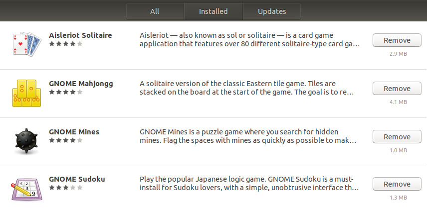
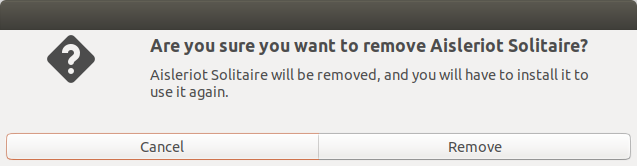

* Draft: 2020-07-03 (Fri)

# Uninstall Gnome Games

## Problem

It's not exactly a problem, but Gnome games are found in the `Show Applications` menu. So I will uninstall them.

## Hint

Google search: ubuntu how to uninstall games

[How to Uninstall Ubuntu Software](https://www.wikihow.com/Uninstall-Ubuntu-Software)

* Method 2: Uninstalling Programs with Ubuntu Software

## Solution

In the `Show Applications` menu, search for `Ubuntu Software`

 and click the icon to launch it.

Click the `Installed` tab and the list of installed softwares are shown. Click the `Remove` button of a Gnome Games.

Click the `Remove` button in the confirmation window. Enter the password in the next step.

Repeatedly remove the rest of Gnome Game softwares.

The end result is the `Show Applications` menu without the games.

