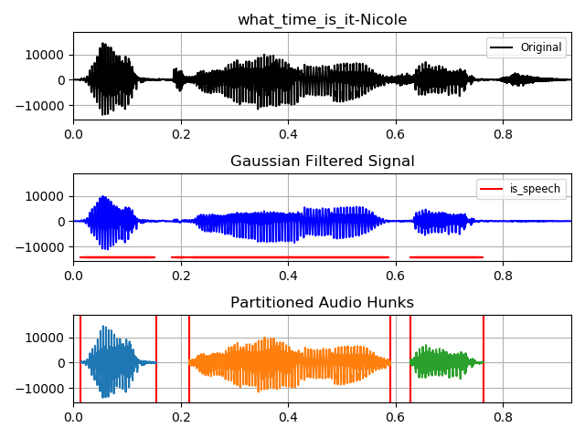

##### aimldl > computing_environments > linux_commands > feh.md

```bash
$ feh file_name.png
```
feh opens an image file in the terminal. For example,
```bash
$ feh _what_time_is_it-Nicole.png
```


* Google search: ubuntu linux command to open image file
* [What is the fastest way to view images from the terminal?](https://unix.stackexchange.com/questions/35333/what-is-the-fastest-way-to-view-images-from-the-terminal)
* Excerpt
```
The way to "double-click" on a file from the command line is xdg-open. 
If you're on Gnome (probably, if you're using Nautilus), you can use eog directly, or 
any other image program (feh is quite good).
  $ feh <image-name>
If you want to consult image-name file easilly.
```
