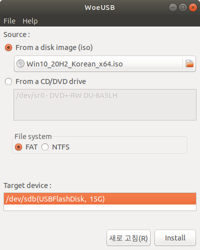
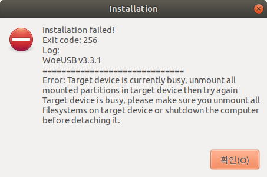

* Draft: 2020-11-30 (Mon)

# WoeUSB

## Summary

`WoeUSB` did not work on my Ubuntu 18.04. Don't use it!

## Installation Instructions

### References

* [How to Create a Bootable Windows 10 USB in Linux](https://itsfoss.com/bootable-windows-usb-linux/), It's FOSS
* [How to Easily Create Windows 10 Bootable USB on Ubuntu or Any Linux Distro](https://www.linuxbabe.com/ubuntu/easily-create-windows-10-bootable-usb-ubuntu), LinuxBabe, 2020-06-03
*  [Create Windows 10 bootable USB on Ubuntu 18.04](https://gist.github.com/togademi/dc55e783cadddb2ed33f9bf957aeba70), github

### One of the instructions

> **1. Download Windows 10**
>
> From here: https://www.microsoft.com/software-download/windows10
>
> I've used the Windows 10 October 2018 Update.
>
> **2. Install WoeUSB**
>
> ```
> sudo add-apt-repository ppa:nilarimogard/webupd8
> sudo apt update
> sudo apt install woeusb
> ```
>
> **3. Format USB drive**
>
> 1. Go to File explorer
> 2. Right click on the USB and click *Format*
> 3. Choose *NTFS*
> 4. Click *next* and format
>
> **4. Create the bootable USB**
>
> ```
> woeusb -v --target-filesystem NTFS --device ~/Downloads/Win10.iso /dev/sdb
> ```
>
> Replace `~/Downloads/Win10.iso` with your Windows 10 location. And `/dev/sdb` with your own USB port (find it by running `lsblk`)
>
> `-v` option is *verbose*, to get more info on what is happening
>
> Source: [Create Windows 10 bootable USB on Ubuntu 18.04](https://gist.github.com/togademi/dc55e783cadddb2ed33f9bf957aeba70)

## Error

`Error: Target device is currently busy, unmount all mounted partitions in target device then try again`

### WoeUSB GUI version

There exist only two options.




Both options fail with the following error.



* I have unmounted the USB memory. Then this device can not be recognized. So no `Target device` can be specified.
* I have rebooted the system. The error persists.
* The conclusion is it doesn't work with the GUI version of WoeUSB.

### WoeUSB command

So I've tried to run a command in the terminal. 

```bash
$ woeusb -v --target-filesystem NTFS --device ./Win10_20H2_Korean_x64.iso /dev/sdb
trap_return: INFO: returning from process_commandline_parameters
WoeUSB v3.3.1
==============================
Warning: You are not running WoeUSB as root!
Warning: This might be the reason of the following failure.
determine_target_parameters: Info: Target device is '/dev/sdb'.
determine_target_parameters: Info: Target partition is '/dev/sdb1'.
Error: Target device is currently busy, unmount all mounted partitions in target device then try again
Target device is busy, please make sure you unmount all filesystems on target device or shutdown the computer before detaching it.
$
```

The error message is identical.

## Conclusion

`WoeUSB` fails to work both on GUI and the terminal. I've read three to four tutorials on the web which recommends to use `WoeUSB`. These tutorials are wrong!