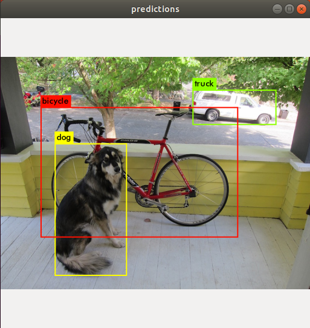

* Draft: 2021-02-03 (Wed)

# OpenCV=1로 다크넷 컴파일 하기

[opencv.md](opencv.md)를 참고해서 OpenCV를 설치합니다.

다크넷을 컴파일하기 위해

* 다운로드 되어 있는 `darknet` 디렉토리의 `Makefile`에서 

```bash
$ cd ~/darknet
$ nano Makefile
```

* `OPENCV`를 `0`에서 `1`로 변경한 후

```makefile
GPU=0
CUDNN=0
OPENCV=1
  ...
```

* 컴파일합니다.

```bash
$ make
  ...
gcc -Iinclude/ -Isrc/ -DOPENCV `pkg-config --cflags opencv`  -Wall -Wno-unused-result -Wno-unknown-pragmas -Wfatal-errors -fPIC -Ofast -DOPENCV -c ./examples/darknet.c -o obj/darknet.o
gcc -Iinclude/ -Isrc/ -DOPENCV `pkg-config --cflags opencv`  -Wall -Wno-unused-result -Wno-unknown-pragmas -Wfatal-errors -fPIC -Ofast -DOPENCV obj/captcha.o obj/lsd.o obj/super.o obj/art.o obj/tag.o obj/cifar.o obj/go.o obj/rnn.o obj/segmenter.o obj/regressor.o obj/classifier.o obj/coco.o obj/yolo.o obj/detector.o obj/nightmare.o obj/instance-segmenter.o obj/darknet.o libdarknet.a -o darknet -lm -pthread  `pkg-config --libs opencv` -lstdc++ libdarknet.a
$
```

다크넷을 테스트합니다.

```bash
$ ./darknet detect cfg/yolov3.cfg yolov3.weights data/dog.jpg
  ...
Loading weights from yolov3.weights...Done!
data/dog.jpg: Predicted in 15.382767 seconds.
dog: 100%
truck: 92%
bicycle: 99%
$
```

실행 후 잠깐 결과를 보여줍니다. 아주 빨리 지나가기 때문에 주의가 필요합니다.



`~/darknet`디렉토리에는 `predictions.png`가 생성되었습니다.

참고로 다크넷이 설치되지 않았을 때는

* `Not compiled with OpenCV, saving to predictions.png instead`라는 메세지가 나옵니다.

