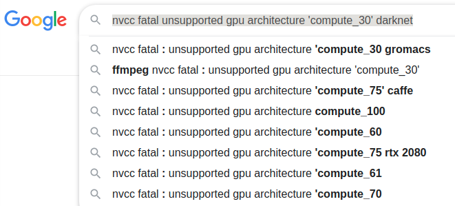

* Draft: 2021-02-03 (Wed)

# $ make ... nvcc: not found

## Summary

결국 원인은 PATH 설정이였는데 아래 두 개 명령어로 해결되었습니다.

```bash
export PATH=/usr/local/cuda/bin:/$PATH
export LD_LIBRARY_PATH=/usr/local/cuda-11.0/lib64:$LD_LIBRARY_PATH
```

사실 기본적으로 실행해야하는 명령어이지만, 여러 버전을 설치하다보니 문제가 생긴듯 합니다. 

조금 더 상세히 정리하자면 `nvcc`와 `cublas`가 설치되어 있었지만 찾지 못하는 문제가 있었습니다. 특히

```bash
$ cd /usr/local
$ ls -d cuda*/
cuda-10.1/  cuda-10.2/  cuda-11.0/  cuda-11.1/  cuda-11.2/  cuda/
$
```

여러 cuda 버전이 설치되었지만 `LID_LIBRARY_PATH`가 

```bash
$ echo $LD_LIBRARY_PATH
/usr/local/cuda-10.1/lib64:/usr/local/cuda-11.2/lib64
$
```

현재 쓰이고 있는 버전을 가리키고 있지 않았습니다.

```bash
$ ll cuda
lrwxrwxrwx 1 root root 9  1월 25 13:37 cuda -> cuda-11.0/
$
```

이것을 수정해주니 문제가 해결되었습니다.

## Problem1

```bash
$ make
  ...
/bin/sh: 1: nvcc: not found
Makefile:92: recipe for target 'obj/convolutional_kernels.o' failed
make: *** [obj/convolutional_kernels.o] Error 127
$
```

## Hint1

Google search: nvcc: not found

* [/bin/sh: 1: nvcc: not found](https://m.blog.naver.com/PostView.nhn?blogId=chandong83&logNo=221000970342&proxyReferer=https:%2F%2Fwww.google.com%2F), 2017-05-08

> nvidia gpu를 이용한 컴파일시 아래와 같은 에러를 만날 수 있다.
>
>   ...
>
> nvcc는 cuda 컴파일러라고 보면 된다.
>
> cuda 설치 후 cuda의 실행파일 경로를 아래의 명령 추가한다.
>
> 
>
> $ nano ~/.bashrc
>
> export PATH=/usr/local/cuda/bin:/$PATH

## Solution1

확인해보면 `nvcc` 명령어를 발견할 수 없습니다.

```bash
$ which nvcc
$
```

`PATH`를 지정해주면 찾을 수 있습니다.

```bash
$ export PATH=/usr/local/cuda/bin:/$PATH
$ which nvcc
/usr/local/cuda/bin/nvcc
$
```

그리고 다시 컴파일하면 원래 에러는 사라졌습니다.

```bash
$ make
nvcc  -gencode arch=compute_30,code=sm_30 -gencode arch=compute_35,code=sm_35 -gencode arch=compute_50,code=[sm_50,compute_50] -gencode arch=compute_52,code=[sm_52,compute_52] -Iinclude/ -Isrc/ -DGPU -I/usr/local/cuda/include/ --compiler-options "-Wall -Wno-unused-result -Wno-unknown-pragmas -Wfatal-errors -fPIC -Ofast -DGPU" -c ./src/convolutional_kernels.cu -o obj/convolutional_kernels.o
nvcc fatal   : Unsupported gpu architecture 'compute_30'
Makefile:92: recipe for target 'obj/convolutional_kernels.o' failed
make: *** [obj/convolutional_kernels.o] Error 1
$
```

## Problem2

```bash
nvcc fatal   : Unsupported gpu architecture 'compute_30'
```

## Hint2

```bash
$ nvidia-smi
Wed Feb  3 10:07:31 2021       
+-----------------------------------------------------------------------------+
| NVIDIA-SMI 460.32.03    Driver Version: 460.32.03    CUDA Version: 11.2     |
|-------------------------------+----------------------+----------------------+
| GPU  Name        Persistence-M| Bus-Id        Disp.A | Volatile Uncorr. ECC |
| Fan  Temp  Perf  Pwr:Usage/Cap|         Memory-Usage | GPU-Util  Compute M. |
|                               |                      |               MIG M. |
|===============================+======================+======================|
|   0  GeForce GTX 1080    On   | 00000000:01:00.0  On |                  N/A |
| 28%   37C    P8     8W / 180W |    354MiB /  8118MiB |      0%      Default |
|                               |                      |                  N/A |
+-------------------------------+----------------------+----------------------+
|   1  GeForce GTX 1080    On   | 00000000:02:00.0 Off |                  N/A |
| 27%   27C    P8     5W / 180W |      2MiB /  8119MiB |      0%      Default |
|                               |                      |                  N/A |
+-------------------------------+----------------------+----------------------+
                                                                               
+-----------------------------------------------------------------------------+
| Processes:                                                                  |
|  GPU   GI   CI        PID   Type   Process name                  GPU Memory |
|        ID   ID                                                   Usage      |
|=============================================================================|
|    0   N/A  N/A      1264      G   /usr/lib/xorg/Xorg                205MiB |
|    0   N/A  N/A      1396      G   /usr/bin/gnome-shell               45MiB |
|    0   N/A  N/A     12019      G   ...gAAAAAAAAA --shared-files       64MiB |
|    0   N/A  N/A     12892      G   ...AAAAAAAAA= --shared-files       33MiB |
+-----------------------------------------------------------------------------+
$
```

Google search: nvcc fatal unsupported gpu architecture 'compute_30' darknet



* [Unsupported gpu architecture compute_30 on a CUDA 5 capable gpu](https://stackoverflow.com/questions/64774548/unsupported-gpu-architecture-compute-30-on-a-cuda-5-capable-gpu)

> Q: I'm currently trying to compile darknet on the latest CUDA toolkit which is version 11.1. I have a GPU capable of running CUDA version 5 which is a GeForce 940M. However, while rebuilding darknet using the latest cuda toolkit, it said
>
> > nvcc fatal : Unsupported gpu architecture 'compute_30'
>
> compute_30 is for version 3, how can it fail while my gpu can run version 5 Is it possible that my code detected my intel graphics card instead of my nvidia gpu? if that's the case, is it possible to change its detection?
>
> A: Your darknet build harness will need to be changed to remove the reference to `compute_30` in order for it to be usable with CUDA 11.x. CUDA 11.x no longer supports compute capability 3.0. This particular error has nothing to do with the GPU you have (this is a compile-time issue, and the compile process does not depend on a particular GPU). – [Robert Crovella](https://stackoverflow.com/users/1695960/robert-crovella) [Nov 10 '20 at 18:21](https://stackoverflow.com/questions/64774548/unsupported-gpu-architecture-compute-30-on-a-cuda-5-capable-gpu#comment114527053_64774548)
>
> A: Support for `compute_30` has been removed for [versions after CUDA 10.2](https://docs.nvidia.com/cuda/archive/10.2/pdf/CUDA_Toolkit_Release_Notes.pdf). So if you are using nvcc make sure to use this flag to target the correct architecture in the build system for darknetARCH= -gencode arch=compute_30,code=sm_30 \
>       -gencode arch=compute_35,code=sm_35 \
>       -gencode arch=compute_50,code=[sm_50,compute_50] \
>       -gencode arch=compute_52,code=[sm_52,compute_52]
>
> -gencode arch=compute_20,code=[sm_20,sm_21] \ This one is deprecated?
>
> This is what I use, uncomment if you know your arch and want to specify
>
> ARCH= -gencode arch=compute_52,code=compute_52
>
> ```
> -gencode=arch=compute_50,code=sm_50
> ```
>
> You may also need to use this one to avoid a warning of **architectures are deprecated**.
>
> ```
> -Wno-deprecated-gpu-targets 
> ```
>
> A: For anyone else reading this question and to answer @talonmies' comment, somewhere in your Makefile you should find a reference to `compute_30`. You can replace it with `compute_50`. In the case of darknet, as an example, `compute_20` is already commented out: 
>
> `#      -gencode arch=compute_20,code=[sm_20,sm_21] \ This one is deprecated?`.
>
> You can do the same with `compute_30` to comment it out as there are other `compute_##` flags specified that will take its place (`compute_35`, `compute_50`, `compute_52`). – [Matt Popovich](https://stackoverflow.com/users/4368898/matt-popovich) [Jan 14 at 0:03](https://stackoverflow.com/questions/64774548/unsupported-gpu-architecture-compute-30-on-a-cuda-5-capable-gpu#comment116182890_64774956) 

## Solution2

우선 `Makefile`을 백업 받습니다.

```bash
$ cp Makefile Makefile.old
```

에디터로 `Makefile`을 열고

```bash
$ nano Makefile
```

아래처럼 된 부분을

```makefile
ARCH= -gencode arch=compute_30,code=sm_30 \
      -gencode arch=compute_35,code=sm_35 \
      -gencode arch=compute_50,code=[sm_50,compute_50] \
      -gencode arch=compute_52,code=[sm_52,compute_52]
#      -gencode arch=compute_20,code=[sm_20,sm_21] \ This one is deprecated?

# This is what I use, uncomment if you know your arch and want to specify
# ARCH= -gencode arch=compute_52,code=compute_52
```

변경해서 `compute_30`이 있는 줄을 주석처리 합니다.

```makefile
#ARCH= -gencode arch=compute_30,code=sm_30 \
ARCH= -gencode arch=compute_35,code=sm_35 \
      -gencode arch=compute_50,code=[sm_50,compute_50] \
      -gencode arch=compute_52,code=[sm_52,compute_52]
#      -gencode arch=compute_20,code=[sm_20,sm_21] \ This one is deprecated?

# This is what I use, uncomment if you know your arch and want to specify
# ARCH= -gencode arch=compute_52,code=compute_52
```

그리고 다시 컴파일하면 원래 메세지는 해결됩니다.

```bash
$ make
  ...
usr/local/cuda/lib64 -lcuda -lcudart -lcublas -lcurand -lstdc++  libdarknet.a
/usr/local/cuda/lib64/libcublas.so: undefined reference to `free_gemm_select@libcublasLt.so.11'
/usr/local/cuda/lib64/libcublas.so: undefined reference to `gemm_utilization@libcublasLt.so.11'
/usr/local/cuda/lib64/libcublas.so: undefined reference to `runGemmShortApi@libcublasLt.so.11'
/usr/local/cuda/lib64/libcublas.so: undefined reference to `init_gemm_select@libcublasLt.so.11'
/usr/local/cuda/lib64/libcublas.so: undefined reference to `runGemmApi@libcublasLt.so.11'
collect2: error: ld returned 1 exit status
Makefile:77: recipe for target 'darknet' failed
make: *** [darknet] Error 1
$
```

## Problem3

```bash
/usr/local/cuda/lib64/libcublas.so: undefined reference to `free_gemm_select@libcublasLt.so.11'
/usr/local/cuda/lib64/libcublas.so: undefined reference to `gemm_utilization@libcublasLt.so.11'
/usr/local/cuda/lib64/libcublas.so: undefined reference to `runGemmShortApi@libcublasLt.so.11'
/usr/local/cuda/lib64/libcublas.so: undefined reference to `init_gemm_select@libcublasLt.so.11'
/usr/local/cuda/lib64/libcublas.so: undefined reference to `runGemmApi@libcublasLt.so.11'
collect2: error: ld returned 1 exit status/usr/local/cuda/lib64/libcublas.so: undefined reference to `free_gemm_select@libcublasLt.so.11'
/usr/local/cuda/lib64/libcublas.so: undefined reference to `gemm_utilization@libcublasLt.so.11'
/usr/local/cuda/lib64/libcublas.so: undefined reference to `runGemmShortApi@libcublasLt.so.11'
/usr/local/cuda/lib64/libcublas.so: undefined reference to `init_gemm_select@libcublasLt.so.11'
/usr/local/cuda/lib64/libcublas.so: undefined reference to `runGemmApi@libcublasLt.so.11'
collect2: error: ld returned 1 exit status
```

## Hint3

Google search: darknet /usr/local/cuda/lib64/libcublas.so: undefined reference to `free_gemm_select@libcublasLt.so.11'

* [ImportError: libcublas.so.10.0: cannot open shared object file: No such file or directory #26182](https://github.com/tensorflow/tensorflow/issues/26182)

> **[rhinsall](https://github.com/rhinsall)** commented [on 28 Feb 2019](https://github.com/tensorflow/tensorflow/issues/26182#issuecomment-468069687)
>
> identical problem here.
>
> clean installation of Nvidia drivers, CUDA 10.1 and TF
>
> libcublas.so.10.0 error as soon as TF is called.
>
> Ubuntu 18.04.2 LTS; Also Anaconda install of Python 3.7 (is the anaconda install relevant?); 2070
>
> **[jvishnuvardhan](https://github.com/jvishnuvardhan)** commented [on 28 Feb 2019](https://github.com/tensorflow/tensorflow/issues/26182#issuecomment-468077732)
>
> [@rhinsall](https://github.com/rhinsall) Which TF version you are trying to install? Could you install CUDA10 or correctly reference the CUDA10.1 path in cuDNN. Thanks
>
> **[rhinsall](https://github.com/rhinsall)** commented [on 28 Feb 2019](https://github.com/tensorflow/tensorflow/issues/26182#issuecomment-468208730)
>
> [@rhinsall](https://github.com/rhinsall) Which TF version you are trying to install? Could you install CUDA10 or correctly reference the CUDA10.1 path in cuDNN. ThanksI'll come home much later and report the exact numbers and paths - but it's a fresh install, downloaded yesterday, CUDA 10.1 per Nvidia's instructions and TF clean install using PIP & Python 3.7
>
> **[fabricatedmath](https://github.com/fabricatedmath)** commented [on 2 Mar 2019](https://github.com/tensorflow/tensorflow/issues/26182#issuecomment-468882301) • edited 
>
> [@rhinsall](https://github.com/rhinsall) I just found this out myself, not sure if it's common knowledge, but got around this by doing
>
> `conda install cudatoolkit `
>
> `conda install cudnn`
>
> I have cuda-10.1 installed on my box, this installed a local conda-only cuda-10.0. Obviously this is to just keep tensorflow working while waiting for better support.
>
> **[rhinsall](https://github.com/rhinsall)** commented [on 3 Mar 2019](https://github.com/tensorflow/tensorflow/issues/26182#issuecomment-468945088)
>
> Excellent advice. Immediate rescue. Thank you very much fabricatedmath.

## Action3

위의 제안대로 설치해봤지만 

```bash
(base) $ conda install -y cudatoolkit
(base) $ conda install -y cudnn
```

효과가 없었습니다.

## Hint 3

Google search: /usr/local/cuda/lib64/libcublas.so: undefined reference to `free_gemm_select@libcublasLt.so.11'
/usr/local/cuda/lib64/libcublas.so: undefined reference to `gemm_utilization@libcublasLt.so.11'
/usr/local/cuda/lib64/libcublas.so: undefined reference to `runGemmShortApi@libcublasLt.so.11'
/usr/local/cuda/lib64/libcublas.so: undefined reference to `init_gemm_select@libcublasLt.so.11'
/usr/local/cuda/lib64/libcublas.so: undefined reference to `runGemmApi@libcublasLt.so.11'

* [Cuda 10.1 is lack of cublas, which is required by magma-2.5.0 ?](http://icl.cs.utk.edu/magma/forum/viewtopic.php?f=2&t=2573)

> Cublas do exists in both:
>
> **In Ubuntu 18.04 (cuda 10.1) and Ubuntu 16.04 (cuda 10.1) are the same**
>
> CODE: [SELECT ALL](http://icl.cs.utk.edu/magma/forum/viewtopic.php?f=2&t=2573#)
>
> ```
> $ dpkg -l | grep cublas
> ii  libcublas-dev              10.1.0.105-1              amd64        CUBLAS native dev links, headers
> ii  libcublas10                10.1.0.105-1              amd64        CUBLAS native runtime libraries
> ```
>
> CODE: [SELECT ALL](http://icl.cs.utk.edu/magma/forum/viewtopic.php?f=2&t=2573#)
>
> ```
> $ ldconfig -p | grep cublas
>     libcublasLt.so.10 (libc6,x86-64) => /usr/lib/x86_64-linux-gnu/libcublasLt.so.10
>     libcublasLt.so (libc6,x86-64) => /usr/lib/x86_64-linux-gnu/libcublasLt.so
>     libcublas.so.10 (libc6,x86-64) => /usr/lib/x86_64-linux-gnu/libcublas.so.10
>     libcublas.so (libc6,x86-64) => /usr/lib/x86_64-linux-gnu/libcublas.so
> ```
>
> CODE: [SELECT ALL](http://icl.cs.utk.edu/magma/forum/viewtopic.php?f=2&t=2573#)
>
> ```
> $ ls /usr/local/cuda-10.1/lib64 | grep cublas
> -------- nothing ------
> ```

```bash
$ ls /usr/lib/x86_64-linux-gnu | grep libcublas
$ dpkg -l | grep cublas
ii  libcublas-11-0      11.2.0.252-1  amd64  CUBLAS native runtime libraries
ii  libcublas-11-2      11.3.1.68-1   amd64  CUBLAS native runtime libraries
ii  libcublas-dev       10.2.3.254-1  amd64  CUBLAS native dev links, headers
ii  libcublas-dev-11-0  11.2.0.252-1  amd64  CUBLAS native dev links, headers
ii  libcublas-dev-11-2  11.3.1.68-1   amd64  CUBLAS native dev links, headers
ii  libcublas10         10.2.3.254-1  amd64  CUBLAS native runtime libraries
$
```

```bash
$ ldconfig -p | grep cublas
	libcublasLt.so.11 (libc6,x86-64) => /usr/local/cuda-11.0/targets/x86_64-linux/lib/libcublasLt.so.11
	libcublasLt.so.10 (libc6,x86-64) => /usr/local/cuda-10.2/targets/x86_64-linux/lib/libcublasLt.so.10
	libcublasLt.so (libc6,x86-64) => /usr/local/cuda-10.2/targets/x86_64-linux/lib/libcublasLt.so
	libcublasLt.so (libc6,x86-64) => /usr/local/cuda-11.0/targets/x86_64-linux/lib/libcublasLt.so
	libcublas.so.11 (libc6,x86-64) => /usr/local/cuda-11.0/targets/x86_64-linux/lib/libcublas.so.11
	libcublas.so.10 (libc6,x86-64) => /usr/local/cuda-10.2/targets/x86_64-linux/lib/libcublas.so.10
	libcublas.so (libc6,x86-64) => /usr/local/cuda-10.2/targets/x86_64-linux/lib/libcublas.so
	libcublas.so (libc6,x86-64) => /usr/local/cuda-11.0/targets/x86_64-linux/lib/libcublas.so
$
```

```bash
$ ls /usr/local/cuda-10.1/lib64 | grep cublas
$
```

```bash
$ cd /usr/
$ find -name '*cublas*'
./local/cuda-10.2/targets/x86_64-linux/include/cublas_api.h
./local/cuda-10.2/targets/x86_64-linux/include/cublasXt.h
./local/cuda-10.2/targets/x86_64-linux/include/cublas.h
./local/cuda-10.2/targets/x86_64-linux/include/cublasLt.h
./local/cuda-10.2/targets/x86_64-linux/include/cublas_v2.h
./local/cuda-10.2/targets/x86_64-linux/lib/libcublasLt_static.a
./local/cuda-10.2/targets/x86_64-linux/lib/libcublasLt.so.10
./local/cuda-10.2/targets/x86_64-linux/lib/libcublas.so.10
./local/cuda-10.2/targets/x86_64-linux/lib/libcublas_static.a
./local/cuda-10.2/targets/x86_64-linux/lib/libcublasLt.so
./local/cuda-10.2/targets/x86_64-linux/lib/libcublas.so.10.2.3.254
./local/cuda-10.2/targets/x86_64-linux/lib/stubs/libcublasLt.so
./local/cuda-10.2/targets/x86_64-linux/lib/stubs/libcublas.so
./local/cuda-10.2/targets/x86_64-linux/lib/libcublasLt.so.10.2.3.254
./local/cuda-10.2/targets/x86_64-linux/lib/libcublas.so
./local/cuda-11.2/targets/x86_64-linux/include/cublas_api.h
./local/cuda-11.2/targets/x86_64-linux/include/cublasXt.h
./local/cuda-11.2/targets/x86_64-linux/include/cublas.h
./local/cuda-11.2/targets/x86_64-linux/include/cublasLt.h
./local/cuda-11.2/targets/x86_64-linux/include/cublas_v2.h
./local/cuda-11.2/targets/x86_64-linux/lib/libcublasLt_static.a
./local/cuda-11.2/targets/x86_64-linux/lib/libcublasLt.so.11.3.1.68
./local/cuda-11.2/targets/x86_64-linux/lib/libcublas.so.11.3.1.68
./local/cuda-11.2/targets/x86_64-linux/lib/libcublas_static.a
./local/cuda-11.2/targets/x86_64-linux/lib/libcublasLt.so
./local/cuda-11.2/targets/x86_64-linux/lib/libcublasLt.so.11
./local/cuda-11.2/targets/x86_64-linux/lib/stubs/libcublasLt.so
./local/cuda-11.2/targets/x86_64-linux/lib/stubs/libcublas.so
./local/cuda-11.2/targets/x86_64-linux/lib/libcublas.so.11
./local/cuda-11.2/targets/x86_64-linux/lib/libcublas.so
./local/cuda-10.1/doc/man/man7/libcublas.so.7
./local/cuda-10.1/doc/man/man7/libcublas.7
./local/cuda-10.1/doc/html/cublas
./local/cuda-10.1/doc/html/cublas/graphics/cublasmg_gemm.jpg
./local/cuda-11.0/targets/x86_64-linux/include/cublas_api.h
./local/cuda-11.0/targets/x86_64-linux/include/cublasXt.h
./local/cuda-11.0/targets/x86_64-linux/include/cublas.h
./local/cuda-11.0/targets/x86_64-linux/include/cublasLt.h
./local/cuda-11.0/targets/x86_64-linux/include/cublas_v2.h
./local/cuda-11.0/targets/x86_64-linux/lib/libcublasLt_static.a
./local/cuda-11.0/targets/x86_64-linux/lib/libcublas_static.a
./local/cuda-11.0/targets/x86_64-linux/lib/libcublasLt.so
./local/cuda-11.0/targets/x86_64-linux/lib/libcublasLt.so.11
./local/cuda-11.0/targets/x86_64-linux/lib/libcublasLt.so.11.2.0.252
./local/cuda-11.0/targets/x86_64-linux/lib/stubs/libcublasLt.so
./local/cuda-11.0/targets/x86_64-linux/lib/stubs/libcublas.so
./local/cuda-11.0/targets/x86_64-linux/lib/libcublas.so.11
./local/cuda-11.0/targets/x86_64-linux/lib/libcublas.so.11.2.0.252
./local/cuda-11.0/targets/x86_64-linux/lib/libcublas.so
./local/cuda-11.0/doc/man/man7/libcublas.so.7
./local/cuda-11.0/doc/man/man7/libcublas.7
./local/cuda-11.0/doc/html/cublas
./local/cuda-11.0/doc/html/cublas/graphics/cublasmg_gemm.jpg
./share/doc/libcublas10
./share/doc/libcublas-dev-11-0
./share/doc/libcublas-11-0
./share/doc/libcublas-dev-11-2
./share/doc/libcublas-11-2
./share/doc/libcublas-dev
./lib/pkgconfig/cublas-11.0.pc
./lib/pkgconfig/cublas-10.2.pc
./lib/pkgconfig/cublas-11.2.pc
./lib/libreoffice/share/gallery/htmlexpo/cublast_.gif
./lib/libreoffice/share/gallery/htmlexpo/cublast.gif
$
```

위의 명령어에서 확인해본 것처럼 CUBLAS가 설치되었음은 명확합니다.

## Hint3+

Google search: ubuntu 18.04 cublas LD_LIBRARY_PATH 

* [Mahedi-61](https://gist.github.com/Mahedi-61)/**[cuda_10.1_installation_on_Ubuntu_18.04](https://gist.github.com/Mahedi-61/2a2f1579d4271717d421065168ce6a73)**

> **setup your paths**
>
> echo 'export PATH=/usr/local/cuda-10.1/bin:$PATH' >> ~/.bashrc
> echo 'export LD_LIBRARY_PATH=/usr/local/cuda-10.1/lib64:$LD_LIBRARY_PATH' >> ~/.bashrc
> source ~/.bashrc
> sudo ldconfig

## Solution3

`LD_LIBRARY_PATH` 위치를 확인해보니

```bash
$ echo $LD_LIBRARY_PATH
/usr/local/cuda-10.1/lib64:/usr/local/cuda-11.2/lib64
$
```

이미 연결이 되어 있습니다. 이미 10.1과 11.2 두 개 버전이 설치되어 있군요. 명확히 하기 위해 `/usr/local`에 설치된 cuda를 보니

```bash
$ cd /usr/local
$ ls -d cuda*/
cuda-10.1/  cuda-10.2/  cuda-11.0/  cuda-11.1/  cuda-11.2/  cuda/
$
```

실제로는 5개의 버전을 설치했군요. 어느 버전을 쓰고 있는지 확인하기 위해 `cuda` 디렉토리의 심볼릭 링크를 보니

```bash
$ ll cuda
lrwxrwxrwx 1 root root 9  1월 25 13:37 cuda -> cuda-11.0/
$
```

지금은 11.0버전을 쓰고 있네요. 그런데 `LD_LIBRARY_PATH`는 설정이 되어 있지 않습니다. 아래 명령어로 임시로 설정하고

```bash
$ export LD_LIBRARY_PATH=/usr/local/cuda-11.0/lib64:$LD_LIBRARY_PATH
```

컴파일을 해보니

```bash
$ make
gcc -Iinclude/ -Isrc/ -DGPU -I/usr/local/cuda/include/ -Wall -Wno-unused-result -Wno-unknown-pragmas -Wfatal-errors -fPIC -Ofast -DGPU obj/captcha.o obj/lsd.o obj/super.o obj/art.o obj/tag.o obj/cifar.o obj/go.o obj/rnn.o obj/segmenter.o obj/regressor.o obj/classifier.o obj/coco.o obj/yolo.o obj/detector.o obj/nightmare.o obj/instance-segmenter.o obj/darknet.o libdarknet.a -o darknet -lm -pthread  -L/usr/local/cuda/lib64 -lcuda -lcudart -lcublas -lcurand -lstdc++  libdarknet.a
$
```

컴파일이 잘 되었습니다.

 `/usr/local/cuda`가 `/usr/local/cuda-11.0`로 연결되므로

```bash
$ export LD_LIBRARY_PATH=/usr/local/cuda-11.0/lib64:$LD_LIBRARY_PATH
```

위의 명령어 대신 보다 일반적으로 아래처럼 해도 좋습니다. 위에서는 디버깅을 위해 `cuda-11.0`이라고 정확히 명시했습니다.

```bash
$ export LD_LIBRARY_PATH=/usr/local/cuda/lib64:$LD_LIBRARY_PATH
```

## Solution3+

다음 번에도 `PATH`와 `LD_LIBRARY_PATH`를 유지하기 위해서 `.bashrc`에 추가합니다.

```bash
$ echo 'export PATH=/usr/local/cuda/bin:/$PATH' >> ~/.bashrc
$ echo 'export LD_LIBRARY_PATH=/usr/local/cuda/lib64:$LD_LIBRARY_PATH' >> ~/.bashrc
$ source ~/.bashrc
```

저는 `.bashrc` 대신 `.bash_custom`을 업데이트하므로 

```bash
$ echo 'export PATH=/usr/local/cuda/bin:/$PATH' >> ~/.bash_custom
$ echo 'export LD_LIBRARY_PATH=/usr/local/cuda/lib64:$LD_LIBRARY_PATH' >> ~/.bash_custom
$ source ~/.bashrc
```

