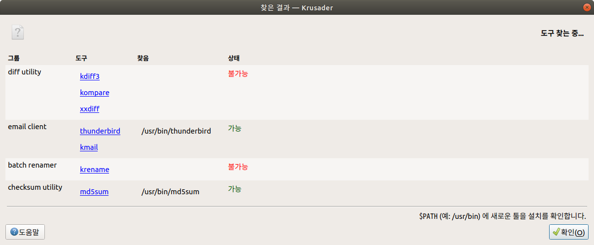

* Draft: 2021-06-17 (Thu)

# How to Install `kdiff3` in Ubuntu

`krusader` file explore requires `kdiff3`.



Google search: how to install kdiff3 in ubuntu

```bash
$ sudo apt update
$ sudo apt-get install -y kdiff3
```

