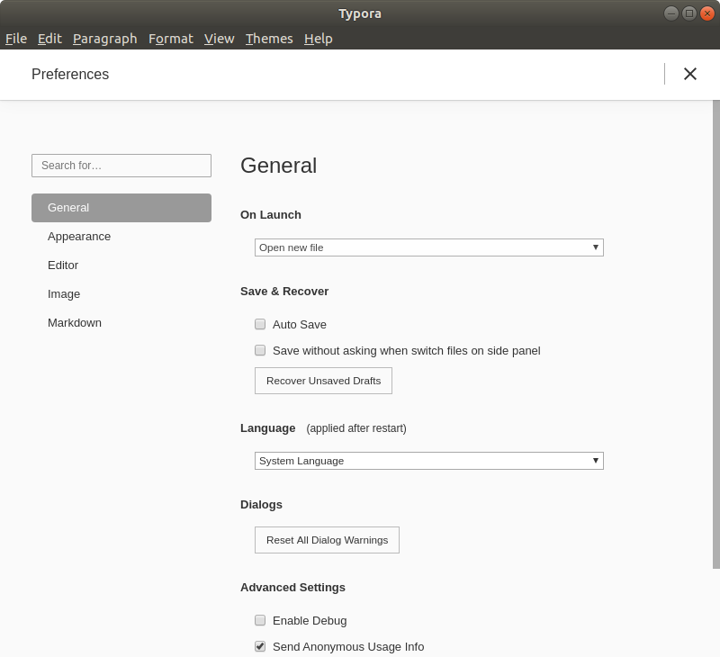
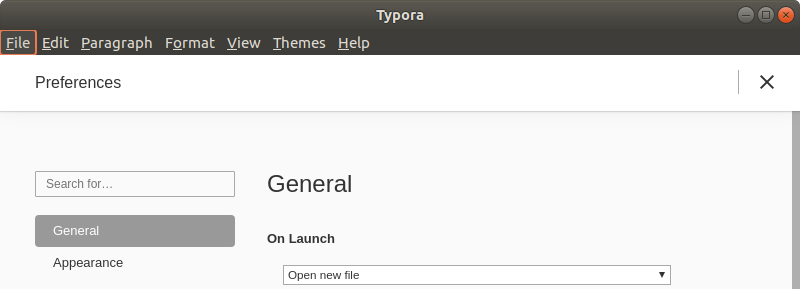
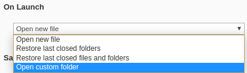
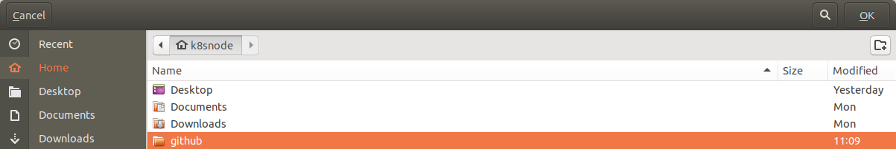
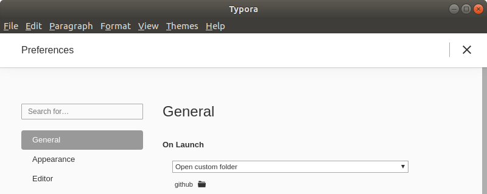

* Draft: 2020-06-24 (Wed)

# Configure Typora

## Open a specific directory whenever Typora is launched.
Go to the `preferences` menu.

Under `On Launch`, `Open new file` is set by default.

Click the drop down menu and select `Open custom folder`

When a window pops up, select the desired directory and click the `OK` button on the top right corner.

In this example, I've selected `~/github` directory, but you can choose whatever directory you want.

The change is shown below.

