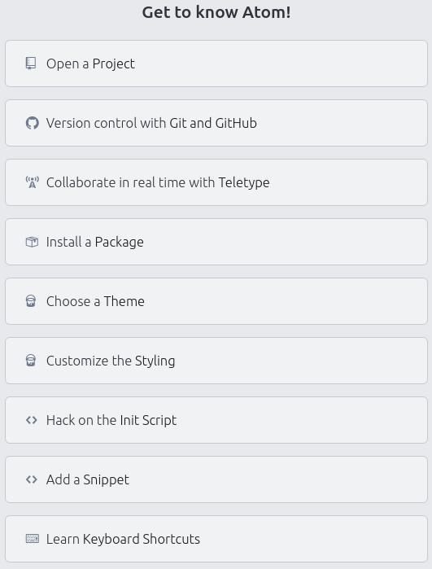
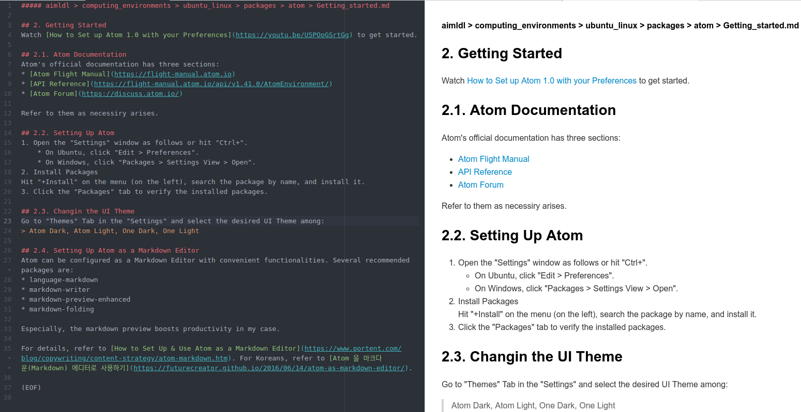

* Rev.1: 2020-11-09 (Mon)
* Draft: 2019-11-05 (Tue)
# Getting Started
Watch [How to Set up Atom 1.0 with your Preferences](https://youtu.be/U5POoGSrtGg) to overview Atom 1.0. Atom's welcome guide also shows some import topics to get started with.

## Atom Documentation

Atom's official documentation has three sections:
* [Atom Flight Manual](https://flight-manual.atom.io)
* [API Reference](https://flight-manual.atom.io/api/v1.41.0/AtomEnvironment/)
* [Atom Forum](https://discuss.atom.io/)

Refer to them as necessiry arises.

## Setting Up Atom
1. Open the "Settings" window as follows or hit "Ctrl+".
    * On Ubuntu, click "Edit > Preferences".
    * On Windows, click "Packages > Settings View > Open".
2. Install Packages
Hit "+Install" on the menu (on the left), search the package by name, and install it.
3. Click the "Packages" tab to verify the installed packages.

## Changin the UI Theme
Go to "Themes" Tab in the "Settings" and select the desired UI Theme among:
> Atom Dark, Atom Light, One Dark, One Light

## Setting Up Atom as a Markdown Editor
Atom can be configured as a Markdown Editor with convenient functionalities. Several recommended packages are:
* language-markdown
* markdown-writer
* markdown-preview-enhanced
* markdown-folding

Especially, the markdown preview boosts productivity in my case. What is typed in on the left is previewed immediately on the right.

For details, refer to [How to Set Up & Use Atom as a Markdown Editor](https://www.portent.com/blog/copywriting/content-strategy/atom-markdown.htm). For Koreans, refer to [Atom 을 마크다운(Markdown) 에디터로 사용하기](https://futurecreator.github.io/2016/06/14/atom-as-markdown-editor/).
