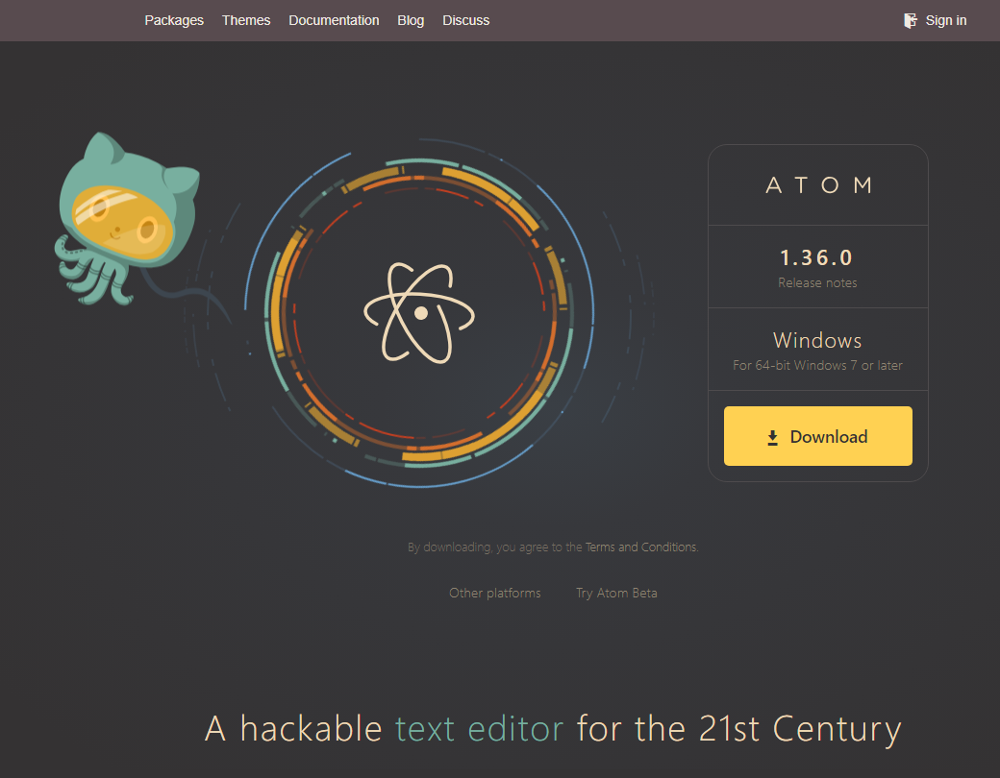

* Rev.1: 2020-11-09 (Mon)
* Draft: 2019-11-03 (Sun)
# Installing Atom and Configuring as a Markdown Editor.
## Installation
### For Ubuntu Linux
The commands to install Atom are below. For details, refer to [How To Install Atom Text Editor on Ubuntu 18.04](https://linuxize.com/post/how-to-install-atom-text-editor-on-ubuntu-18-04/#starting-atom) or [Installing Atom (Linux)](https://flight-manual.atom.io/getting-started/sections/installing-atom/#platform-linux).

Download and run [bash_scripts/install_atom-ubuntu_linux](bash_scripts/install_atom-ubuntu_linux).

Equivalently, run the following commands in the terminal.

```bash
$ sudo apt update
$ sudo apt install -y software-properties-common apt-transport-https wget
$ wget -q https://packagecloud.io/AtomEditor/atom/gpgkey -O- | sudo apt-key add -
$ sudo add-apt-repository "deb [arch=amd64] https://packagecloud.io/AtomEditor/atom/any/ any main"
$ sudo apt install -y atom
```
##### Starting Atom
```bash
$ atom
```
##### Upgrading Atom on Ubuntu Linux
```bash
$ sudo apt update
$ sudo apt upgrade
```
### For Windows
Go to https://atom.io/ and click "Download". Your Windows will be automatically detected.



For details, refer to [Installing Atom (Windows)](https://flight-manual.atom.io/getting-started/sections/installing-atom/#platform-windows).

### For MAC
Refer to [Installing Atom (MAC)](https://flight-manual.atom.io/getting-started/sections/installing-atom/#platform-mac).
