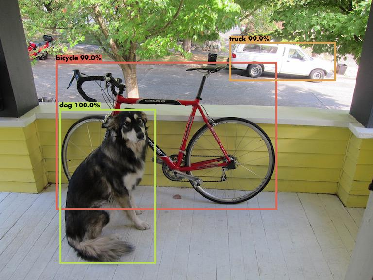
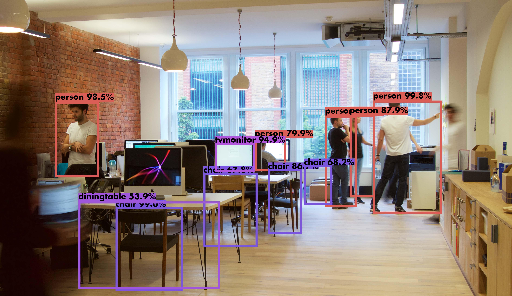

* Draft: 2021-02-02 (Tue)

# Git Repo [heartkilla](https://github.com/heartkilla)/**[yolo-v3](https://github.com/heartkilla/yolo-v3)**

## 개요

* [Yolo v3 Object Detection in Tensorflow](https://github.com/heartkilla/yolo-v3)를 참고해서 YOLOv3를 동작시켜봅니다.
* 부록
  * Git Repo [heartkilla](https://github.com/heartkilla)/[yolo-v3](https://github.com/heartkilla/yolo-v3)의 오류를 수정해서 동작하도록 만드는 과정을 
    * [../troubleshoot/make_heartkilla_yolo-v3_work.md](../troubleshoot/make_heartkilla_yolo-v3_work.md)
    * [../troubleshoot/make_heartkilla_yolo-v3_work-video.md](../troubleshoot/make_heartkilla_yolo-v3_work-video.md)
  * 에 기록했습니다.

## 요약


### 환경 설정

Git 레파지토리를 다운로드 받습니다.

```bash
$ git clone https://github.com/heartkilla/yolo-v3.git
```

`conda_by_aimldl.yml`을 아래처럼 생성합니다.

```yaml
name: yolov3-heartkilla-tensorflow-1_15

dependencies:
  - python==3.6.6
  - pip
  - matplotlib
  - numpy
  - tensorflow=1.15.0
  - pip:
    - seaborn
    - pillow
    - opencv-python
```

Anaconda와 NVIDIA Driver가 이미 설치된 상황에서 아나콘다 가상환경을 작성한 `.yml`파일에 맞게 생성합니다.

```bash
(base) $ conda env create -f conda_by_aimldl.yml 
(base) $ conda activate yolov3-heartkilla-tensorflow
(yolov3-heartkilla-tensorflow) $
```

### 웨이트 파일 -> 텐서플로 웨이트 변환

가상환경에 들어가서 `load_weights.py`파일을 실행하면 동작합니다. 그 전에 파일실행 시 필요한 웨이트 파일을 다운로드 받습니다. `weights` 디렉토리로 이동해서 `yolov3`파일을 다운로드 받습니다.

```bash
# yolov3
$ wget https://pjreddie.com/media/files/yolov3.weights -O weights/yolov3.weights

# yolov3-tiny
$ wget https://pjreddie.com/media/files/yolov3-tiny.weights -O weights/yolov3-tiny.weights
```

```bash
(yolov3-heartkilla-tensorflow) $ python load_weights.py
```

버전2.0을 쓰라는 경고메세지 다음에 웨이트파일을 텐서플로 체크포인트 파일로 변경하는 과정이 나옵니다.

```bash
  ...
2021-02-02 11:20:26.924854: I tensorflow/core/platform/cpu_feature_guard.cc:145] This TensorFlow binary is optimized with Intel(R) MKL-DNN to use the following CPU instructions in performance critical operations:  SSE4.1 SSE4.2 AVX AVX2 FMA
To enable them in non-MKL-DNN operations, rebuild TensorFlow with the appropriate compiler flags.
2021-02-02 11:20:26.955228: I tensorflow/core/platform/profile_utils/cpu_utils.cc:94] CPU Frequency: 3699850000 Hz
2021-02-02 11:20:26.955758: I tensorflow/compiler/xla/service/service.cc:168] XLA service 0x55d804fa8db0 initialized for platform Host (this does not guarantee that XLA will be used). Devices:
2021-02-02 11:20:26.955771: I tensorflow/compiler/xla/service/service.cc:176]   StreamExecutor device (0): Host, Default Version
OMP: Info #154: KMP_AFFINITY: Initial OS proc set respected: 0-11Container
OMP: Info #214: KMP_AFFINITY: decoding x2APIC ids.
OMP: Info #156: KMP_AFFINITY: 12 available OS procs
OMP: Info #157: KMP_AFFINITY: Uniform topology
OMP: Info #285: KMP_AFFINITY: topology layer "LL cache" is equivalent to "socket".
OMP: Info #285: KMP_AFFINITY: topology layer "L3 cache" is equivalent to "socket".
OMP: Info #285: KMP_AFFINITY: topology layer "L2 cache" is equivalent to "core".
OMP: Info #285: KMP_AFFINITY: topology layer "L1 cache" is equivalent to "core".
OMP: Info #191: KMP_AFFINITY: 1 socket x 6 cores/socket x 2 threads/core (6 total cores)
OMP: Info #216: KMP_AFFINITY: OS proc to physical thread map:
OMP: Info #171: KMP_AFFINITY: OS proc 0 maps to socket 0 core 0 thread 0 
OMP: Info #171: KMP_AFFINITY: OS proc 6 maps to socket 0 core 0 thread 1 
OMP: Info #171: KMP_AFFINITY: OS proc 1 maps to socket 0 core 1 thread 0 
OMP: Info #171: KMP_AFFINITY: OS proc 7 maps to socket 0 core 1 thread 1 
OMP: Info #171: KMP_AFFINITY: OS proc 2 maps to socket 0 core 2 thread 0 
OMP: Info #171: KMP_AFFINITY: OS proc 8 maps to socket 0 core 2 thread 1 
OMP: Info #171: KMP_AFFINITY: OS proc 3 maps to socket 0 core 3 thread 0 
OMP: Info #171: KMP_AFFINITY: OS proc 9 maps to socket 0 core 3 thread 1 
OMP: Info #171: KMP_AFFINITY: OS proc 4 maps to socket 0 core 4 thread 0 
OMP: Info #171: KMP_AFFINITY: OS proc 10 maps to socket 0 core 4 thread 1 
OMP: Info #171: KMP_AFFINITY: OS proc 5 maps to socket 0 core 5 thread 0 
OMP: Info #171: KMP_AFFINITY: OS proc 11 maps to socket 0 core 5 thread 1 
OMP: Info #252: KMP_AFFINITY: pid 5514 tid 5514 thread 0 bound to OS proc set 0
2021-02-02 11:20:26.959434: I tensorflow/core/common_runtime/process_util.cc:115] Creating new thread pool with default inter op setting: 2. Tune using inter_op_parallelism_threads for best performance.
Model has been saved successfully.
(yolov3-heartkilla-tensorflow) $
```

`~/yolov3/yolo-v3/weights` 디렉토리에 체크포인트 파일이 생성되었습니다.

```bash
(yolov3-heartkilla-tensorflow) $ ls
checkpoint  model.ckpt.data-00000-of-00001  model.ckpt.index  model.ckpt.meta  yolov3.weights
(yolov3-heartkilla-tensorflow) $
```

### 동작 확인

깃허브 레포지토리에 포함된 파일을 써서 동작여부를 확인해봅니다. `data` 서브 디렉토리에 있는 파일의 리스트입니다.

```bash
$ tree data
data
├── detection_examples
│   ├── detection_1.jpg
│   ├── detection_2.jpg
│   └── detections.gif
├── fonts
│   └── futur.ttf
├── images
│   ├── dog.jpg
│   └── office.jpg
├── labels
│   └── coco.names
└── video
    └── shinjuku.mp4

5 directories, 8 files
$
```

#### 이미지 검출 테스트아래의 창이 생겨서 영상의 앞부분이 재생됩니다.

(yolov3-heartkilla-tensorflow) 

조금 기다리면 사물이 검출되는 화면을 볼 수 있습니다.



영상이 재생되는 창을 닫아도 다시 열립니다.

중간에 빠져나가려면 터미널에서 Ctrl+c를 누르세요.


^CDetections have been saved successfully.
(yolov3-heartkilla-tensorflow) $
사물 검출된 영상을 저장하려면 마지막까지 기다리시면 됩니다.

```bash
(yolov3-heartkilla-tensorflow) $ python detect.py images 0.5 0.5 data/images/dog.jpg
  ...
bicycle 99.01%
truck 99.86%
dog 99.99%
Detections have been saved successfully.
(yolov3-heartkilla-tensorflow) $
```

`detection` 디렉토리에 `detection_1.jpg`라는 파일이 생성됩니다.



다른 예로 `office.jpg`를 실행한 결과입니다.

```bash
(yolov3-heartkilla-tensorflow) $ python detect.py images 0.5 0.5 data/images/office.jpg
  ...
person 99.85%
person 98.54%
person 97.93%
person 87.88%
person 79.89%
chair 99.03%
chair 86.68%
chair 68.25%
chair 67.77%
diningtable 53.86%Summary
tvmonitor 94.91%
Detections have been saved successfully.
(yolov3-heartkilla-tensorflow) $
```

동일하게 `detection` 디렉토리에 `detection_1.jpg`라는 파일이 생성됩니다.



  - pip:
    - seaborn
    - pillow
    - opencv-pythonpip:
      - seaborn
      - pillow
      - opencv-python
    - pip:
      - seaborn
      - pillow
      - opencv-python
    - pip:
      - seaborn
      - pillow
      - opencv-python
    - pip:
      - seaborn
      - pillow
      - opencv-python
    - 두 개의 파일을 동시에 입력으로 넣을 경우

```bash
(yolov3-heartkilla-tensorflow) $ python detect.py images 0.5 0.5 data/images/dog.jpg data/images/office.jpg
  ...
bicycle 99.01%
truck 99.86%
dog 99.99%
person 99.85%
person 98.54%
person 97.93%
person 87.88%Summary
person 79.89%
chair 99.03%
chair 86.68%
chair 68.25%
chair 67.77%
diningtable 53.86%
tvmonitor 94.91%
Detections have been saved successfully.아래의 창이 생겨서 영상의 앞부분이 재생됩니다.

(yolov3-heartkilla-tensorflow) 

조금 기다리면 사물이 검출되는 화면을 볼 수 있습니다.



영상이 재생되는 창을 닫아도 다시 열립니다.

중간에 빠져나가려면 터미널에서 Ctrl+c를 누르세요.


^CDetections have been saved successfully.
(yolov3-heartkilla-tensorflow) $
사물 검출된 영상을 저장하려면 마지막까지 기다리시면 됩니다.
(yolov3-heartkilla-tensorflow) $
```

`detection` 디렉토리에 2개의 파일`detection_1.jpg` `detection_2.jpg`이 생성됩니다.

| detection_1.jpg                        | detection_2.jpg                           |
| -------------------------------------- | ----------------------------------------- |
|  |  |

### 비디오 검출 테스트

비디오를 쓰기 위해서 `ffmpeg`를 설치합니다.  - pip:
    - seaborn
        - pillow
        - opencv-python  - pip:
        - seaborn
        - pillow
        - opencv-python

```bash
$ sudo apt install -y ffmpeg
```

비디오 검출 테스트를 진행합니다.

```bash
(yolov3-heartkilla-tensorflow) $ python detect.py video 0.5 0.5 data/video/shinjuku.mp4

  ...
OpenCV: FFMPEG: tag 0x34363258/'X264' is not supported with codec id 27 and format 'mp4 / MP4 (MPEG-4 Part 14)'
OpenCV: FFMPEG: fallback to use tag 0x31637661/'avc1'
Could not find encoder for codec id 27: Encoder not found
OMP: Info #252: KMP_AFFINITY: pid 10491 tid 10524 thread 1 bound to OS proc set 1
  ...
OMP: Info #252: KMP_AFFINITY: pid 10491 tid 10571 thread 22 bound to OS proc set 10(yolov3-heartkilla-tensorflow) 

```

아래의 창이 생겨서 영상의 앞부분이 재생됩니다.

(yolov3-heartkilla-tensorflow) 

조금 기다리면 사물이 검출되는 화면을 볼 수 있습니다.


* 아래는 레파지토리에 포함된 파일 `data/detection_examples/detections.gif`입니다. 
* 동작하는 동영상을 `.gif`파일로 변환한 것입니다.
* 실제로는 원본 .mp4 파일의 해상도로 동작합니다.


* 영상이 재생되는 창을 닫아도 다시 열립니다.
* 중간에 빠져나가려면 터미널에서 `Ctrl+c`를 누르세요.

```bash
^CDetections have been saved successfully.
(yolov3-heartkilla-tensorflow) $
```

* 사물 검출된 영상을 저장하려면 마지막까지 기다리시면 됩니다.

* `detections` 디렉토리에 `detections.mp4`파일이 생성됩니다.

## 이 레파지토리의 문제

* 이미지 및 영상에 대한 object detection이 되지만 이 소스코드의 문제가 있습니다.

* 속도가 너무 느려서 실전에서 써먹을 수 없습니다.
  * NVIDIA 1080이 2장 있는 컴퓨터이지만, 803.1MB짜리 .mp4 파일 (49분12초 길이)를 변환하는데 벌써 2시간 넘게 기다리고 있습니다.
  * 지금 28분 42초인데 몇 배가 느리네요. 

```bash

$ ffmpeg -i seoul.mp4
  ...
Stream #0:0(und): Video: h264 (Main) (avc1 / 0x31637661), yuv420p(tv, bt709), 1280x720 [SAR 1:1 DAR 16:9], 2044 kb/s, 30 fps, 30 tbr, 15360 tbn, 60 tbc (default)
  ...
$ ffprobe -v 0 -of csv=p=0 -select_streams v:0 -show_entries stream=r_frame_rate seoul.mp4 
30/1
$
```

30 fps짜리 동영상인데, 몇 배로 느리네요. GPU가 사용되지 않았습니다.

설치된 `opencv-python`는

```yaml
name: yolov3-heartkilla-tensorflow-1_15

dependencies:
  ...
- tensorflow=1.15.0
  - pip:
  ...
    - opencv-python
```

CPU에서 동작합니다. GPU에서 쓰려면 수동으로 빌드해야 합니다.

[opencv-python 4.5.1.48](https://pypi.org/project/opencv-python/)

> $ pip install opencv-python
> Latest version, Released: Jan 2, 2021
>
> Unofficial pre-built CPU-only OpenCV packages for Python.
> Check the manual build section if you wish to compile the bindings from source to enable additional modules such as CUDA.

