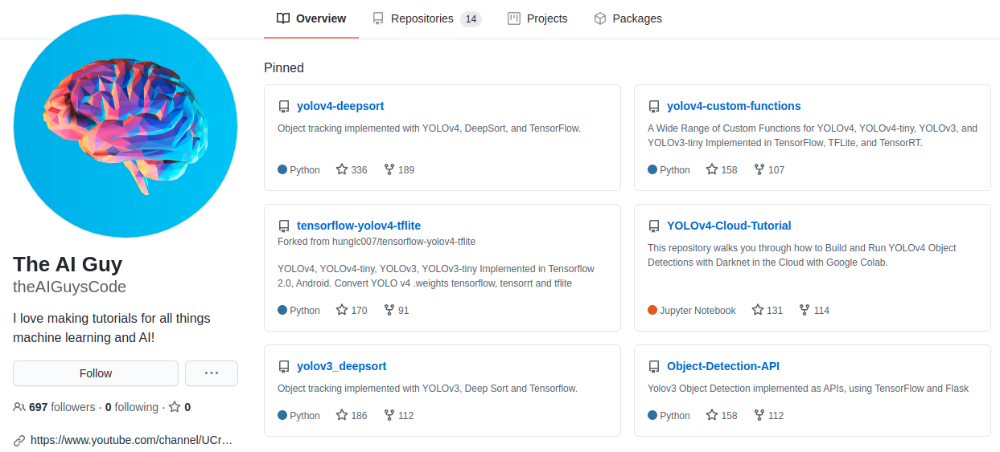

* Draft: 2021-02-02 (Tue)


Google search: youtube ai guy

* [The AI Guy](https://github.com/theAIGuysCode)
  * [Yolov3 Object Detection with Flask and Tensorflow 2.0 (APIs and Detections)](https://github.com/theAIGuysCode/Object-Detection-API)

> This repository implements Yolov3 using TensorFlow 2.0 and creates two easy-to-use APIs that you can integrate into web or mobile applications.



### Git 레파지토리 복제하기

```bash
$ cd
$ mkdir yolov3
$ cd yolov3/
$ git clone https://github.com/theAIGuysCode/Object-Detection-API.git
```

출력

```bash
'Object-Detection-API'에 복제합니다...
remote: Enumerating objects: 15, done.
remote: Counting objects: 100% (15/15), done.
remote: Compressing objects: 100% (15/15), done.
remote: Total 219 (delta 5), reused 1 (delta 0), pack-reused 204
오브젝트를 받는 중: 100% (219/219), 26.03 MiB | 4.76 MiB/s, 완료.
델타를 알아내는 중: 100% (96/96), 완료.
$
```

### Anaconda 가상환경 만들기

Anaconda가 설치되어 있다고 가정합니다. 그래서 현재 `(base)`가상환경 안에 있습니다.

```bash
(base) $ conda env create -f conda-gpu.yml
Collecting package metadata (repodata.json): done
Solving environment: done

Downloading and Extracting Packages
  ...
done
#
# To activate this environment, use
#
#     $ conda activate yolov3-gpu
#
# To deactivate an active environment, use
#
#     $ conda deactivate

(base) $
```

만든 가상환경을 활성화합니다. 

```bash
(base) $ conda activate yolov3-gpu
(yolov3-gpu) $
```

프롬프트가 `(yolov3-gpu) `로 바뀌었음을 알 수 있습니다. 

**중요: 반드시 가상환경에 있어야 하는 경우는 `(yolov3-gpu) $`처럼 가상환경을 이름을 명시합니다. 그러지 않아도 되는 경우는 `$`로 표기합니다.**

참고로 [conda-gpu.yml](https://github.com/theAIGuysCode/Object-Detection-API/blob/master/conda-gpu.yml)에는 아래 패키지를 설치하라고 되어 있습니다.

```yaml
name: yolov3-gpu

dependencies:
  - python==3.7
  - pip
  - matplotlib
  - opencv
  - cudnn
  - cudatoolkit==10.1.243
  - pip:
    - tensorflow-gpu==2.1.2
    - lxml
    - tqdm
    - flask
    - seaborn
    - pillow
```

### NVIDIA 드라이버 설치

이미 설치했는지 확인해봅니다.

```bash
$ sudo ubuntu-drivers devices
== /sys/devices/pci0000:00/0000:00:01.1/0000:02:00.0 ==
modalias : pci:v000010DEd00001B80sv00001028sd00003366bc03sc00i00
vendor   : NVIDIA Corporation
model    : GP104 [GeForce GTX 1080]
driver   : nvidia-driver-455 - third-party free
driver   : nvidia-driver-418 - third-party free
driver   : nvidia-driver-460 - third-party free recommended
driver   : nvidia-driver-450 - third-party free
driver   : nvidia-driver-418-server - distro non-free
driver   : nvidia-driver-450-server - distro non-free
driver   : nvidia-driver-390 - distro non-free
driver   : xserver-xorg-video-nouveau - distro free builtin
$
```

설치가 안 되어 있다면 설치를 진행합니다.

```bash
# Ubuntu 18.04
$ sudo apt-add-repository -r ppa:graphics-drivers/ppa
$ sudo apt install -y nvidia-driver-430
```

### YOLOv3 Pretrained weights 다운로드

COCO dataset에서 사전에 훈련된 웨이트 파일을 다운로드 받습니다.

```bash
# yolov3
$ wget https://pjreddie.com/media/files/yolov3.weights -O weights/yolov3.weights

# yolov3-tiny
$ wget https://pjreddie.com/media/files/yolov3-tiny.weights -O weights/yolov3-tiny.weights
```

`yolov3.weights`는 248MB입니다.

### 테스트

우선 잘 돌아가는지 확인합니다.

```bash
(yolov3-gpu) $ python load_weights.py
```

출력 메세지의 일례입니다.

```bash
2021-02-02 09:40:29.824818: I tensorflow/stream_executor/platform/default/dso_loader.cc:44] Successfully opened dynamic library libnvinfer.so.6
```

라이브러리를 찾을 수 없다고 합니다만 일단 동작은 합니다.

```bash
2021-02-02 09:40:29.825913: W tensorflow/stream_executor/platform/default/dso_loader.cc:55] Could not load dynamic library 'libnvinfer_plugin.so.6'; dlerror: libnvrtc.so.10.2: cannot open shared object file: No such file or directory; LD_LIBRARY_PATH: /usr/local/cuda-11.2/lib64
2021-02-02 09:40:29.825938: W tensorflow/compiler/tf2tensorrt/utils/py_utils.cc:30] Cannot dlopen some TensorRT libraries. If you would like to use Nvidia GPU with TensorRT, please make sure the missing libraries mentioned above are installed properly.
```

CUDA 라이브러리는 잘 찾았습니다.

```bash
2021-02-02 09:40:30.662746: I tensorflow/stream_executor/platform/default/dso_loader.cc:44] Successfully opened dynamic library libcuda.so.1
```

NUMA node에 관한 주의사항이 있습니다.

```bash
2021-02-02 09:40:30.702424: I tensorflow/stream_executor/cuda/cuda_gpu_executor.cc:981] successful NUMA node read from SysFS had negative value (-1), but there must be at least one NUMA node, so returning NUMA node zero
```

첫 번째 GPU카드를 찾았습니다.

```bash
2021-02-02 09:40:30.702876: I tensorflow/core/common_runtime/gpu/gpu_device.cc:1555] Found device 0 with properties: 
pciBusID: 0000:01:00.0 name: GeForce GTX 1080 computeCapability: 6.1
coreClock: 1.7335GHz coreCount: 20 deviceMemorySize: 7.93GiB deviceMemoryBandwidth: 298.32GiB/s
```

메모리 사이즈가 7.93GB입니다.

두 번째 GPU카드도 찾았습니다. 동일한 메모리 사이즈를 가집니다.

```bash
2021-02-02 09:40:30.703531: I tensorflow/core/common_runtime/gpu/gpu_device.cc:1555] Found device 1 with properties: 
pciBusID: 0000:02:00.0 name: GeForce GTX 1080 computeCapability: 6.1
coreClock: 1.7335GHz coreCount: 20 deviceMemorySize: 7.93GiB deviceMemoryBandwidth: 298.32GiB/s
```

그런데 문제가 발생합니다.

```bash
  ...
2021-02-02 09:40:30.708915: I tensorflow/core/common_runtime/gpu/gpu_device.cc:1697] Adding visible gpu devices: 0, 1
  ...
  File "/home/k8smaster/anaconda3/envs/yolov3-gpu/lib/python3.7/site-packages/tensorflow_core/python/eager/context.py", line 945, in _compute_gpu_options
    raise ValueError("Memory growth cannot differ between GPU devices")
ValueError: Memory growth cannot differ between GPU devices
(yolov3-gpu) $
```

> ## Running just the TensorFlow model
>
> The tensorflow model can also be run not using the APIs but through using `detect.py` script.

다른 스크립트를 단독으로 실행해봐도 동일한 에러가 발생합니다.

```bash
(yolov3-gpu) $ python detect.py
  ...
    raise ValueError("Memory growth cannot differ between GPU devices")
ValueError: Memory growth cannot differ between GPU devices
(yolov3-gpu) $
```

## Next

* [as_heartkilla_suggests.md](as_heartkilla_suggests.md)
  * Git Repo [heartkilla](https://github.com/heartkilla)/**[yolo-v3](https://github.com/heartkilla/yolo-v3)**를 참고합니다.