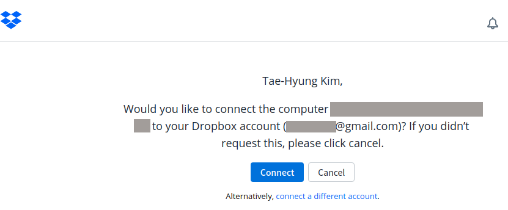
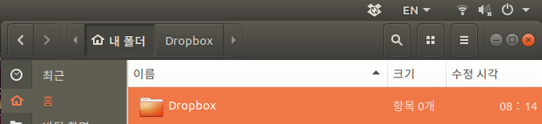

* Draft: 2020-11-19 (Thu)

# Dropbox 설치하기

## 요약 (Summary)

우분투 리눅스 (18.04)에서 드롭박스를 설치하려면, 터미널에서 아래 두 명령어를 입력하면 됩니다. 

```bash
$ cd ~ && wget -O - "https://www.dropbox.com/download?plat=lnx.x86_64" | tar xzf -
$ ~/.dropbox-dist/dropboxd
```

* 두 번째 명령어를 실행한 후
* 웹브라우저에서 계정접속 권한을 묻는 페이지가 자동으로 런칭되면 수락한 후,
* 드롭박스 계정에 있는 파일이 다운로드 될 때까지 기다리면 됩니다.
* 파일의 위치는 `/home/user_id/Dropbox` 혹은 줄여서 `~/Dropbox`입니다.

## 커맨드라인 명령어의 전체 출력 메세지

터미널에서 명령어를 입력했을 때 전체 출력 메세지는 다음과 같습니다.

첫 번째 명령어를 실행하면 유저홈 디렉토리에, 설치파일을 다운로드하고, 압축을 풉니다.

```bash
$ cd ~ && wget -O - "https://www.dropbox.com/download?plat=lnx.x86_64" | tar xzf -
--2020-11-20 08:13:11--  https://www.dropbox.com/download?plat=lnx.x86_64
Resolving www.dropbox.com (www.dropbox.com)... 162.125.82.1, 2620:100:6032:1::a27d:5201
접속 www.dropbox.com (www.dropbox.com)|162.125.82.1|:443... 접속됨.
HTTP request sent, awaiting response... 302 Found
Location: https://edge.dropboxstatic.com/dbx-releng/client/dropbox-lnx.x86_64-110.4.458.tar.gz [following]
--2020-11-20 08:13:12--  https://edge.dropboxstatic.com/dbx-releng/client/dropbox-lnx.x86_64-110.4.458.tar.gz
Resolving edge.dropboxstatic.com (edge.dropboxstatic.com)... 162.125.82.10, 2620:100:6032:10::a27d:520a
접속 edge.dropboxstatic.com (edge.dropboxstatic.com)|162.125.82.10|:443... 접속됨.
HTTP request sent, awaiting response... 200 OK
Length: 102601668 (98M) [application/gzip]
Saving to: ‘STDOUT’

-                         100%[==================================>]  97.85M  14.2MB/s    in 6.8s    

2020-11-20 08:13:19 (14.4 MB/s) - written to stdout [102601668/102601668]

$ 
```

두 번째 명령어는 `.dropbox-dist` 디렉토리에 다운로드 받은 `dropboxd`명령어를 실행합니다.

```bash
$ ~/.dropbox-dist/dropboxd
dropbox: locating interpreter
dropbox: logging to /tmp/dropbox-antifreeze-XTuqw4
dropbox: initializing
dropbox: initializing python 3.7.9
dropbox: setting program path '/home/aimldl/.dropbox-dist/dropbox-lnx.x86_64-110.4.458/dropbox'
dropbox: setting python path '/home/aimldl/.dropbox-dist/dropbox-lnx.x86_64-110.4.458:/home/aimldl/.dropbox-dist/dropbox-lnx.x86_64-110.4.458/python-packages.zip'
dropbox: python initialized
dropbox: running dropbox
dropbox: setting args
dropbox: enabling allocator metrics
dropbox: applying overrides
dropbox: running main script
dropbox: load fq extension '/home/aimldl/.dropbox-dist/dropbox-lnx.x86_64-110.4.458/cryptography.hazmat.bindings._constant_time.cpython-37m-x86_64-linux-gnu.so'
dropbox: load fq extension '/home/aimldl/.dropbox-dist/dropbox-lnx.x86_64-110.4.458/cryptography.hazmat.bindings._openssl.cpython-37m-x86_64-linux-gnu.so'
dropbox: load fq extension '/home/aimldl/.dropbox-dist/dropbox-lnx.x86_64-110.4.458/cryptography.hazmat.bindings._padding.cpython-37m-x86_64-linux-gnu.so'
dropbox: load fq extension '/home/aimldl/.dropbox-dist/dropbox-lnx.x86_64-110.4.458/psutil._psutil_linux.cpython-37m-x86_64-linux-gnu.so'
dropbox: load fq extension '/home/aimldl/.dropbox-dist/dropbox-lnx.x86_64-110.4.458/psutil._psutil_posix.cpython-37m-x86_64-linux-gnu.so'
dropbox: load fq extension '/home/aimldl/.dropbox-dist/dropbox-lnx.x86_64-110.4.458/apex._apex.cpython-37m-x86_64-linux-gnu.so'
dropbox: load fq extension '/home/aimldl/.dropbox-dist/dropbox-lnx.x86_64-110.4.458/tornado.speedups.cpython-37m-x86_64-linux-gnu.so'
dropbox: load fq extension '/home/aimldl/.dropbox-dist/dropbox-lnx.x86_64-110.4.458/wrapt._wrappers.cpython-37m-x86_64-linux-gnu.so'
dropbox: load fq extension '/home/aimldl/.dropbox-dist/dropbox-lnx.x86_64-110.4.458/PyQt5.QtWidgets.cpython-37m-x86_64-linux-gnu.so'
dropbox: load fq extension '/home/aimldl/.dropbox-dist/dropbox-lnx.x86_64-110.4.458/PyQt5.QtCore.cpython-37m-x86_64-linux-gnu.so'
dropbox: load fq extension '/home/aimldl/.dropbox-dist/dropbox-lnx.x86_64-110.4.458/PyQt5.QtGui.cpython-37m-x86_64-linux-gnu.so'
dropbox: load fq extension '/home/aimldl/.dropbox-dist/dropbox-lnx.x86_64-110.4.458/PyQt5.QtNetwork.cpython-37m-x86_64-linux-gnu.so'
dropbox: load fq extension '/home/aimldl/.dropbox-dist/dropbox-lnx.x86_64-110.4.458/PyQt5.QtDBus.cpython-37m-x86_64-linux-gnu.so'

(dropbox:10767): LIBDBUSMENU-GLIB-WARNING **: 08:13:25.405: About to Show called on an item wihtout submenus.  We're ignoring it.
```

## 접속 권한 수락

웹브라우저에서 계정 접속 권한을 묻는 페이지가 자동으로 런칭됩니다. 원하는 계정이 맞는지 확인 후 `Connect`버튼을 눌러서 접속 권한을 부여합니다. 계정을 아직 입력하지 않은 경우엔 계정을 입력해야 합니다.



성공적으로 연결됐다는 메세지가 출력됩니다.


## 드록박스 디몬 실행 및 Files의 디렉토리 위치

드록박스 계정이 성공적으로 연결되면, 화면 제일 위의 `EN`좌측에 아이콘이 생겨서 화살표가 계속 돌아가고 있음을 볼 수 있습니다. 계정에 있는 파일이 다운로드 될 때까지 기다리면 됩니다. 



파일이 동기화되서 저장되는 위치는 `/home/user_id/Dropbox` 혹은 줄여서 `~/Dropbox`입니다.

## 부록: 드롭박스 홈페이지의 설치 관련 내용

간결하게 아래와 같이 설명되어 있습니다.

> **Dropbox Headless Install via command line**
>
> The Dropbox daemon works fine on all 32-bit and 64-bit Linux servers. To install, run the following command in your Linux terminal.
>
> **32-bit:**
>
> ```bash
> cd ~ && wget -O - "https://www.dropbox.com/download?plat=lnx.x86" | tar xzf -
> ```
>
> **64-bit:**
>
> ```
> cd ~ && wget -O - "https://www.dropbox.com/download?plat=lnx.x86_64" | tar xzf -
> ```
>
> Next, run the Dropbox daemon from the newly created `.dropbox-dist` folder.
>
> ```bash
> ~/.dropbox-dist/dropboxd
> ```
>
> If you’re running Dropbox on your server for the first time, you’ll be asked to copy and paste a link in a working browser to create a new account or add your server to an existing account. Once you do, your Dropbox folder will be created in your home directory. Download this [Python script](https://www.dropbox.com/download?dl=packages/dropbox.py) to control Dropbox from the command line. For easy access, put a symlink to the script anywhere in your PATH.
>
> Source: [Install Dropbox to get the most out of your account](https://www.dropbox.com/install-linux)

