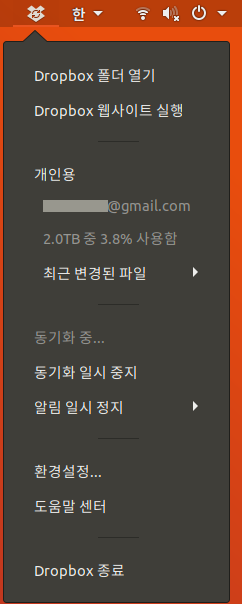

* Draft: 2020-11-20 (Fri)

# Dropbox

[드롭박스](https://ko.wikipedia.org/wiki/%EB%93%9C%EB%A1%AD%EB%B0%95%EC%8A%A4)는 파일 동기화와 클라우드 컴퓨팅을 이용한 웹 기반의 파일 공유 서비스입니다. 자세한 것은 http://dropbox.com/를 참고하세요.

## 설치하기

[Dropbox 설치하기](INSTALL.md)를 참고하세요.

## 사용하기

```bash
$ ~/.dropbox-dist/dropboxd
$ dropbox start
```

시작한 후 `동기화 중...`이 보일 경우, 아직 파일을 드롭박스 서버에서 내려받고 있는 중입니다.



