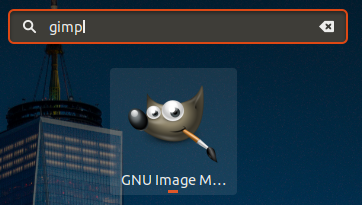

* Rev.2: 2020-12-08 (Tue)

* Rev.1: 2020-06-24 (Wed)
* Draft: 2019-05-22 (Wed)

# 우분투에 김프 설치하기

## 우분투 20.04에 설치하기

`snap`명령어로 김프를 성공적으로 설치할 수 있습니다.

```bash
$ sudo snap install gimp
```

우분투 18.04에서 쓰인 `apt`명령어는 의존성이 맞지 않아서 실패했습니다. (2020-12-08) 참고하세요.

```bash
$ sudo apt install gimp
  ...
다음 패키지의 의존성이 맞지 않습니다:
 gimp : 의존: libgimp2.0 (>= 2.10.18) 하지만 %s 패키지를 설치하지 않을 것입니다
        의존: libgimp2.0 (<= 2.10.18-z) 하지만 %s 패키지를 설치하지 않을 것입니다
        의존: libgegl-0.4-0 (>= 0.4.22) 하지만 %s 패키지를 설치하지 않을 것입니다
E: 문제를 바로잡을 수 없습니다. 망가진 고정 패키지가 있습니다.
$
```

## 우분투 18.04에 설치하기

```bash
$ sudo add-apt-repository ppa:otto-kesselgulasch/gimp
$ sudo apt-get update
$ sudo apt-get install -y gimp
```

## 설치 확인하기

### 터미널 명령어

```bash
$ gimp &
```

### `프로그램 표시`

`gimp`로 검색한 후 아이콘을 클릭하면



김프가 다음처럼 시작됩니다.


## 프로그램 삭제

```bash
$ sudo apt-get autoremove gimp gimp-plugin-registry
```

## 참고

* [How to Install GIMP 2.10 on Ubuntu 18.04 LTS](https://tecadmin.net/install-gimp-on-ubuntu/)
* [[Linux] 포토샵 대용 프로그램인 Gimp 설치하기](https://m.blog.naver.com/PostView.nhn?blogId=aimldl&logNo=221543659176&referrerCode=0&searchKeyword=linux)