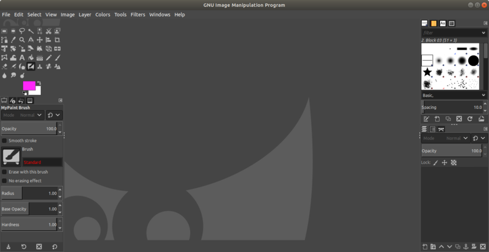

* Rev.1: 2020-06-24 (Wed)
* Draft: 2019-05-22 (Wed)

# Install Gimp on Ubuntu

```bash
$ sudo add-apt-repository ppa:otto-kesselgulasch/gimp
$ sudo apt-get update
$ sudo apt-get install -y gimp
```

## Verify the Installation

### On terminal

```bash
$ gimp &
```

### On `Show Applications`

or go to `Show Applications` and search for `gimp`


GIMP is launched as follows.




## Uninstall

```bash
$ sudo apt-get autoremove gimp gimp-plugin-registry
```

## References

* [How to Install GIMP 2.10 on Ubuntu 18.04 LTS](https://tecadmin.net/install-gimp-on-ubuntu/)
* [[Linux] 포토샵 대용 프로그램인 Gimp 설치하기](https://m.blog.naver.com/PostView.nhn?blogId=aimldl&logNo=221543659176&referrerCode=0&searchKeyword=linux)