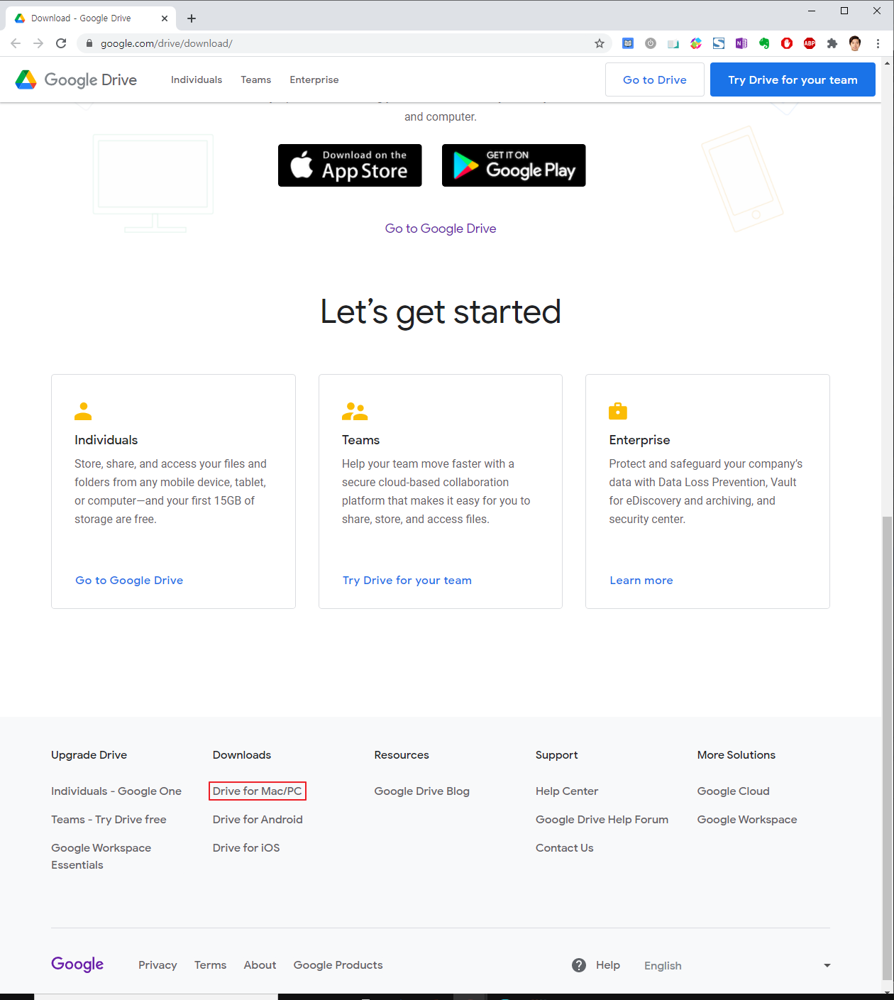
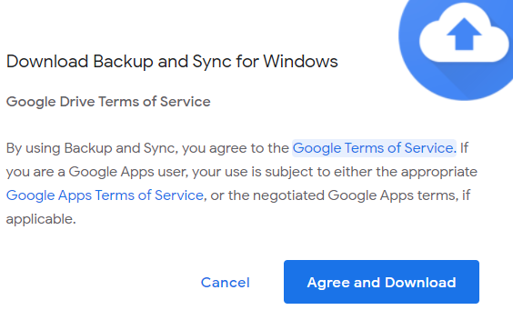
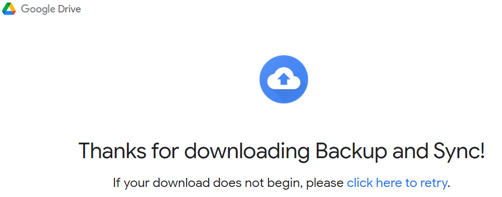
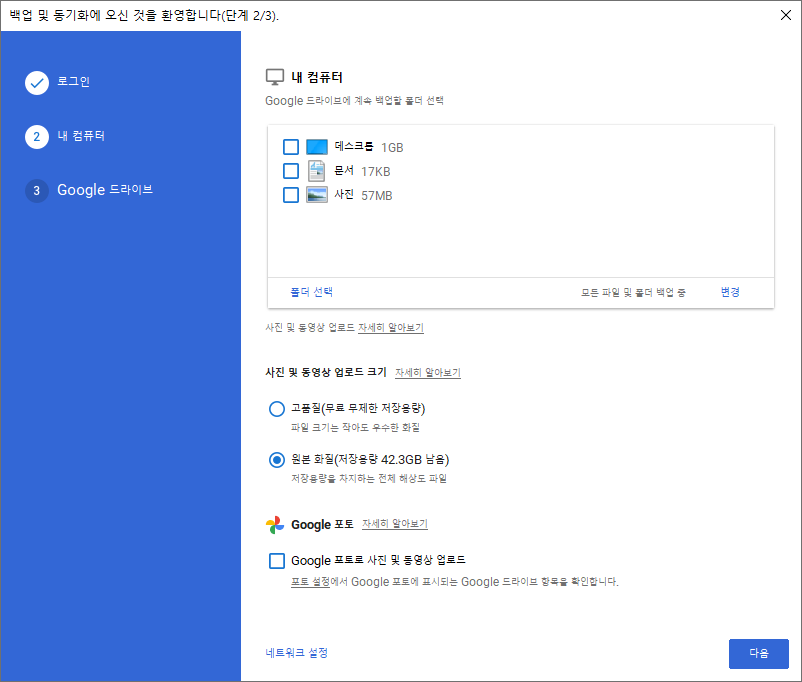
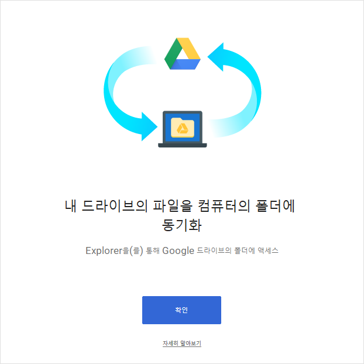
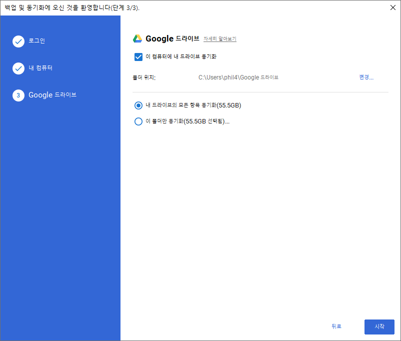

* Draft: 2020-11-20 (Fri)
# 구글 드라이브 설치하기 (윈도우10)

##
* Google search: how to synch google drive for windows 10
* [How to Sync Your Desktop PC with Google Drive (and Google Photos)](https://www.howtogeek.com/228989/how-to-use-the-desktop-google-drive-app/)

구글의 `Backup and Sync`를 설치하면 `Google 드라이브`를 탐색기에 마운트 가능합니다.

## 다운로드 받기
https://www.google.com/drive/download/로 갑니다. 

아래 링크가 나오면 다운로드가 자동으로 시작됩니다. 아니라면 이 페이지의 링크를 클릭해서 수동으로 다운로드 받습니다.

## 설치하기
다운로드 받은 `installbackupandsync.exe` 파일을 실행합니다.

## 사용하기
설치가 완료되면 트레이에 구글 드라이브 아이콘이 보입니다.

탐색기에도 `Google 드라이브`가 자동으로 마운트 되어 있습니다.

동기화가 이미 진행되고 있습니다. 파일의 총 용량이 클 경우 동기화되는데 시간이 꽤 소요될 수 있습니다.
