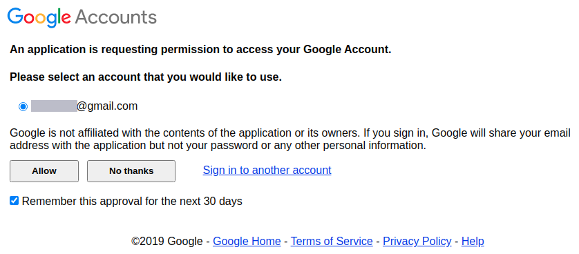
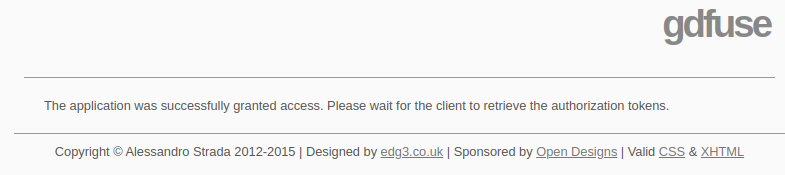

* Draft: 2020-11-19 (Thu)

# 우분투 리눅스에 구글 드라이브 설치하기

우분투 리눅스에서는 `google-drive-ocamlfuse`를 이용해서 구글 드라이브를 동기화하고 자동으로 마운트 할 수 있습니다. 자세한 내용은 [How to Install Google Drive on Ubuntu 20.04](https://linuxhint.com/google_drive_installation_ubuntu/) (영문 문서)를 참고하세요. 

## 설치하기

### Step 1. PPA를 설정합니다.

```bash
$ sudo add-apt-repository ppa:alessandro-strada/ppa
  ...
[ENTER]을 눌러 진행하거나 Ctrl-c를 눌러 추가하는것을 취소합니다.
  ...
$
```

우분투의 언어를 영어로 설정해놓은 경우 메세지는 다음과 같습니다.

```bash
Press [ENTER] to continue or Ctrl-c to cancel adding it.
```

### Step 2. `apt-get update`명령어로 업데이트 합니다. 

```bash
$ sudo apt-get update
```

### Step 3. `google-drive-ocamlfuse`를 설치합니다.

```bash
$ sudo apt-get install -y google-drive-ocamlfuse
```

## 설정하기

### 구글 계정에 접속 권한 수락하기

`google-drive-ocamlfuse`를 실행하면 웹브라우저가 자동으로 열립니다.

```bash
$ google-drive-ocamlfuse
```

원하는 구글 계정을 마우스로 클릭해서 로그인합니다.


`Allow`버튼을 누르면 구글 계정에 접근할 수 있도록 수락됩니다.


 `google-drive-ocamlfuse`를 처음 쓸 경우 구글 계정에 접속권한을 수락하는 아래 화면이 출력됩니다. 이미 한번 수락한 경우엔 보이지 않고 바로 다음의 메세지로 넘어갑니다.



성공적으로 수락되면 아래 메세지가 보여집니다. 웹브라우저를 닫습니다.



### 터미널에서 명령어 실행하기

구글 드라이브를 저장할 디렉토리를 생성한 후, 구글 드라이브를 이 디렉토리에 마운트합니다.

```bash
$ mkdir -v ~/GoogleDrive
$ google-drive-ocamlfuse ~/GoogleDrive
```

위에선 디렉토리 이름을 `GoogleDrive`라고 했지만, 원하는 디렉토리로 설정하면 됩니다.

## 설치 확인하기

`df` 명령어로 마운트된 것을 확인합니다. `-h`옵션은 사람이 읽을 수 있는 포맷 (human readable format)으로 용량을 보여줍니다. 

```bash
$ df -h
Filesystem              Size  Used Avail Use% Mounted on
  ...
google-drive-ocamlfuse       100G  -64Z  -16M 100% /home/aimldl/GoogleDrive
$
```

위 경우는 용량이 100G일 경우입니다. 100%용량을 모두 채웠습니다. 무료가 아니라 유료로 지불해서 용량을 100G로 늘린 경우입니다. 아래는 이 중 58%인 58G만 찼고, 43G의 여유 공간이 있는 경우입니다.

```bash
$ df -h
Filesystem              Size  Used Avail Use% Mounted on
  ...
google-drive-ocamlfuse  100G   58G   43G  58% /home/aimldl/GoogleDrive
$
```

