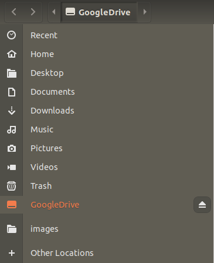

* Draft: 2020-11-19 (Thu)

# 구글 드라이브 (Googld Drive)

## 개요 (Overview)

우분투 리눅스에서 구글 드라이브를 직접 마운트 할 수 있습니다.

## 설치하기
* [우분투 리눅스에 구글 드라이브 설치하기](INSTALL.md)
* [구글 드라이브 설치하기 (윈도우10)](INSTALL-windows10.md)

## 사용하기

구글 드라이브가 마운트되면 `데스크탑`화면에 `GoogleDrive`가 보입니다. 더블 클릭해서 디렉토리를 연다음 사용하면 됩니다.

`Files` 프로그램에도 `GoogleDrive`가 보입니다.

