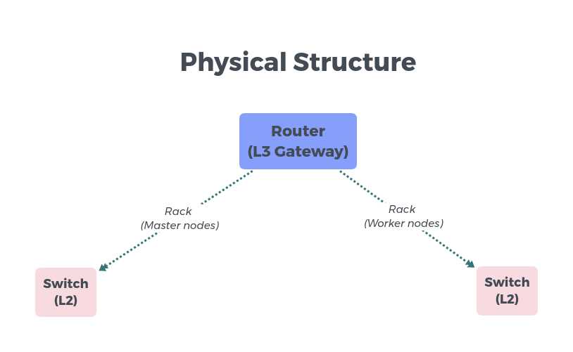
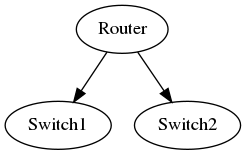
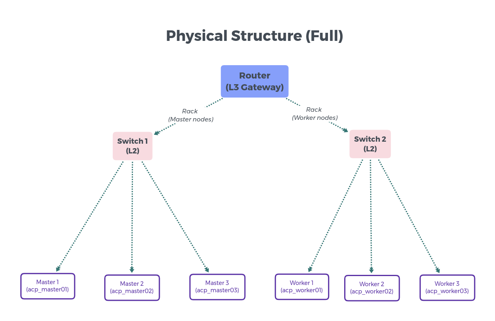
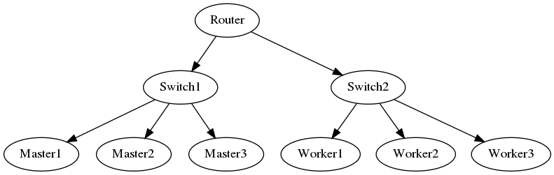
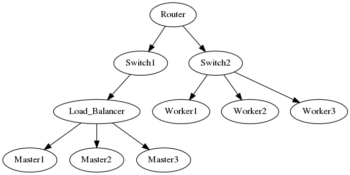
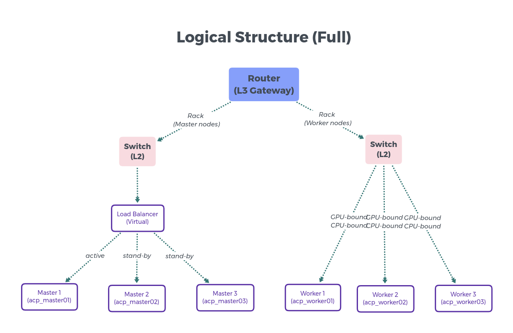

* Draft: 2021-04-15 (Thu)

# Kubernetes Nodes


## A tree with two branches

My target is to draw the following figure.



```bash
$ echo "digraph G {Router->Switch1; Router->Switch2;}" | dot -Tpng > graphvia-physical_structure.png
```

Equivalently,

```bash
$ echo "digraph G {Router-> {Switch1 Switch2};" | dot -Tpng > graphvia-physical_structure.png
```




Q1: How do I put '(L3 Gateway)' in the next line?

Q2: How can I add a text on the arrow(s)?



```bash
$ echo "digraph G {Router->Switch1; Router->Switch2; Switch1->Master1; Switch1->Master2; Switch1->Master3; Switch2->Worker1; Switch2->Worker2; Switch2->Worker3;}" | dot -Tpng > graphvia-physical_structure_with_nodes.png
```



Q3: How can I center the location of "Router" between "Switch1" and "Switch2"?


## Adding a virtual load balancer below Switch1

```bash
$ echo "digraph G {Router->Switch1; Router->Switch2; Switch1->Load_Balancer; Load_Balancer->Master1; Load_Balancer->Master2; Load_Balancer->Master3; Switch2->Worker1; Switch2->Worker2; Switch2->Worker3;}" | dot -Tpng > graphvia-physical_structure_with_nodes_and_virtual_load_balancer.png
```



Q4: How can I use "( or )" in the node name"

```bash
$ echo "digraph G {Router->Switch1; Router->Switch2; Switch1->Load_Balancer(Virtual); Load_Balancer(Virtual)->Master1; Load_Balancer(Virtual)->Master2; Load_Balancer(Virtual)->Master3; Switch2->Worker1; Switch2->Worker2; Switch2->Worker3;}" | dot -Tpng > graphvia-physical_structure_with_nodes_and_virtual_load_balancer.png
Error: <stdin>: syntax error in line 1 near '('
$
```

Using `\` won't work.

```bash
$ echo "digraph G {Router->Switch1; Router->Switch2; Switch1->Load_Balancer\(Virtual\); Load_Balancer\(Virtual\)->Master1; Load_Balancer\(Virtual\)->Master2; Load_Balancer\(Virtual\)->Master3; Switch2->Worker1; Switch2->Worker2; Switch2->Worker3;}" | dot -Tpng > graphvia-physical_structure_with_nodes_and_virtual_load_balancer.png
Error: <stdin>: syntax error in line 1 near '\'
$
```




TODO