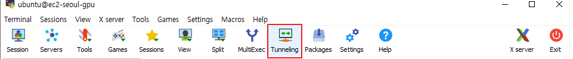
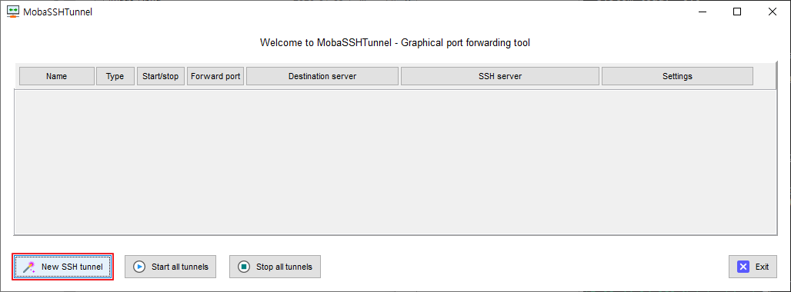
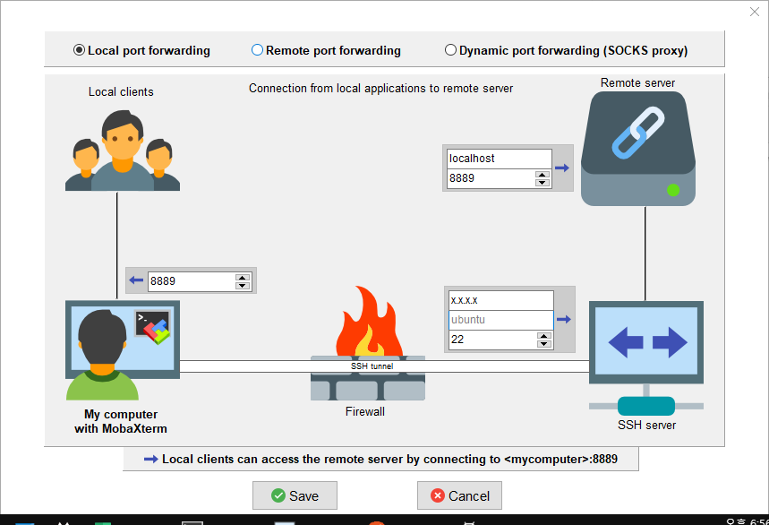
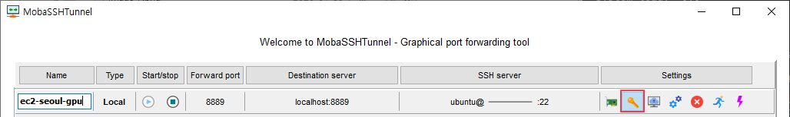
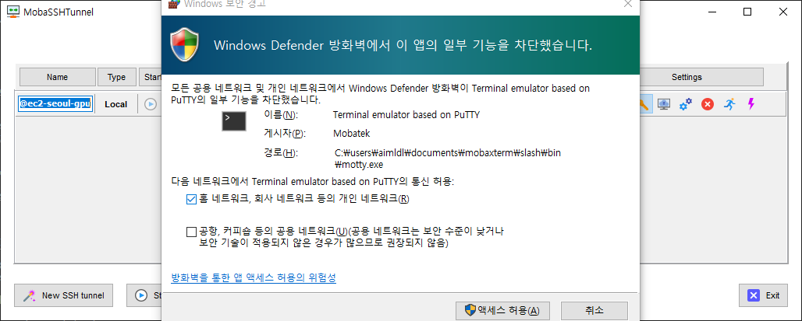
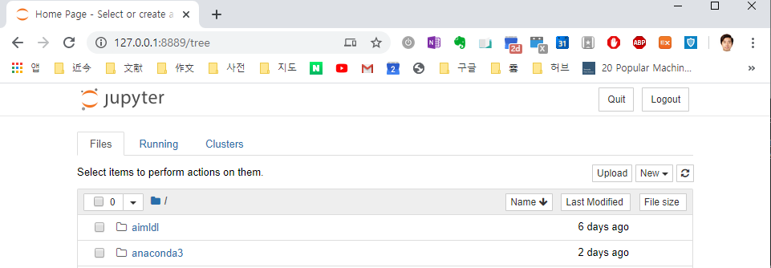

##### mobaxterm_port_forwarding.md

### mobaxterm port forwarding
MobaXterm is a SSH client program that comes with X-Windows system. MobaXterm is configured to allow port forwarding so that Jupyter Notebook on an EC2 instance is accessible on a local web browser.

For more information, refer to:
* Google search: mobaxterm port forwarding
* [Creating a SSH tunnel using MobaXterm on Windows](https://ubccr.freshdesk.com/support/solutions/articles/13000059375-creating-a-ssh-tunnel-using-mobaxterm-on-windows)

#### Example
Open MobaXterm and select "Tunneling"

Select "New SSH tunnel"

Enter the same port number on the "Local clients" and the "Remote server". In this example, 8889 is used instead of 8888 because 8888 is already in use. SSH server needs the EC2 instance's public IP address, ID, and SSH's port number, e.g. x.x.x.x, ubuntu, and 22. Note a private key is necessary to be authenticated by the SSH server or the EC2 instance. The private key is provided in the next step.

The following is the command line message on the EC2 instance. 
```bash
(base) aimldl@ec2-gpu:~$ jupyter notebook
[I 08:44:14.181 NotebookApp] The port 8888 is already in use, trying another port.
  ...
    To access the notebook, open this file in a browser:
        file:///home/ubuntu/.local/share/jupyter/runtime/nbserver-10972-open.html
    Or copy and paste one of these URLs:
        http://localhost:8889/?token=a123bcd45ef6789g0h12i3jk4l5m67n8o9pq012rs34t56u7
     or http://127.0.0.1:8889/?token=a123bcd45ef6789g0h12i3jk4l5m67n8o9pq012rs34t56u7
```
This jupyter notebook server is the "Remote server" that we'll connect. Pay attention to "localhost:8889".

Select the key icon under "Settings" to select the private key for the EC2 instance.


Windows defender message has popped up and I've accepted it. (My Windows is in Korean.)


After the port forwarding has been set up, a web browser is open on the local machine and the URL, e.g. http://localhost:8889/?token=a123bcd45ef6789g0h12i3jk4l5m67n8o9pq012rs34t56u7, is copied and pasted on the address bar.

