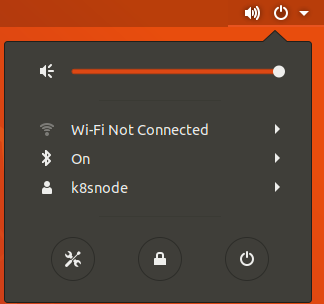
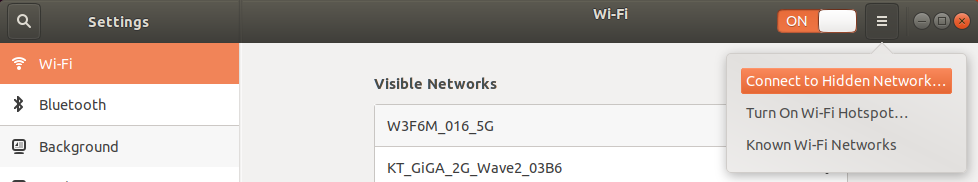
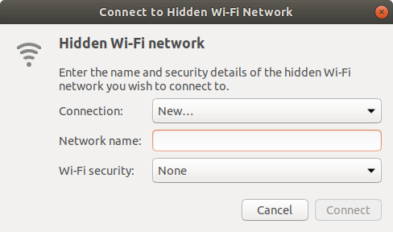
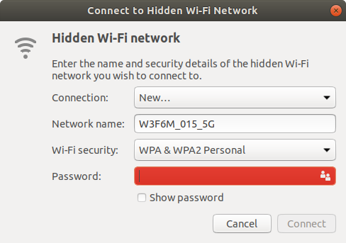
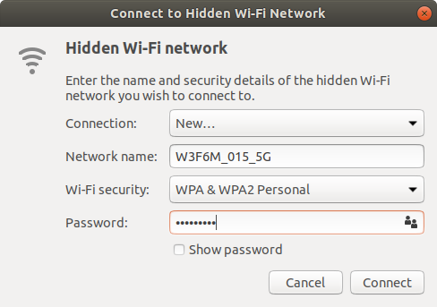
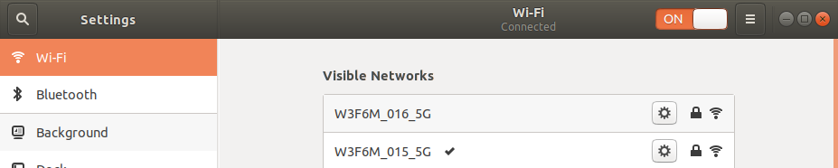

* Rev.3: 2020-07-23 (Thu)
* Rev.2: 2020-06-24 (Wed)
* Rev.1: 2020-06-22 (Mon)
* Draft: 2020-
# How to Configure WiFi-"Connect to Hidden Network"
A hidden network is not visible. So the network name must be typed in manually. 

## See also:
* [How to Get the MAC Address on Ubuntu (18.04)](get_the_mac_address.md).
* [How to Register the MAC Address to a Wi-Fi Router](register_the_mac_address_to_a_wifi_router.md)

## Prerequisite
1. The password to access the hidden network is necessary.
2. If the hidden network requires **MAC Authentication**, the MAC address must be registered to the Wi-Fi router.
  
Ask the owner/system admin of the hidden network about the details.

## Steps
Step 1. Go to `Settings`, select `Wi-Fi` and click the triple bar ≡ on the top right corner of the window.

The  `Connect to Hidden Wi-Fi Network` window pops up.

Step 2. Enter `Network name` and select `Wi-Fi security` from the drop down menu.

Step 3. Enter the password of the hidden network.

Step 4. If the connection is established, the hidden network moves on top of the available WiFi list and it is checked with v.

