* Draft: 2020-09-14 (Mon)

## How to Take a Snapshot Image Every Second

## Google search

* keywords: bash script take image every second
* [How to Run or Repeat a Linux Command Every X Seconds Forever](https://www.tecmint.com/run-repeat-linux-command-every-x-seconds/)

* [ffmpeg capture current frame and overwrite the image output file](https://stackoverflow.com/questions/25360470/ffmpeg-capture-current-frame-and-overwrite-the-image-output-file)


## Summary

Use the following commands to run within the current user session.

* Use the `watch` command
* Use the `sleep` command inside a `for` or `while` loop

Use the `cron` command to run periodically even after system reboots.

## Bash Script

### `get_image_from_webcam`

```bash
#!/bin/bash
# get_image_from_webcam
#  * Draft: 2020-09-14 (Mon)
#
# Usage:
#   First, make the file executable.
#     $ chmod +x get_image_from_webcam   
#   To get a single snapshot image from the webcam, run:
#     $ ./get_image_from_webcam
#
#   To capture images periodically, specify the interval with the watch command in second
#   For example, every 1 second.
#     $ watch -n 1 /home/pi/get_image_from_webcam
#
# Prerequisites:
#  1. Install fswebcam
#    $ sudo apt install -y fswebcam
#
#  2. Check if the user has the video group.
#    Simply,run:
#      $ groups <user_name>
#    Say user_name is "pi", the default user name for the Raspberry Pi OS.
#      $ groups pi
#      pi : pi adm dialout cdrom sudo audio video plugdev games users input netdev spi i2c gpio
#      $
#    As shown above, the default user account or "pi" has the video group.
#
#    Equivalently,
#      $ groups `whoami`
#      pi : pi adm dialout cdrom sudo audio video plugdev games users input netdev spi i2c gpio
#      $
#
#   3. (If "video" is not in your group),add the user to the video group.
#     $ sudo usermod -a -G video <user_name>

DATE=$(date +"%Y-%m-%d_%H%M%S")
RESOLUTION='1280x720'
DIR_OUTPUT='/home/pi/webcam'
FILE_EXTENSION='jpg'
FILE="$DIR_OUTPUT/webcam-$DATE.$FILE_EXTENSION"

run() {
  COMMAND=$1
  echo $COMMAND
  eval $COMMAND
}

run "fswebcam -r $RESOLUTION --no-banner $FILE"
```

### `get_images`

Take a snapshot every second.

```bash
$ watch -n 1 ./get_image_from_webcam
```

-n can take a floating value. For example, `-n 0.1` is to take a snapshot every 0.1 second.

TODO: write a script for the above command.

### test1


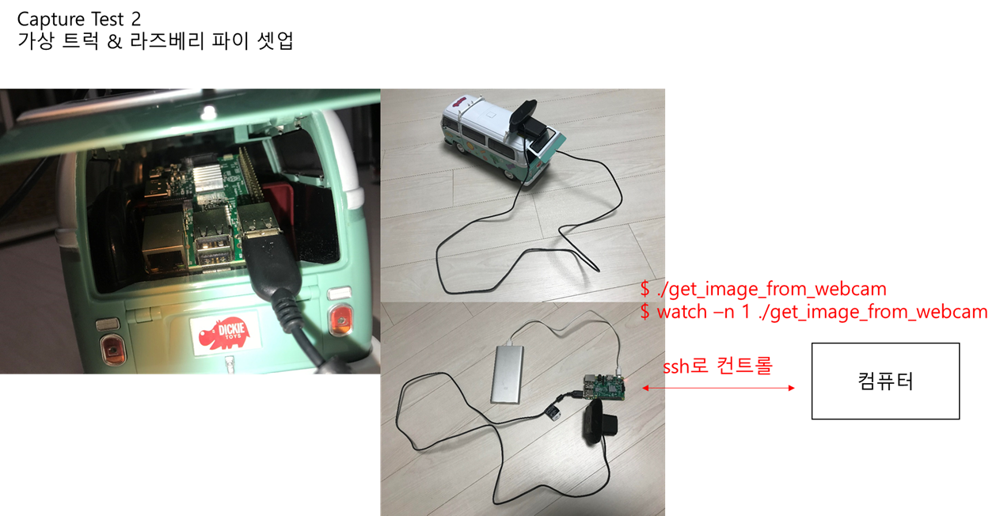

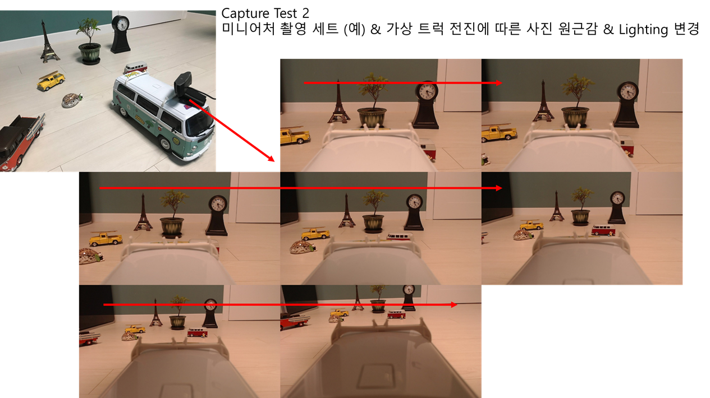


## Memo

TODO: Organize this

비디오로 찍으면 파일 사이즈가 너무 커지고, 이미지로 발라내는 후처리 작업이 필요하므로, 이미지로 바로 저장하는 방식으로 작성 (필요 시 비디오 변경 가능)

 

라즈베리 파이에 SSH server를 설치해서, 아래 프로그램/Script를 원격으로 실행하면 사진이 찍힙니다.

**1.**   **Single Snapshot**

User home (/home/pi/)에 webcam 디렉토리를 만들고

$ cd

$ mkdir webcam

User home에 get_image_from_webcam을 이동한 후, 실행하면 single snapshot을 webcam 디렉토리에 저장

$ cd

$ get_image_from_webcam

 

해상도 조절하시려면 SCRIPT 안의 RESOLUTION에 있는 값을 변경하면 됩니다.

 RESOLUTION=’1280x720’

 

**2.**   **연속 샷**

1초에 한번씩 찍으려면 watch 명령어를 쓰면 됩니다.

$ watch -n 1 ./get_image_from_webcam

 혹은

$ watch -n 1 /home/pi/get_image_from_webcam

 

정지하려면 Ctrl+C를 눌러 명령어 취소하면 됩니다.

(이 부분은 단일 명령어로 실행가능하게 별도 Script 작성하겠습니다.)

 

**촬영 테스트 결과**

압축 파일에는 테스트한 사진이 들어있습니다.

\- Test 1 폴더

매 초 손가락으로 1, 2, 3 ~ 10까지 카운트해서 찍은 것이 있습니다.

\- Test 2 폴더

미니어처 차 (트럭) 위에 웹캠을 올린 후 이동하며 사진을 찍었습니다.

원근감이 있는 이미지 캡쳐가 가능하므로, 대략적인 아이디어는 전달될 것으로 생각합니다.

 

**미니어처 촬영 세트 & 라즈베리파이 셋업 관련**

(1)  미니어처 촬영 세트와 무선 조정 가능한 트럭이 있으면 많은 데이터를 만들어 낼 수 있을 것으로 예상됩니다.

촬영세트: 미니어처 트럭에 웹캠을 올려서 현대중공업과 유사한 배경의 미니어처를 만들면 될 것 같습니다.

이 때 라즈베리파이가 트럭에 탑재되어야 하는데요. 배터리는 휴대폰 충전기로 연결 가능합니다.

(2)  다양한 배경 적용을 위한 Chroma Key 활용

미니어처 촬영 세트 작성 시, Chroma key를 이용할 수 있도록 녹색천을 두르면 다양한 배경로 Augment 가능할 것 같습니다.

(3)  일조량 고려를 위한 Lighting 위치 변경

이미지에서 Lighting이 변경되면, 값이 바뀌므로 촬영세트에 불빛의 괘도를 조절할 수 있는 장치를 만들 수 있으면 좋을 것 같습니다.

(이 부분은 기계적인 지식이 필요해서 어떻게 만들어야 할지 정확히 모르겠습니다. 아이디어 있으신 분?)

 

## Appendix

### Images for `test1`


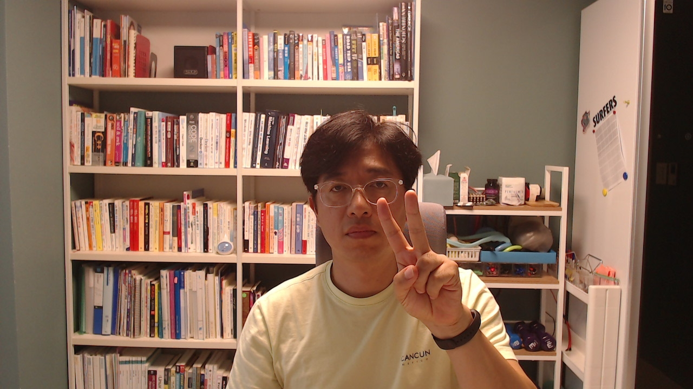

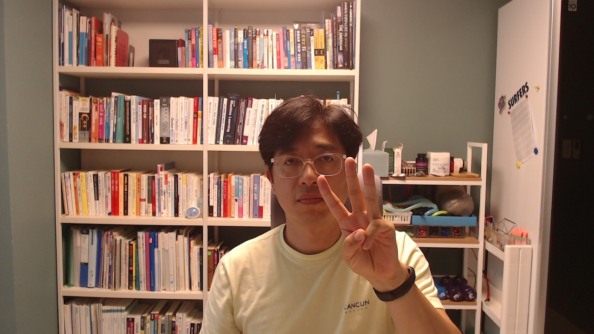

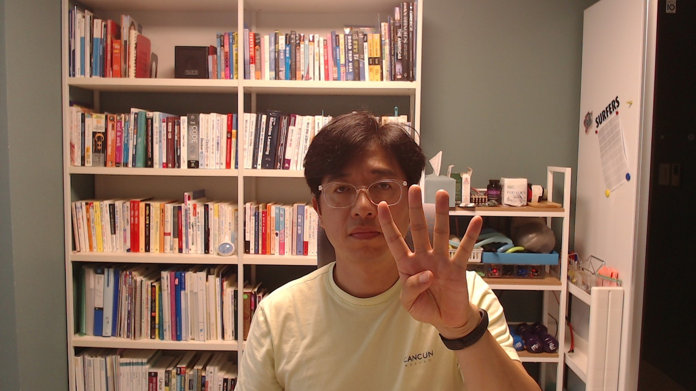


### Images for `test2`

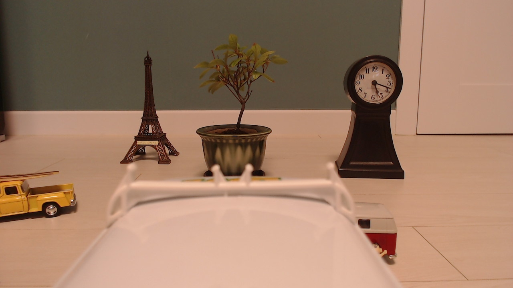

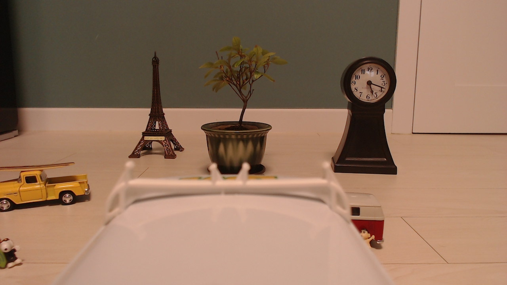


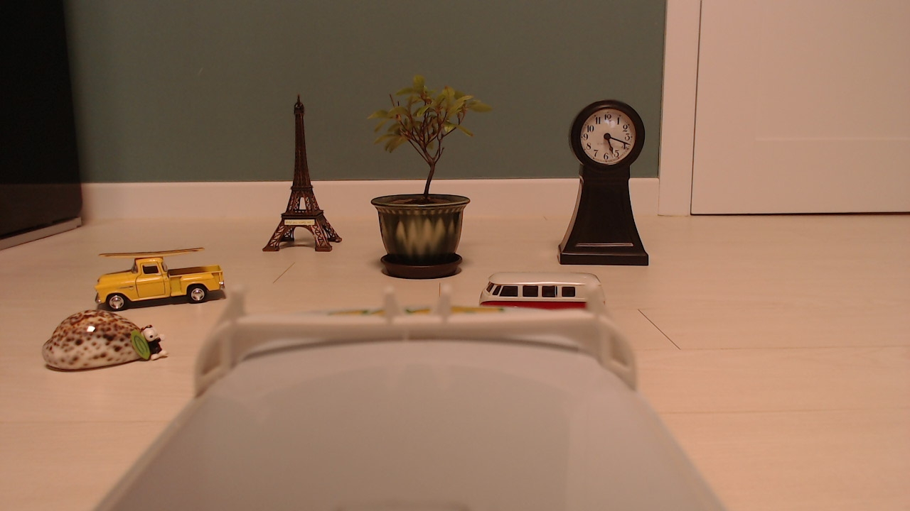

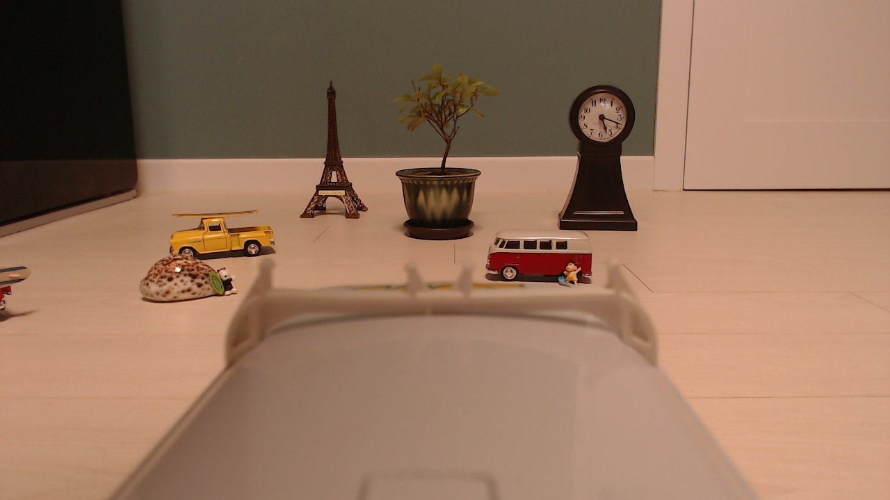

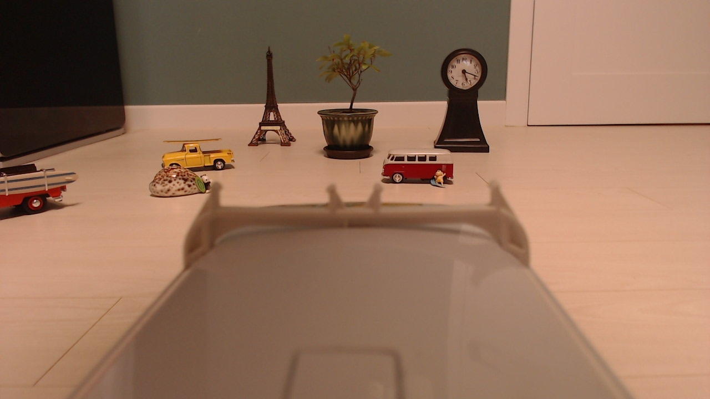

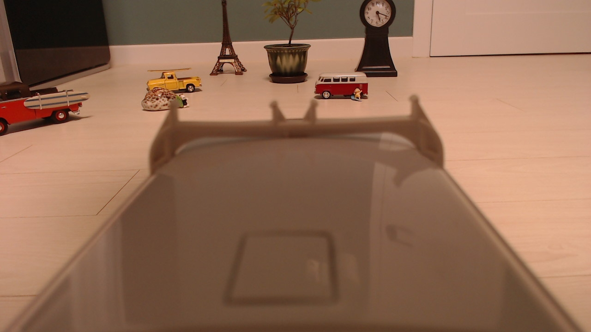