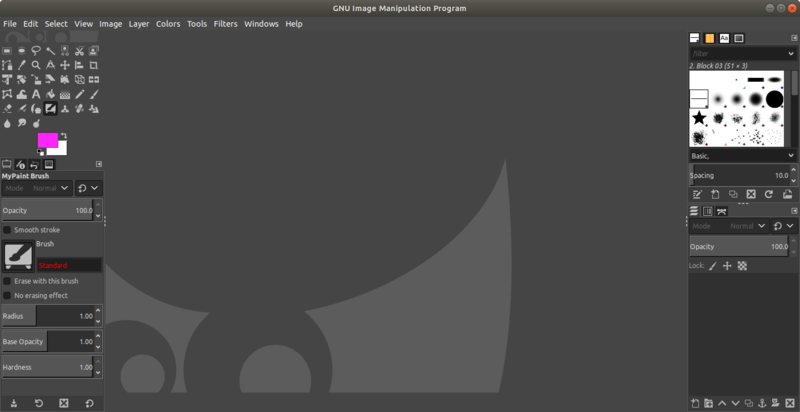

* Draft: 2020-04-01 (Wed)

# GIMP

GIMP is an open-source image editing program. It is one of the most popular Photoshop alternative on Linux. For a simple task to crop or rotate an image, I recommend Nomacs. GIMP is for more complex and serious image editing.

