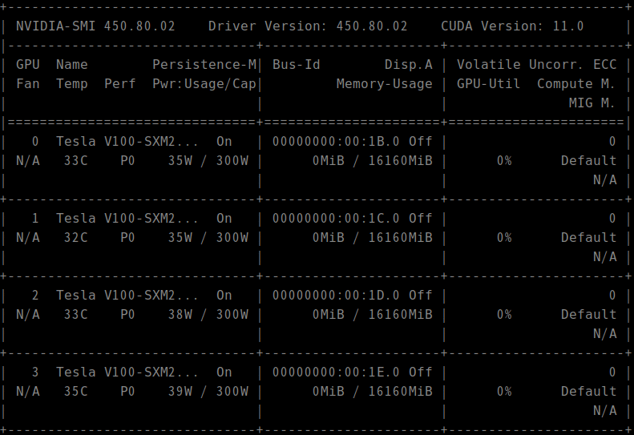

* Draft: 2021-05-26 (Wed)

# Imagemagick


## Google search: ubuntu how to make a moving gif

* [How do I create an animated gif from still images (preferably with the command line)?](https://askubuntu.com/questions/648244/how-do-i-create-an-animated-gif-from-still-images-preferably-with-the-command-l)

> You can create a `gif` from number of pictures(`jpg`) using:
>
> ```
> convert -delay 20 -loop 0 *.jpg myimage.gif
> ```

## Example
Save screenshots in the same directory.
```bash
$ ls
'스크린샷, 2021-05-27 13-34-49.png'  '스크린샷, 2021-05-27 13-35-54.png'  '스크린샷, 2021-05-27 13-36-02.png'  '스크린샷, 2021-05-27 13-36-11.png'  '스크린샷, 2021-05-27 13-57-18.png'
$
```
Create the moving GIF with the following command.
```bash
$ convert -delay 25 -loop 0 *.png python_2-2-basic_text_classification-imdb_embedding_mlp-edited_py-watch_-n_1_nvidia-smi.gif
```
The created moving GIF looks like below.


