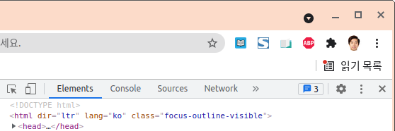

* Draft: 2021-09-15 (Wed)

# 복사 방지된 블로그에서 복사 가능하게 하기

Google search: 블로그 복사 방지 해제
* [복사 금지 된 블로그글 해제 후 복사하는 방법](https://speciallife7.tistory.com/103), 2021-01-03, 활기찬 리치엔

1. 크롬 브라우저에서 개발자 도구를 클릭합니다.
   ⋮(환경설정) > 도구 더보기 > 개발자 도구 (혹은 Ctrl+Shift+I)

2. 개발자 도구 메뉴의 환경설정 (톱니바퀴)를 클릭합니다.

3. 아래에 Debugger 관련 설정을 확인합니다.

4. `Disable javaScript`를 체크해서 자바스크립트가 실행되지 못하게 합니다.

5. 개발자 도구를 빠져나와서 우클릭/복사해보면 동작함을 알 수 있습니다.
