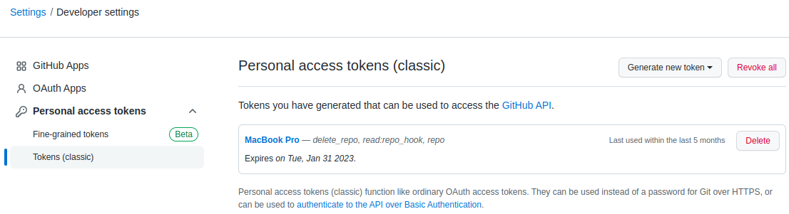
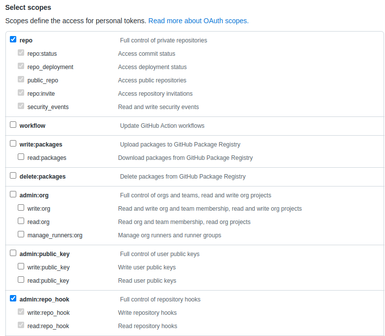
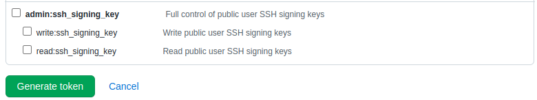

* Rev.1: 2022-11-26 (Sat)
* Draft: 2021-05-31 (Mon)

# 토큰으로 GitHub 이용하기

## Problem

* `git` 명령어를 실행할 때 `Username`과 `Password`를 이용해서 인증을 받았던 것이 더이상 동작하지 않습니다.
  * 예를 들어 `git push` 명령어의 경우 `인증이 실패하였습니다`라고 에러가 발생합니다.
  * `'git push`뿐만 아니라 모든 `git` 명령어도 동작하지 않습니다.

```bash
$ git push
  ...
Username for 'https://github.com': user_id
Password for 'https://aimldl@github.com': 
remote: Invalid username or password.
fatal: https://github.com/aimldl/tensorflow.git/에 대한 인증이 실패하였습니다
  ...
$
```

## Solution

`Personal access token`을 발급받아서 `Password`에 발급받은 token을 비밀번호처럼 입력하면 됩니다.

### Steps

Step 1. GitHub 홈페이지에 로그인합니다.

Step 2. Settings > Developer settings 페이지로 이동합니다.

Step 3. [Personal access tokens](https://github.com/settings/tokens) > Tokens (classic) 메뉴를 클릭합니다.



Step 4. `Generate new token`을 클릭합니다.

Step 5. GitHub mobile로 Authentication을 진행합니다.

Step 6. 토큰의 범위를 설정한 후



토큰을 생성합니다.



Step 7. 토큰을 복사해서 잘 저장해놓습니다.

Step 8. `git` 명령어의 password 대신 사용하면 인증이 됩니다.


## 참고 문서

* Google search: github 인증

  * [Git 개인 액세스 토큰을 사용하여 사용자 인증 진행하기 - JooTC](https://www.google.com/url?sa=t&rct=j&q=&esrc=s&source=web&cd=&cad=rja&uact=8&ved=2ahUKEwjN-t6cu_PwAhXR62EKHQmnDvgQFjAAegQIAxAD&url=https%3A%2F%2Fjootc.com%2Fp%2F201905122828&usg=AOvVaw0GqCmek1W7-uBL0fOKaj3j)


