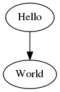

* Draft: 2021-04-15 (Thu)

# Quick Start Guide to Graphviz on Ubuntu


[Graphviz](https://www.graphviz.org/) > [The DOT Language](https://www.graphviz.org/doc/info/lang.html)

graph	:	[ strict ] (graph | digraph) [ ID ] '{' stmt_list '}'

**Subgraphs and Clusters**

```text
  A -> {B C}
is equivalent to

  A -> B
  A -> C
```


## [Hello World](https://graphviz.org/Gallery/directed/hello.html)

```bash
$ echo "digraph G {Hello->World}" | dot -Tpng > hello.png
```



## Variations to Hello World

### Variation 1

```bash
$ echo "graph G {Hello World}" | dot -Tpng > hello-variation01.png
```


Q1: How can I connect the two nodes with a line?


