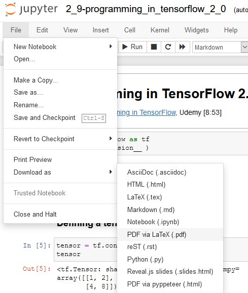
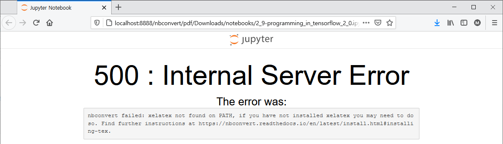
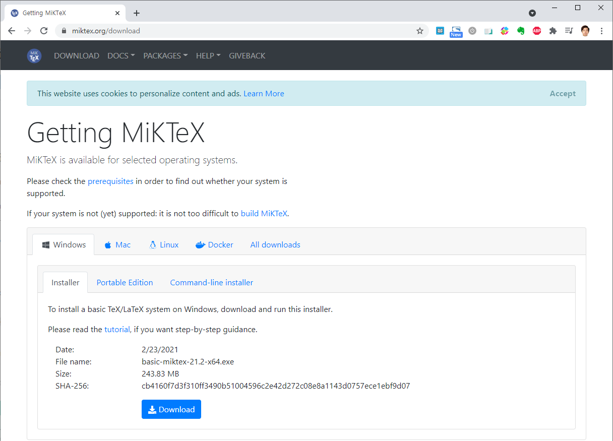
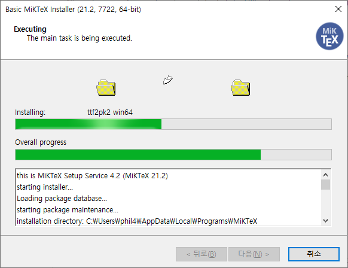
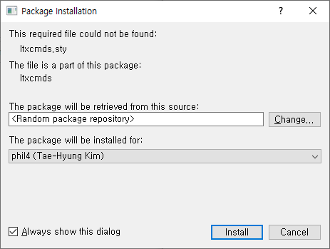
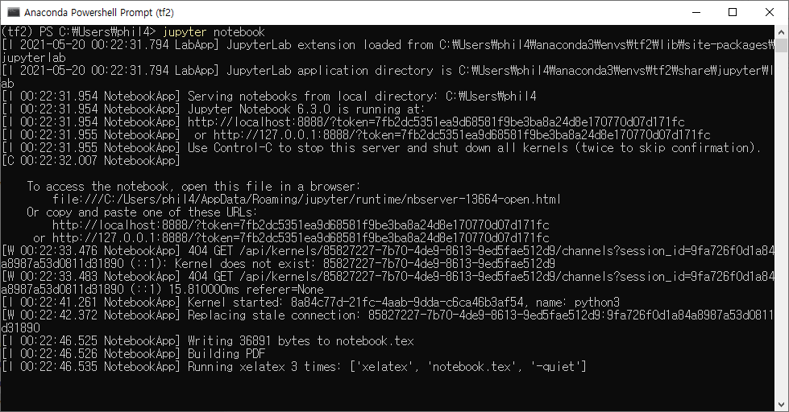
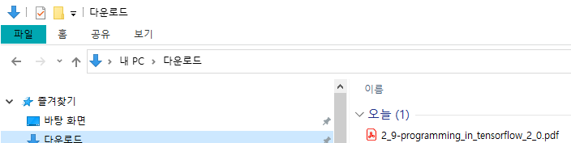
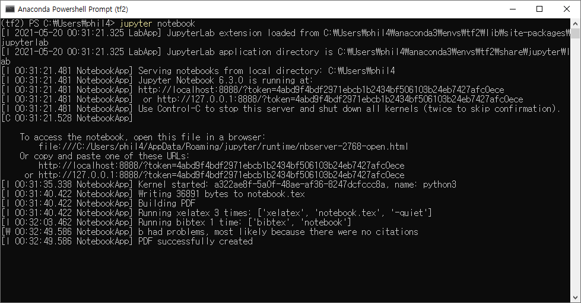

* Draft: 2021-05-20 (Wed)
# How to Configure to Export PDF

## Problem
* On Windows 10, an attempt to export an .ipynb file as a .pdf file


 fails with the following error.
 
 

## Hint
The `500: Internal Server Error` provides a link.

## Solution
* Install `nbconvert` and `MikTex`.

### Installing `nbconvert`
Refer to [nbconvert > Installation](https://nbconvert.readthedocs.io/en/latest/install.html#installing-tex).
> * Installing nbconvert
>   * Nbconvert is packaged for both pip and conda, so you can install it with:
> ```
> pip install nbconvert
> \# OR
> conda install nbconvert
> ```

#### Windows 10
Open `Anaconda PowerShell Promt` and run:
```powershell
(tf2) > conda install nbconvert
```

### Installing TeX

> * Linux: [TeX Live](http://tug.org/texlive/)
>   * e.g. on Debian or Ubuntu:
> ```bash
> $ sudo apt-get install texlive-xetex texlive-fonts-recommended texlive-generic-recommended
> ```
> * macOS (OS X): [MacTeX](http://tug.org/mactex/)
> * Windows: [MikTex](https://miktex.org/)

#### Windows 10
* To download the installation file, go to https://miktex.org/download and click `Download`.



* Run the installer.
  * The installation process is like other Windows programs.
 
 
###### Memo
Later I found these articles.
Google search: nbconvert failed: xelatex not found on PATH, if you have not installed xelatex you may need to do so. Find further instructions at https://nbconvert.readthedocs.io/en/latest/install.html#installing-tex.
* [jupyter notebook pdf 변환 :: nbconvert failed: xelatex not found on PATH 에러](https://hoho325.tistory.com/14)

#### Continued
I followed these steps and was able to save PDF.






The problem is the converted .pdf file can't be opened at github AND by Acrobat Reader.

Something must be wrong.


TODO: Fix the problem. Recall I unchecked when xelatex were installed. The blog said to hit `Install` about 13 times. But I hit three times and uncheck `Always ask...`. Was it the reason?


