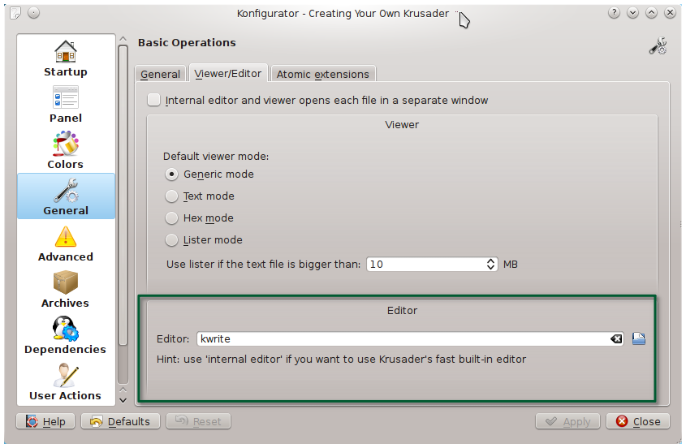

* Draft: 2021-05-27 (Thu)

# How to Change the Default Text Editor on Krusader

Google search: krusader how to change the default text editor

* [Krusader automatically opens newly created text files](https://askubuntu.com/questions/575313/krusader-automatically-opens-newly-created-text-files)

* > **Krusader settings**
  >
  > Krusader > Settings > Configure Krusader > General -> Viewer/Editor tab and add your favorite.
  >
  > 

Krusader의 설정에서 `편집기`를 변경합니다.


## 예: spyder로 편집기를 변경하기

프로그램이 있는 정확한 위치가 필요하므로 터미널에서 `which` 명령어로 위치를 확인합니다.

```bash
$ which spyder
/home/aimldl/anaconda3/bin/spyder
$
```

해당 실행 파일을 선택하면 아래처럼 변경됩니다.


