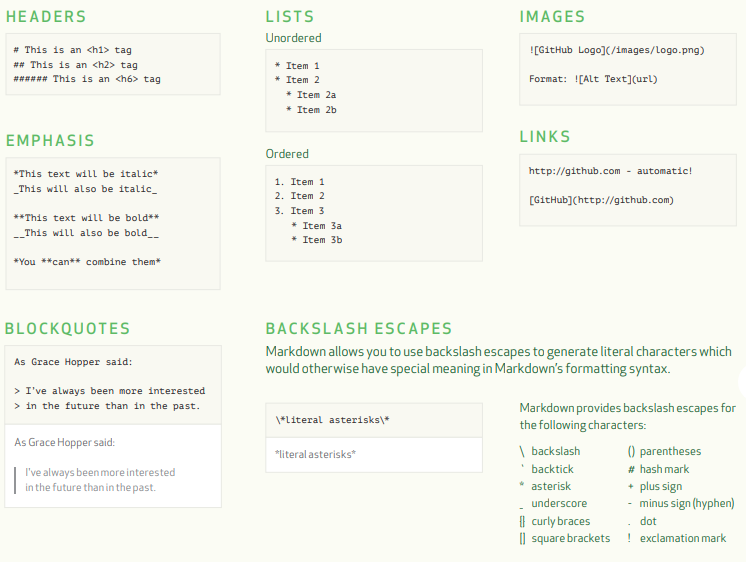
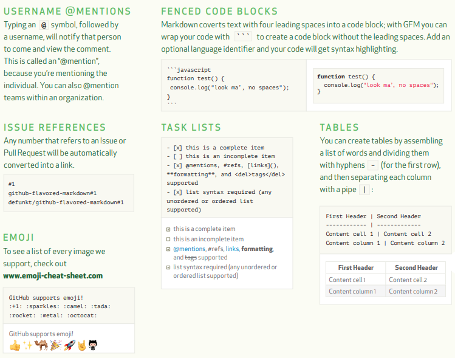

* Rev.1: 2021-03-21 (Sat)
* Draft: 2020-11-25 (Wed)

# Markdown Cheat Sheets


## [MARKDOWN SYNTAX](https://guides.github.com/pdfs/markdown-cheatsheet-online.pdf)






## [Markdown Quick Reference Cheat Sheet](https://wordpress.com/support/markdown-quick-reference/)

TODO: reformat the following table which is not identical to the table in the original source.

|                     | Markdown                                                     | Processed                                                    |
| :------------------ | :----------------------------------------------------------- | :----------------------------------------------------------- |
| Emphasis            | `*Emphasize* _emphasize_ **Strong** __Strong__`              | *Emphasize* **Strong** <br /><br />Some WordPress.com themes may have different formatting for these styles |
| Inline Links        | `A [link](http://example.com "Title").`Most browsers show the title text when hovering over a link.Please note that WordPress shortcodes, like [video] or [audio], will take priority over Markdown links and shouldn’t be used for link text. | A [link](http://example.com/).                               |
| Referenced Links    | `Some text with [a link][1] and another [link][2]. [1]: http://example.com/ "Title" [2]: http://example.org/ "Title"`The reference section can be anywhere in the document | Some text with [a link](http://example.com/) and another [link](http://example.org/). |
| Inline Images       | `Logo: `The “Alt” text (alternative text) makes images accessible to visually impaired | Logo:  |
| Referenced Images   | `Smaller logo: ![Alt][1] [1]: /wp-smaller.png "Title"`       | Smaller logo:  |
| Linked Images       | `Linked logo: [] (http://wordpress.com/ "Title")` | Linked logo: [](http://wordpress.com/) |
| Footnotes           | `I have more [^1] to say up here. [^1]: To say down here.`Footnotes will be added to the bottom of the document, with a link back to the original reference | I have more [1](https://wordpress.com/support/markdown-quick-reference/68137-1) to say up here. To say down here. [](https://wordpress.com/support/markdown-quick-reference/68137-1) |
| Line breaks         | *We do not support Markdown’s typical double-space to generate a line break due to our built-in auto-linebreaking function. A regular line break will generate a line break on output.* |                                                              |
| Bullet Lists        | `* Item * Item - Item - Item`                                | ItemItemItemItem                                             |
| Numbered Lists      | `1. Item 2. Item`                                            | ItemItem                                                     |
| Mixed Lists         | `1. Item 2. Item   * Mixed   * Mixed   3. Item`              | ItemItemMixedMixedItem                                       |
| Task Lists          | `- [ ] Unfinished task`                                      | ☐ Unfinished task.                                           |
|                     | `- [x] Completed task`                                       | ☑ Completed task                                             |
| Blockquotes         | `> Quoted text. > > Quoted quote. > * Quoted  > * List`      | Quoted text.Quoted quote.QuotedList                          |
| Preformatted        | `  Begin each line with   two spaces or more to   make text look  e x a c t l y   like  you  type i  t.` | `Begin each line with  two spaces or more to  make text look e x a c t l y  like  you  type i t.` |
| Code                | ``This is code``                                             | `This is code`                                               |
| Code block          | `~~~~ This is a  piece of code  in a block ~~~~ ``` This too ```` | `This is apiece of codein a block` `This too`                |
| Syntax highlighting | ````css #button {    border: none; } ````See [Posting Source Code](https://wordpress.com/support/code/posting-source-code/) for supported languages | `#button {  border: none;}`                                  |
| Headers             | `# Header 1 ## Header 2 ### Header 3  #### Header 4 #### ##### Header 5 ##### ###### Header 6 ######`Closing hash marks are optional on all levels | Header 1Header 2Header 3Header 4Header 5Header 6             |
| Definition Lists    | `WordPress :  A semantic personal publishing platform  Markdown :  Text-to-HTML conversion tool` | WordPressA semantic personal publishing platformMarkdownText-to-HTML conversion toolFormatting for definition lists may vary between themes |
| Abbreviations       | `Markdown converts text to HTML. *[HTML]: HyperText Markup Language`Definitions can be anywhere in the document | Markdown converts text to HTML.                              |
