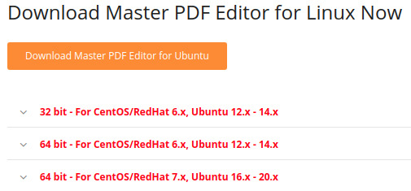
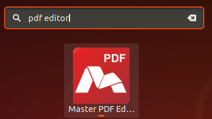
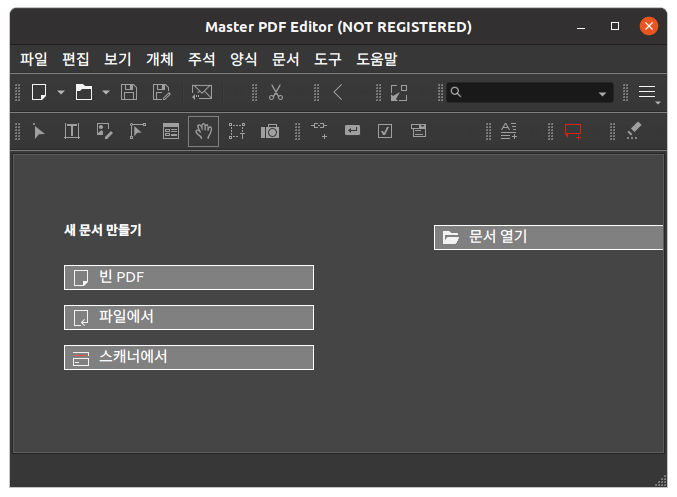

* Rev.2: 2021-09-25 (Sat)
* Rev.1: 2021-01-12 (Tue)
* Draft: 2020-12-17 (Thu)

# 마스터 PDF 에디터 (Master PDF Editor) 설치하는 방법
마스터 PDF 에디터 ([Master PDF Editor](https://code-industry.net/masterpdfeditor/) )

## 다운로드
[Download Master PDF Editor for macOS, Windows and Linux](https://code-industry.net/get-masterpdfeditor/)

### 지원OS
* [Windows (32 & 64 bit)](https://code-industry.net/public/MasterPDFEditor-setup.exe)
* [Linux](https://code-industry.net/free-pdf-editor/)
* [macOS](https://code-industry.net/public/MasterPDFEditor.dmg)

윈도우즈 및 맥OS의 설치는 간단합니다. 위의 다운로드 링크로 설치파일을 받은 다음 일반적인 설치 절차를 거치면 됩니다. 아래에는 리눅스 설치 절차 및 명령어를 정리합니다.

### 우분투 리눅스에 설치하기
#### 요약

1. 설치 파일 (예: `master-pdf-editor-5.6.80-qt5.x86_64.deb`)를 홈페이지에서 다운로드 받습니다.

2. 터미널에서 아래 명령어를 실행해서 설치합니다.

   ```bash
   $ sudo dpkg -i master-pdf-editor-5.6.80-qt5.x86_64.deb 
   ```

#### 1. 설치 파일 다운로드 하기

Step 1. [Downloads](https://code-industry.net/get-masterpdfeditor/)에 가서 [Download Master PDF Editor for Linux](https://code-industry.net/free-pdf-editor/)를 클릭합니다.

Step 2. `Download`버튼을 클릭해서


Step 3. `Download Master PDF Editor for Ubuntu` 버튼을 클릭합니다.



(밑에 나오는 32 bit 혹은 64bit에 현혹되지 말고) 오렌지색 버튼을 클릭하면 `master-pdf-editor-5.6.80-qt5.x86_64.deb와 같은 `.deb파일이 다운로드 됩니다.

#### 터미널에서 아래 명령어를 실행해서 설치합니다.

터미널을 열어, 다운로드 폴더에 이동한 후, 아래 명령어를 실행합니다.

```bash
$ sudo dpkg -i master-pdf-editor-5.6.80-qt5.x86_64.deb 
```

성공적으로 설치가 되면 `프로그램 표시`에서 `Master PDF Editor`를 검색할 수 있습니다.



프로그램을 시작하려면 아이콘을 클릭하세요.

#### `libqt5printsupport5` 의존성 에러 해결

만약 설치 명령어를 실행했을 때 다음처럼 의존성 에러가 발생한다면

```bash
$ sudo dpkg -i master-pdf-editor-5.6.80-qt5.x86_64.deb 
[sudo] aimldl의 암호: 
(데이터베이스 읽는중 ...현재 249317개의 파일과 디렉터리가 설치되어 있습니다.)
Preparing to unpack master-pdf-editor-5.6.80-qt5.x86_64.deb ...
Unpacking master-pdf-editor (5.6.80) over (5.6.80) ...
dpkg: dependency problems prevent configuration of master-pdf-editor:
 master-pdf-editor 패키지는 다음 패키지에 의존: libqt5printsupport5 (>= 5.6.3): 하지만:
  libqt5printsupport5 패키지는 설치하지 않았습니다.

dpkg: error processing package master-pdf-editor (--install):
 의존성 문제 - 설정하지 않고 남겨둠
Processing triggers for gnome-menus (3.36.0-1ubuntu1) ...
Processing triggers for desktop-file-utils (0.24-1ubuntu3) ...
Processing triggers for mime-support (3.64ubuntu1) ...
Processing triggers for hicolor-icon-theme (0.17-2) ...
처리하는데 오류가 발생했습니다:
 master-pdf-editor
$
```

다음 명령어를 실행해서 에러를 해결합니다.

```bash
$ sudo apt -f install
```

참고: [How to Install Master PDF Editor 5 on Ubuntu 18.04](https://www.atechtown.com/install-master-pdf-editor-on-ubuntu/), Atechtown

`프로그램 표시`에서 `Master PDF Editor`를 검색해서


실행해보면 다음처럼 프로그램이 시작됩니다.


