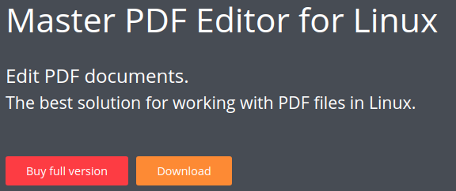

* Draft: 2020-12-17 (Thu)

# How to install Master PDF Editor

[Master PDF Editor](https://code-industry.net/masterpdfeditor/) supports Linux, Windows, and macOS.

## Install on Ubuntu Linux

### Summary

1. A `.deb` file such as `master-pdf-editor-5.6.80-qt5.x86_64.deb` is downloaded

2. Installed with the following command

   ```bash
   $ sudo dpkg -i master-pdf-editor-5.6.80-qt5.x86_64.deb 
   ```

### Download the installation file

Step 1. Go to [Downloads](https://code-industry.net/get-masterpdfeditor/). 

Step 2. Click [Download Master PDF Editor for Linux](https://code-industry.net/free-pdf-editor/).

Step 3. Click `Download`.



Step 4. Click `Download Master PDF Editor for Ubuntu`.


A `.deb` file such as `master-pdf-editor-5.6.80-qt5.x86_64.deb` is downloaded.

### Run a command to install from the installation file

Go to the download folder and run:

```bash
$ sudo dpkg -i master-pdf-editor-5.6.80-qt5.x86_64.deb 
```

The installation is done! Master PDF Editor is found as follows. 


Click to run the program!

