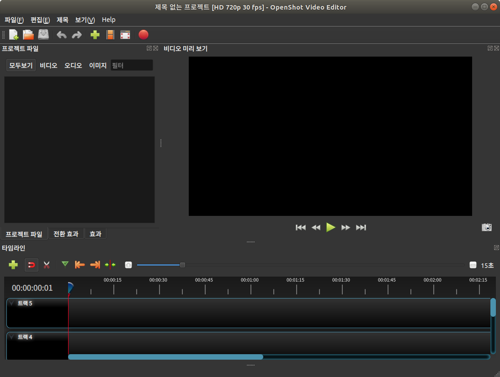

##### aimldl/compuing_environments/openshot/INSTALL.md

* Draft: 2020-04-01 (Wed)

# Install OpenShot on Ubuntu

## How to Install Openshot 2.4. 4 in Ubuntu 18.04 / 18.10

[How to Install Openshot 2.4.4 in Ubuntu 18.04 / 18.10](http://ubuntuhandbook.org/index.php/2019/03/install-openshot-2-4-4-ubuntu-18-04-18-10/), March 23, 2019 details the installation process. The summary is below.

```bash
$ sudo add-apt-repository ppa:openshot.developers/ppa
[sudo] aimldl의 암호: 
 This PPA contains the current stable version of OpenShot Video Editor.

If you would rather the bleeding-edge version, check out the following URL:
https://launchpad.net/~jonoomph/+archive/openshot-edge

 더 많은 정보: https://launchpad.net/~openshot.developers/+archive/ubuntu/ppa
[ENTER]을 눌러 진행하거나 Ctrl-c를 눌러 추가하는것을 취소합니다.
  ...
$ sudo apt-get update
$ sudo apt-get install -y openshot-qt
  ...
$ 
```

## Verify the Installation

```bash
$ which openshot-qt
/usr/bin/openshot-qt
$ $ openshot-qt
Loaded modules from installed directory: /usr/lib/python3/dist-packages/openshot_qt
         app:INFO ------------------------------------------------
         app:INFO             Wed Apr  1 09:55:19 2020            
         app:INFO               Starting new session              
         app:INFO ------------------------------------------------
         app:INFO          OpenShot (version 2.5.1-dev2)          
         app:INFO ------------------------------------------------
  ...
timeline_webview:INFO Qt Found!
timeline_webview:INFO $scope.Qt = true;
timeline_webview:INFO SetThumbAddress: http://127.0.0.1:36859/thumbnails/
timeline_webview:INFO UpdateLayerIndex
timeline_webview:INFO SortItems
timeline_webview:INFO UpdateLayerIndex
```



## Uninstall

```bash
$ sudo apt-get remove --autoremove openshot-qt
```

