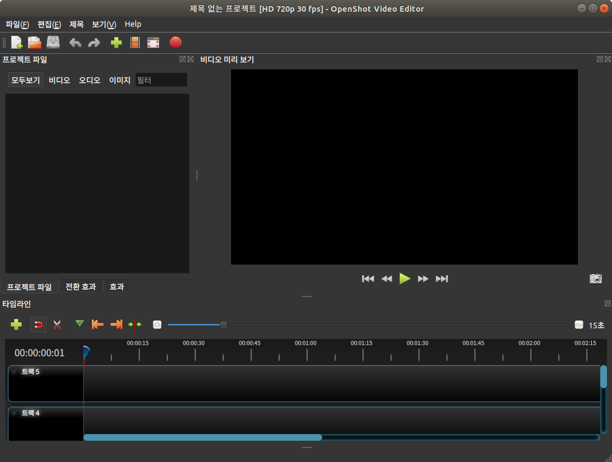

##### aimldl/compuing_environments/openshot/README.md

* Draft: 2020-04-01 (Wed)

# README

## Kdenlive vs. OpenShot vs. Pitivi

There are three popular free video editors for Ubuntu: Kdenlive, OpenShot, and Pitivi. Reviews recommend either Kdenlive or OpenShot. OpenShot is like Microsoft Paint while Kdenlive is like Adobe Photoshot. The user interface of OpenShot is easier to use than Kdenlive while the performance of Kdenlive is better than that of OpenShot according to an interesting review (written in Korean ) [Openshot vs Kdenlive 오픈소스 병렬 동영상 편집기 비교](https://sergeswin.com/914). Some said Windows Premire is better than Kdenlive in terms of the user interface and stability of the program.

## OpenShot

