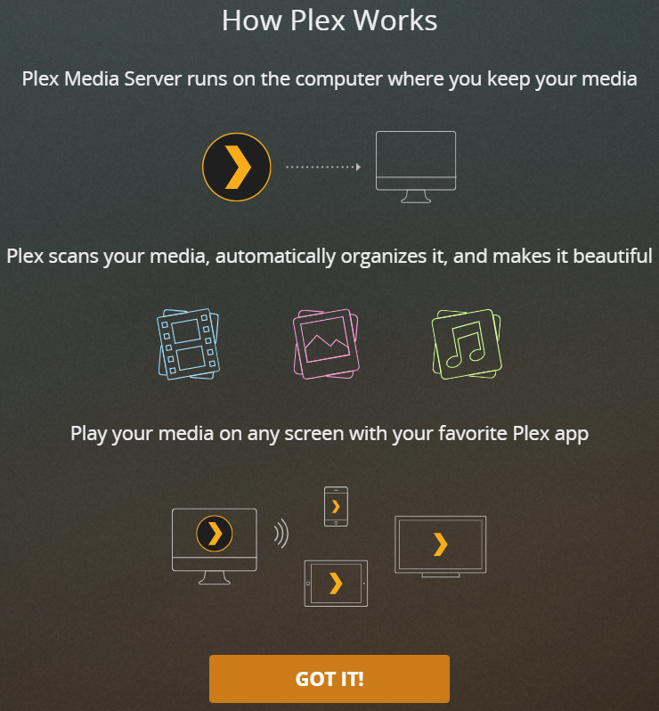
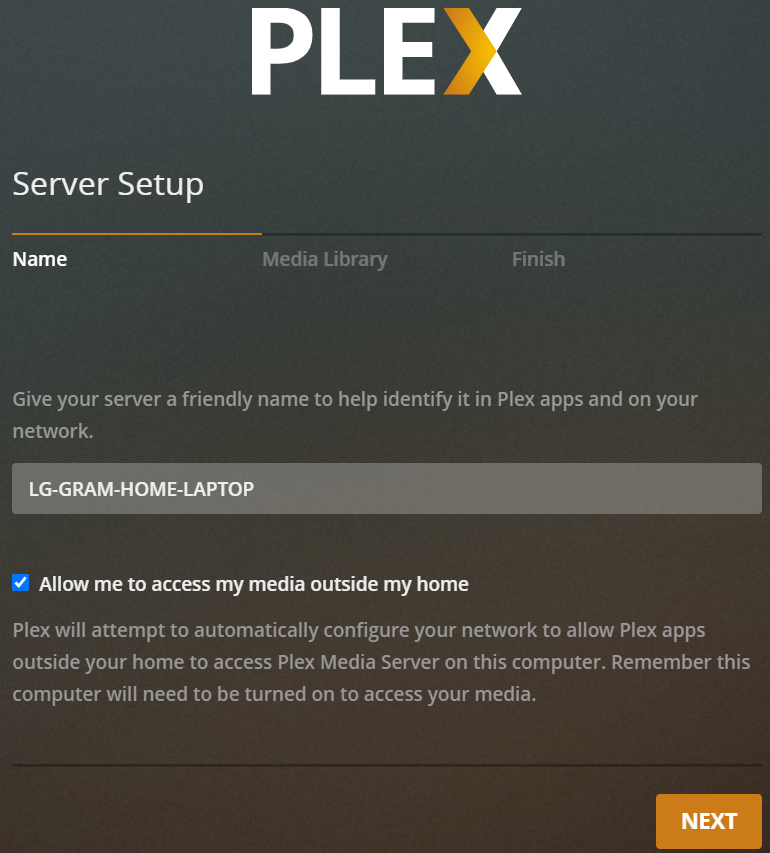

# [Plex Media Server](https://support.plex.tv/articles/categories/plex-media-server/)

> Plex is a media playback system that makes it simple to enjoy your movies, TV shows, music, pictures, and internet-based content. It uses a Server to house your media library and player Apps to playback the media.

#### [Installation and Basic Setup](https://support.plex.tv/articles/categories/plex-media-server/installation-and-basic-setup/)

- [Overview](https://support.plex.tv/articles/200380843-overview/)

- [Installation](https://support.plex.tv/articles/200288586-installation/)

- [Basic Setup Wizard](https://support.plex.tv/articles/200288896-basic-setup-wizard/)

- [Uninstall Plex Media Server](https://support.plex.tv/articles/201941078-uninstall-plex-media-server/)

- [Dynamically Updated Server Components](https://support.plex.tv/articles/203088737-dynamically-updated-server-components/)

- [Plex Media Server Logs](https://support.plex.tv/articles/200250417-plex-media-server-log-files/)

## Media library types and names
Refer to [Setting library types](how_to/set_library_types.md).

### NAS Devices

- Download the installation package appropriate to your device
- Follow the NAS manufacturer’s installation procedure to install the Plex Media Server
- If you have problems, visit the Plex Media Server NAS forums and search for your device for help

To setup the server, open a browser window and go to `http://local.nas.ip.address:32400/web` (e.g `http://192.168.1.5:32400/web`).

**Related Page:** [Opening Plex Web App](https://support.plex.tv/articles/200288666-opening-plex-web-app/)
**Related Page**: [Forums > Plex Media Server > NAS](https://forums.plex.tv/categories/nas)

