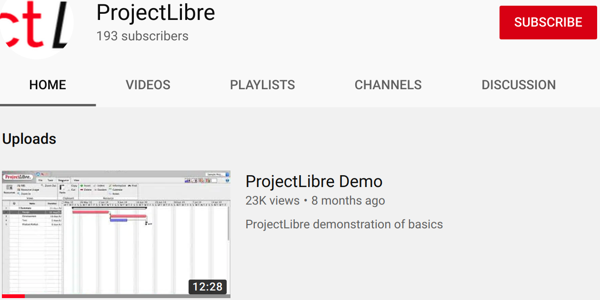

* Rev.2: 2021-07-12 (Mon)
* Rev.1: 2020-12-01 (Tue)
* Draft: 2020-10-16 (Fri)

# [ProjectLibre](https://www.projectlibre.com/)
* a project management software 
* the most popular Microsoft project alternative for Ubuntu.
  * compatible with Microsoft Project files
* open-source and supports a multi-platform 
  * including Linux, Mac OS or Windows

## Introduction

* Google search: Microsoft project alternative for ubuntu
* [5 of the Best Microsoft Project Alternatives for Linux](https://www.maketecheasier.com/microsoft-project-alternatives-for-linux/), Apr. 28, 2017, Ada Ivanova.
  
  * ProjectLibre
  
  > It’s compatible with Microsoft Project 2003, 2007 and 2010. Some of the features it offers are Gantt chart, earned value costing, PERT Charts, RBS Chart, network diagram, WBS/RBS charts, resource histograms, etc. Its authors claim it’s a Microsoft Project replacement, but I am not sure this applies to the free community edition or the paid version.
  
  * TaskJuggler
  * OpenProject
  * Plan by Calligra
  * Planner

## Features

- Compatibility with Microsoft Project
- Gantt Chart
- Earned Value Costing
- PERT Charts
- WBS/RBS charts
- Network Diagram
- Resource Histograms

## [ProjectLibre Youtube Channel](https://www.youtube.com/channel/UCpvll2xkdgLkj9cWQ2hm4PA)

Quick start: [ProjectLibre : How to introduction demo ( Project Management Software )](https://youtu.be/9xwR4JCBaIU) [12:27]

## Next

[How to Install `projectlibre` on Ubuntu Linux](INSTALL-ubuntu.md)

