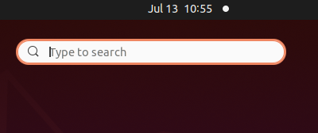
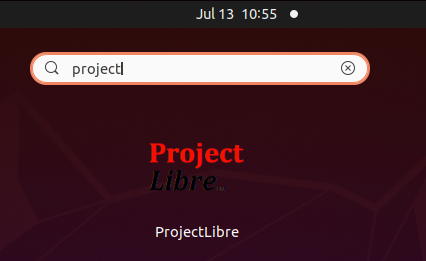
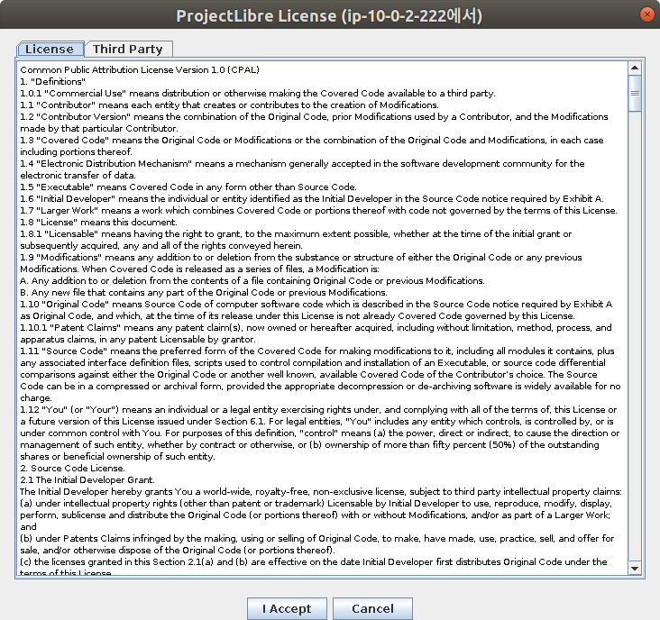
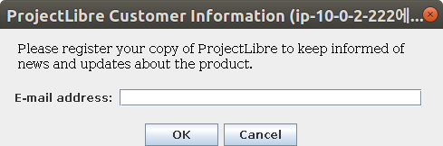
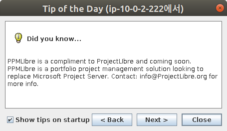
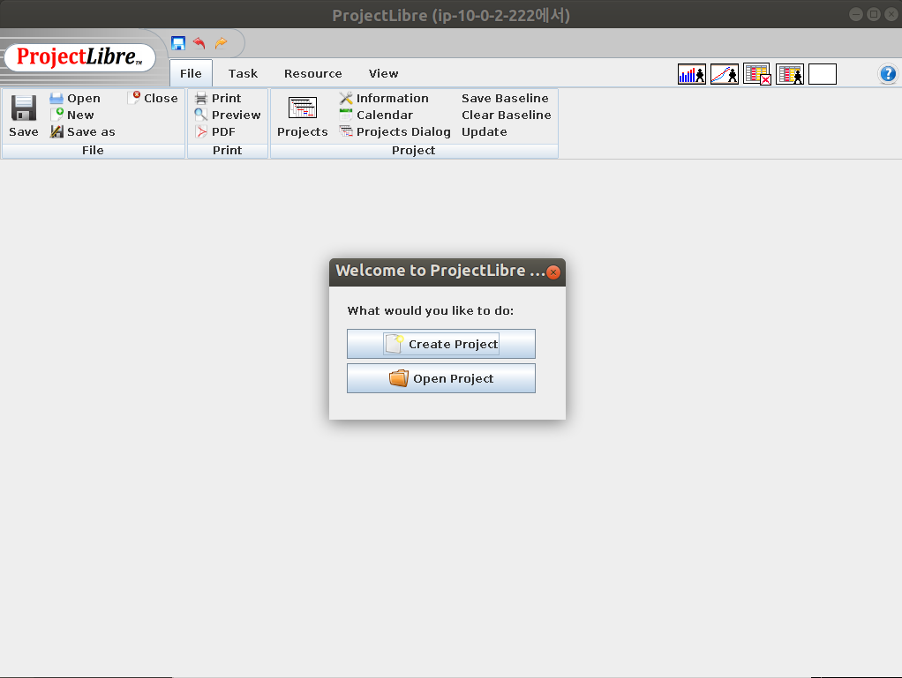

* Rev.2: 2021-07-13 (Tue)
* Rev.1: 2020-12-01 (Tue)
* Draft: 2020-10-16 (Fri)

## How to Run `projectlibre` on Ubuntu Linux

### Option 1. Run `projectlibre` on terminal

1. Open a terminal or press `Ctrl+alt+t`
2. Run

```bash
$ projectlibre &
```

### Option 2. Run `projectlibre` from `Show Applications`

1. Go to `Show Applications`



1. Search `projectlibre` as follows.
   

2. Click the icon to laucnh `projectlibre`

   

   When `ProjectLibre` is launched for the first time, the following windows will show up.







When the welcome message is shown,



 `ProjectLibre` is launched successfully.

