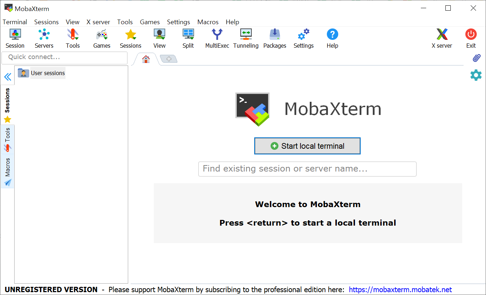

* Rev.1: 2021-05-25 (Tue)
* Draft: 2021-01-18 (Mon)
# PuTTy-like 프로그램
* 윈도우즈용 SSH (Secure Shell) 클라이언트 프로그램인 PuTTy와 PuTTy보다 편의성이 높은 대체 프로그램인 MobaXTerm (Windows용)에 관한 내용입니다.

* 리눅스용 SSH클라이언트 프로그램인 `ssh`와 `Terminator`는 `ssh-like 프로그램`의 내용을 참고하세요.

## 개요
* PuTTY, WinSCP, Xming 3개의 프로그램을 별도로 설치해야 합니다.
  * PuTTY는 CLI (Command Line Interface)만 제공합니다.
  * WinSCP는 원격으로 파일을 주고 받기 위한 SFTP (Secure FTP) 클라이언트 프로그램입니다.
  * Xming-XServer는 윈도우즈에서 GUI를 지원하기 위한 X-Server system을 제공합니다.
* 유사 프로그램인 MobaXTerm는 CLI와 GUI를 한번에 설치해주므로 편리합니다.

## PuTTy와 유사한 프로그램
* 구글에서 `Putty alternatives`로 검색하면 유사한 프로그램이 많이 나옵니다.

## MobaXTerm
* 그 중에서 `MobaXTerm` 무료판의 특징입니다. 

```text
Full X server and SSH support
Remote desktop (RDP, VNC, Xdmcp)
Remote terminal (SSH, telnet, rlogin, Mosh)
X11-Forwarding
Automatic SFTP browser
Master password protection
Plugins support
Portable and installer versions
Full documentation
Max. 12 sessions
Max. 2 SSH tunnels
Max. 4 macros
Max. 360 seconds for Tftp, Nfs and Cron
```

설치 후 프로그램을 실행했을 때의 화면입니다.



다음: [설치하기: PuTTy vs. MobaXTerm](INSTALL.md)
