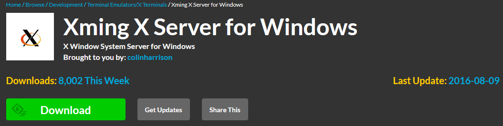
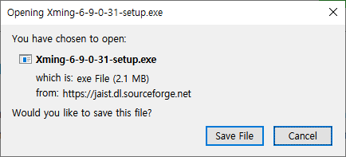
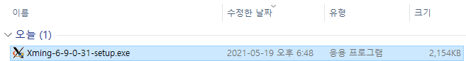
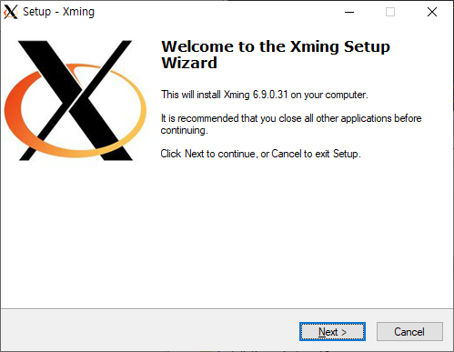
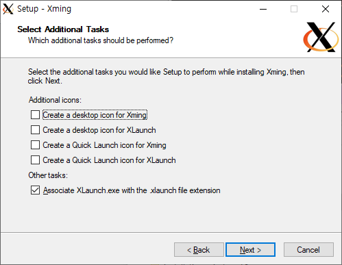
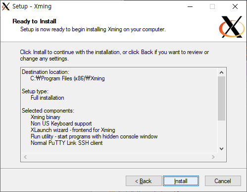
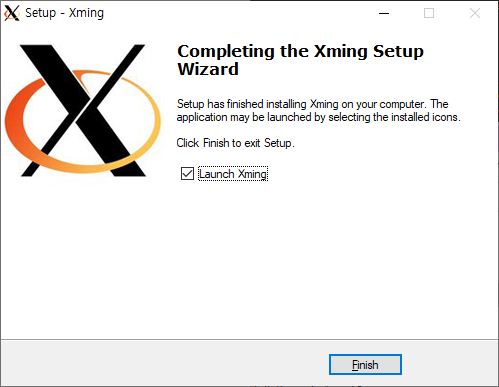
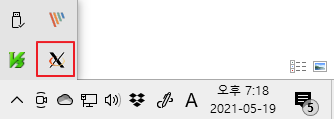

* Draft: 2021-05-19 (Wed)

# (Windows 10)에 XMing X Server 설치하기

Google search: download xming

* [Xming X Server for Windows download | SourceForge.net](https://sourceforge.net/projects/xming/)

다운로드 가능한 홈페이지에 가서

`Download`를 클릭합니다.

`Save File`을 클릭합니다. 설치파일의 다운로드가 완료되면 탐색기의 다운로드 폴더로 이동합니다.

더블클릭해서 실행합니다.

다른 윈도우즈 프로그램처럼 설치를 진행하면 됩니다.

계속 `Next`를 선택하다가

`Install`을 선택합니다.

설치가 완료되면 `Finish`를 클릭합니다.

알아서 프로그램이 시작됩니다. `XMing` 아이콘이 있는지 확인합니다.

참 쉽죠?

