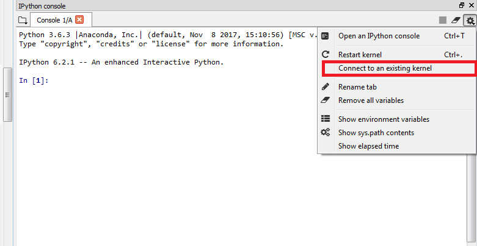
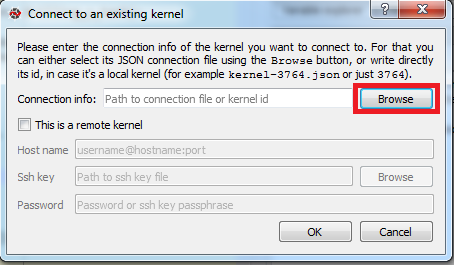
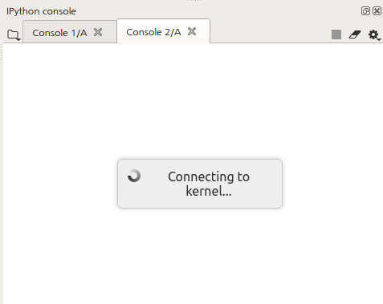
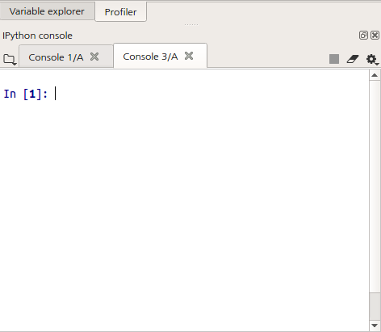
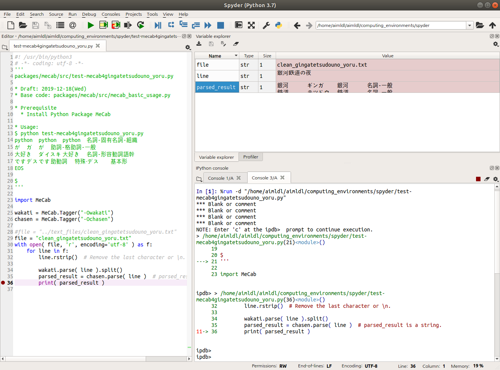

* Rev.3: 2020-10-16 (Fri)
* Rev.2: 2020-05-12 (Tue)
* Rev.1: 2019-12-20 (Fri)
* Draft: 2019-12-18 (Wed)
# Connect a Remote EC2 Instance from Spyder (Local)

## Summary
### On my remote EC2 instance
``` bash
# Install Anaconda
$ wget https://repo.anaconda.com/archive/Anaconda3-2020.02-Linux-x86_64.sh
$ chmod+x Anaconda3-2020.02-Linux-x86_64.sh
$ ./Anaconda3-2020.02-Linux-x86_64.sh
# Anaconda is installed successfully.
$ bash
(base) bitnami@EC2-Seoul:~$ conda install spyder-kernels
(base) bitnami@EC2-Seoul:~$
```

## 1. Introduction
#### 1.1. Purpose
The target is to write, edit and debug Python scripts with Spyder, but to run the scripts on a remote server. For example, use Spyder on a local computer, but run the scripts on an Amazon EC2 instance.

If this environment is ready, it is possible to set up an EC2 instance and work on scripts on multiple computers conveniently. My motivation is to work on a deep learning project seamlessly at work, home, and a coffee shop while I use three different computers at each location.

#### 1.2. Survey/Google Search
Google search: spyder edit code on ec2 instance
* [Spyder: How to edit a python script locally and execute it on a remote kernel?](https://stackoverflow.com/questions/26699356/spyder-how-to-edit-a-python-script-locally-and-execute-it-on-a-remote-kernel)
> Spyder now has the ability to connect to remote kernels. The "This is a remote kernel" checkbox, when checked, enables the portion of the dialog where you can enter your ssh connection credentials. (You should need this unless you have manually opened the required ssh tunnels to forward the process ports of your remote kernel... )

Google search: how to configure spyder to connect remote server ec2
* [Connecting Spyder IDE to a remote IPython kernel](https://medium.com/@halmubarak/connecting-spyder-ide-to-a-remote-ipython-kernel-25a322f2b2be)

#### 1.3. References
* [Connecting Spyder IDE to a remote IPython kernel](https://medium.com/@halmubarak/connecting-spyder-ide-to-a-remote-ipython-kernel-25a322f2b2be)

#### 1.4. spyder-kernels: Jupyter kernels for the Spyder console
Use "spyder-kernels" package and remote-access a computer from Spyder IDE on a local computer. Jupyter kernels can be launched through Spyder itself or as an independent Python session. Refer to [documentation](https://docs.spyder-ide.org/ipythonconsole.html) and [wiki](https://github.com/spyder-ide/spyder/wiki/Working-with-packages-and-environments-in-Spyder) for details.

### 2. Installation
Install spyder-kernels on ***both local and remote machines***. Anaconda is recommended. So prepare the Anaconda3 virtual environment as the prerequisite.
#### 2.1. Install Anaconda3 (Prerequisite)
If Anaconda3 is not installed either on the local or remove machines, install Anaconda3 and get the virtual environment ready. An example of 'Spyder (local)'-'remote server' is:
* Local machine = GPU-Desktop
* Remote machine = Amazon EC2 Instance

Refer to [Anaconda Documentation - Installation](https://docs.anaconda.com/anaconda/install/). Note installation of Anaconda may fail on t2.micro. Use t2.medium or larger.

#### 2.2. Install spyder-kernels
spyder-kernels can be installed both with conda and pip. But using conda is the recommended way.
> Under Anaconda, avoid to use pip to manage a package that is part of the distribution, it may broke something. Instead, use conda.
[Spyder 3.30 pip installed wrong spyder-kernels requirement (<1.0 is required)](https://github.com/spyder-ide/spyder/issues/7395)

```bash
# Conda is recommended!
$ conda install spyder-kernels
# or
$ pip install spyder-kernels
```
For details, refer to [spyder-kernels 1.8.1](https://pypi.org/project/spyder-kernels/).

##### Verify the Installation
It's necessary to verify the installation is successful on both sides (local and remote).
```bash
$ [TODO]
```

#### 2.3. Examples
##### 2.3.1. On the Remote Server
```bash
(base) aimldl@EC2-Oregon:~$ conda install spyder-kernels
    ...
  Proceed ([y]/n)?  y
    ...
(base) aimldl@EC2-Oregon:~$
```
##### 2.3.2. On the Local Machine
The command is identical. More detailed message is shown in this case.
```bash
(base) aimldl@GPU-Desktop:~$ conda install spyder-kernels
    ...
  ## Package Plan ##

    environment location: /home/aimldl/anaconda3/envs/base

    added / updated specs:
      - spyder-kernels


  The following packages will be downloaded:

      package                    |            build
      ---------------------------|-----------------
      ca-certificates-2019.11.27 |                0         132 KB
      certifi-2019.11.28         |           py37_0         156 KB
      spyder-kernels-0.5.2       |           py37_0          69 KB
      ------------------------------------------------------------
                                             Total:         357 KB

  The following packages will be UPDATED:

    ca-certificates                               2019.5.15-1 --> 2019.11.27-0
    certifi                                  2019.6.16-py37_1 --> 2019.11.28-py37_0
    openssl                                 1.1.1c-h7b6447c_1 --> 1.1.1d-h7b6447c_3
    spyder-kernels                               0.5.1-py37_0 --> 0.5.2-py37_0


  Proceed ([y]/n)?  y
    ...
(base) aimldl@GPU-Desktop:~$
```

### 3. Connect to the Remote Server
#### 3.1. (Local) Terminal: Start a kernel using "python -m spyder_kernels.console"
On a terminal, run the following command to connect the remote server at public IP address of x.x.x.x. To stop it, type in "Ctrl+\" instead of Ctrl+C (which doesn't work). Keep running it to connect the remote server. In other words, ***DO NOT EXIT*** the program to keep the session running.

```bash
$ python -m spyder_kernels.conole — matplotlib=’inline’ — ip=x.x.x.x -f=./remotemachine.json
NOTE: When using the `ipython kernel` entry point, Ctrl-C will not work.

To exit, you will have to explicitly quit this process, by either sending
"quit" from a client, or using Ctrl-\ in UNIX-like environments.

To read more about this, see https://github.com/ipython/ipython/issues/2049


To connect another client to this kernel, use:
    --existing /home/aimldl/aimldl/computing_environments/spyder/remotemachine.json

```
Note "remotemachine.json" is saved on the current directory "./" in the above command.
##### 3.1.1. Options
The explanation on the above command line options is below.
```bash
$ python -m spyder_kernels.console --help
  ...
--matplotlib
    Configure matplotlib for interactive use with
    the default matplotlib backend.

--ip=<Unicode> (IPKernelApp.ip)
    Default: ''
    Set the kernel's IP address [default localhost]. If the IP address is
    something other than localhost, then Consoles on other machines will be able
    to connect to the Kernel, so be careful!

-f <Unicode> (IPKernelApp.connection_file)
    Default: ''
    JSON file in which to store connection info [default: kernel-<pid>.json]
    This file will contain the IP, ports, and authentication key needed to
    connect clients to this kernel. By default, this file will be created in the
    security dir of the current profile, but can be specified by absolute path.
```

##### 3.1.2. remotemachine.json
"remotemachine.json" is the configuration file. Let's check the file. Note key is changed to a random sequence for this example.

```bash
$ cat remotemachine.json
{
  "shell_port": 39431,
  "iopub_port": 41545,
  "stdin_port": 41733,
  "control_port": 35459,
  "hb_port": 43999,
  "ip": "127.0.0.1",
  "key": "7c123d53-a51dafb4edf230a19757er09",
  "transport": "tcp",
  "signature_scheme": "hmac-sha256",
  "kernel_name": ""
}
```
Caution: Use remotemachine.json as it is and do not change it.

#### 3.2. (Local) Spyder > Connect to An Existing Kernel > "remotemachine.json"
##### 3.2.1. Launch Spyder, right-click Console, and select "Connect to an existing kernel".


(Image from [Connecting Spyder IDE to a remote IPython kernel](https://medium.com/@halmubarak/connecting-spyder-ide-to-a-remote-ipython-kernel-25a322f2b2be))

##### 3.2.2. Open "remotemachine.json".
Click "Browse", select the configuration file "remotemachine.json", and click "OK".


(Image from [Connecting Spyder IDE to a remote IPython kernel](https://medium.com/@halmubarak/connecting-spyder-ide-to-a-remote-ipython-kernel-25a322f2b2be))


##### 3.2.3. Use the Console on the Remote Server
A new console tab is created and you're connected to the remote server.


The console looks like below when connection is established.


##### 3.2.3. Check if the Remote Console Works.
In the console inside Spyder, command 'ls' shows the files in the current directory.
```bash
In [5]: ls
README.md                       remote_kernel/
clean_gingatetsudouno_yoru.txt  remotemachine.json
connect_remote_ec2_instance.md  test-mecab4gingatetsudouno_yoru.py
images/

In [6]: pwd
Out[6]: '/home/aimldl/aimldl/computing_environments/spyder'
```

##### 3.2.4. Use Spyder to Debug the Code
A Python script on this local machine can be run on the remote server. So I can use the "Variable explorer" (on the top right) for debugging!


* Q: How do I know this Python script runs on the remote server?
* A: In the above example, Spyder fails to run the script on the local machine, but suceeds on the remote server. "import MeCab" fails on my local machine. But it works properly on the remote machine.

#### 3.3. Troubleshooting

Q: Why 1 works, but 2 doesn't?
```bash
#1
(tensorflow_gpu) aimldl@GPU-Desktop:~/aws_keys$ python -m spyder_kernels.console — matplotlib=’inline’ — ip=x.x.x.x -f=./remotemachine.json
(tensorflow_gpu) aimldl@GPU-Desktop:~/aws_keys$ python -m spyder_kernels.console — matplotlib=’inline’ --ip=x.x.x.x -f=./remotemachine-aws_ec2_oregon.json
(tensorflow_gpu) aimldl@GPU-Desktop:~/aws_keys$ python -m spyder_kernels.console — matplotlib='inline' --ip=x.x.x.x -f=./remotemachine-aws_ec2_oregon.json
(tensorflow_gpu) aimldl@GPU-Desktop:~/aws_keys$ python -m spyder_kernels.console --matplotlib='inline' --ip=x.x.x.x -f=./remotemachine-aws_ec2_oregon.json

#2
(tensorflow_gpu) aimldl@GPU-Desktop:~/aws_keys$ python -m spyder_kernels.console --matplotlib='inline' --ip='x.x.x.x' -f=./remotemachine.json
(tensorflow_gpu) aimldl@GPU-Desktop:~/aws_keys$ python -m spyder_kernels.console --matplotlib=’inline’ — ip=x.x.x.x -f=./remotemachine-aws_ec2_oregon.json
  ...
  [IPKernelApp] CRITICAL | Bad config encountered during initialization:
  [IPKernelApp] CRITICAL | The 'matplotlib' trait of an IPKernelApp instance must be any of ['auto', 'agg', 'gtk', 'gtk3', 'inline', 'ipympl', 'nbagg', 'notebook', 'osx', 'pdf', 'ps', 'qt', 'qt4', 'qt5', 'svg', 'tk', 'widget', 'wx'] or None, but a value of '’inline’' <class 'str'> was specified.

# Changing '' works!
(tensorflow_gpu) aimldl@GPU-Desktop:~/aws_keys$ python -m spyder_kernels.console --matplotlib='inline' — ip=x.x.x.x -f=./remotemachine-aws_ec2_oregon.json


​```bash
(base) aimldl@GPU-Desktop:~/aws_keys$ python -m spyder_kernels.console --matplotlib='inline' --ip=xx.xx.xxx.xx --f=./remotemachine.json
Traceback (most recent call last):
  File "/home/aimldl/anaconda3/lib/python3.7/runpy.py", line 193, in _run_module_as_main
    "__main__", mod_spec)
  File "/home/aimldl/anaconda3/lib/python3.7/runpy.py", line 85, in _run_code
    exec(code, run_globals)
  File "/home/aimldl/anaconda3/lib/python3.7/site-packages/spyder_kernels/console/__main__.py", line 11, in <module>
    start.main()
  File "/home/aimldl/anaconda3/lib/python3.7/site-packages/spyder_kernels/console/start.py", line 298, in main
    kernel.initialize()
  File "</home/aimldl/anaconda3/lib/python3.7/site-packages/decorator.py:decorator-gen-124>", line 2, in initialize
  File "/home/aimldl/anaconda3/lib/python3.7/site-packages/traitlets/config/application.py", line 87, in catch_config_error
    return method(app, *args, **kwargs)
  File "/home/aimldl/anaconda3/lib/python3.7/site-packages/ipykernel/kernelapp.py", line 469, in initialize
    self.init_sockets()
  File "/home/aimldl/anaconda3/lib/python3.7/site-packages/ipykernel/kernelapp.py", line 238, in init_sockets
    self.shell_port = self._bind_socket(self.shell_socket, self.shell_port)
  File "/home/aimldl/anaconda3/lib/python3.7/site-packages/ipykernel/kernelapp.py", line 178, in _bind_socket
    port = s.bind_to_random_port(iface)
  File "/home/aimldl/anaconda3/lib/python3.7/site-packages/zmq/sugar/socket.py", line 259, in bind_to_random_port
    self.bind("%s:*" % addr)
  File "zmq/backend/cython/socket.pyx", line 547, in zmq.backend.cython.socket.Socket.bind
  File "zmq/backend/cython/checkrc.pxd", line 25, in zmq.backend.cython.checkrc._check_rc
zmq.error.ZMQError: Cannot assign requested address
```
```bash
(base) aimldl@GPU-Desktop:~/aws_keys$ python -m spyder_kernels.console --matplotlib='inline' --ip=xx.xx.xxx.xx --f=./remotemachine.json
/home/aimldl/anaconda3/bin/python: No module named spyder_kernels.conole
(base) aimldl@GPU-Desktop:~/aws_keys$
```

```bash
(tensorflow_gpu) aimldl@GPU-Desktop:~/aws_keys$ python -m spyder_kernels.console --matplotlib='inline' --ip=xx.xx.xxx.xx --f=./remotemachine.json
/home/aimldl/anaconda3/bin/python: No module named spyder_kernels.conole
(tensorflow_gpu) aimldl@GPU-Desktop:~/aws_keys$
```

$ python -m spyder_kernels.console — matplotlib=’inline’ — ip=52.43.197.51 -f=./remotemachine.json
NOTE: When using the `ipython kernel` entry point, Ctrl-C will not work.

To exit, you will have to explicitly quit this process, by either sending
"quit" from a client, or using Ctrl-\ in UNIX-like environments.

To read more about this, see https://github.com/ipython/ipython/issues/2049


To connect another client to this kernel, use:
    --existing ./remotemachine.json

## Existing
Q: Spyder stopped working on my local computer. How can I stop this process?
A: On the remote server, identify the process ID with the ps command.
```bash
(pytorch) ubuntu@ec2-seoul-aimldl:~/wav2vec/src$ ps
  PID TTY          TIME CMD
26218 pts/1    00:00:00 bash
26271 pts/1    00:01:36 ZMQbg/5
26279 pts/1    00:00:00 QtWebEngineProc
26281 pts/1    00:00:00 QtWebEngineProc
26297 pts/1    00:00:00 QtWebEngineProc
26312 pts/1    00:00:53 python
26313 pts/1    00:00:02 ZMQbg/1
26317 pts/1    00:00:00 QtWebEngineProc
26325 pts/1    00:00:00 QtWebEngineProc
29290 pts/1    00:00:01 python
29831 pts/1    00:00:00 ps
```
Kill the corresponding process ID.
```bash
(pytorch) ubuntu@ec2-seoul-aimldl:~/wav2vec/src$ kill -9 26279
(pytorch) ubuntu@ec2-seoul-aimldl:~/wav2vec/src$ ps
  PID TTY          TIME CMD
26218 pts/1    00:00:00 bash
26271 pts/1    00:01:36 ZMQbg/5
26312 pts/1    00:00:53 python
26313 pts/1    00:00:02 ZMQbg/1
29290 pts/1    00:00:01 python
29850 pts/1    00:00:00 ps
(pytorch) ubuntu@ec2-seoul-aimldl:~/wav2vec/src$ kill -9 26271
(pytorch) ubuntu@ec2-seoul-aimldl:~/wav2vec/src$ ps
  PID TTY          TIME CMD
26218 pts/1    00:00:00 bash
26312 pts/1    00:00:53 python
29858 pts/1    00:00:00 ps
[1]+  Killed                  spyder  (wd: ~/wav2vec)
(wd now: ~/wav2vec/src)
(pytorch) ubuntu@ec2-seoul-aimldl:~/wav2vec/src$
```
Spyder dissapeared when 26271 was killed!
