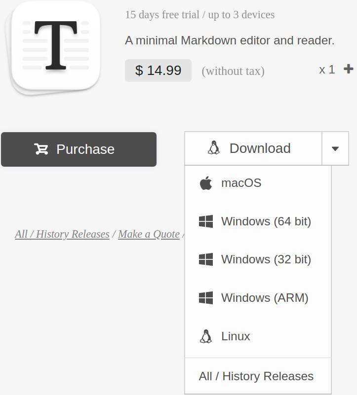

# Installing Typora
source: https://support.typora.io/Typora-on-Linux/
## Installing Typora on Ubuntu Linux
```bash
# sudo apt-key adv --keyserver keyserver.ubuntu.com --recv-keys BA300B7755AFCFAE
wget -qO - https://typora.io/linux/public-key.asc | sudo tee /etc/apt/trusted.gpg.d/typora.asc

# add Typora's repository
sudo add-apt-repository 'deb https://typora.io/linux ./'
sudo apt update

# install typora
sudo apt install -y typora
```

```bash
  ...
Suggested packages:
  pandoc
The following NEW packages will be installed:
  typora
0 upgraded, 1 newly installed, 0 to remove and 1 not upgraded.
Need to get 0 B/79.8 MB of archives.
After this operation, 279 MB of additional disk space will be used.
Selecting previously unselected package typora.
(Reading database ... 287023 files and directories currently installed.)
Preparing to unpack .../typora_1.4.7-1_amd64.deb ...
Unpacking typora (1.4.7-1) ...
Setting up typora (1.4.7-1) ...
Processing triggers for mime-support (3.64ubuntu1) ...
Processing triggers for hicolor-icon-theme (0.17-2) ...
Processing triggers for gnome-menus (3.36.0-1ubuntu1) ...
Processing triggers for desktop-file-utils (0.24-1ubuntu3) ...
$
```
## Note
Typora used to be free, but it needs to be purchased now.




