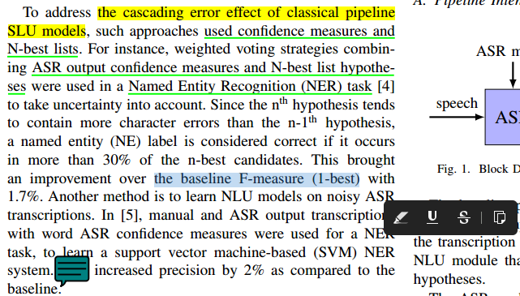

* Draft: 2020-12-17 (Thu)

# Master PDF Editor

## Overview

Among several PDF editors for Linux, [Master PDF Editor](https://code-industry.net/masterpdfeditor/) is my choice over Okular.

When I first tried [Master PDF Editor](https://code-industry.net/masterpdfeditor/), I liked the intuitive and convenient highlighting functionality. The above screen capture shows the convenient interface and highlighted results.

## Installation

Installation is quite easy. Refer to [INSTALL.md](INSTALL.md). 

## Comparison to other PDF editors

* Google search: `highlight pdf file in ubuntu linux`
* [10 Best Linux PDF Editors You Can Use in 2020 - It's FOSS](https://itsfoss.com/pdf-editors-linux/)
  * This article recommends 10 Linux PDF editors
    1. LibreOffice Draw
    2. [Okular](https://okular.kde.org/)
    3. Scribus
    4. Qoppa PDF Studio [Not FOSS]
    5. [Master PDF Editor](https://code-industry.net/masterpdfeditor/) [Not FOSS]
    6. PDF Mix Tool
    7. PDFsam
    8. PDFArranger
    9. PDF Chain
    10. PDF Slicer

I chose Okular last year and tried it out for a couple of weeks. Okular is good because it supports Linux, Windows, and macOS. I got away from it because I decided to use [ReadCube Papers](https://www.papersapp.com/), a subscription-based paper management system with PDF editor.

This year, I did not renew the subscription of [ReadCube Papers](https://www.papersapp.com/). Instead, I chose to try out a free, but upgradeable Master PDF Editor.

