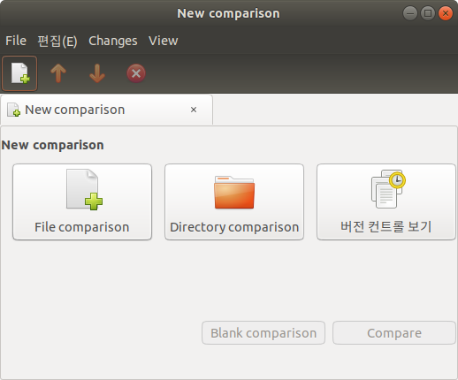

##### aimldl/computing_environments/meld/INSTALL on Ubuntu.md
* Draft: 2020-04-10 (Fri)
# Installing meld on Ubuntu
Installing meld on Ubuntu (18.04) is straightforward. Just run:
```bash
$ sudo apt-get update -y
$ sudo apt-get install -y meld
$
```

## Verify the installation
Run the program and the GUI will launch as follows.
```bash
$ meld &
$
```

