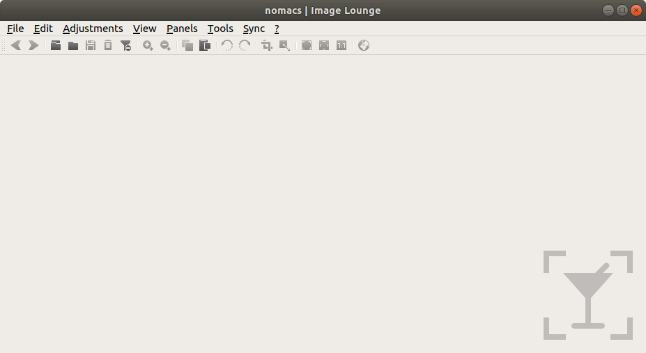
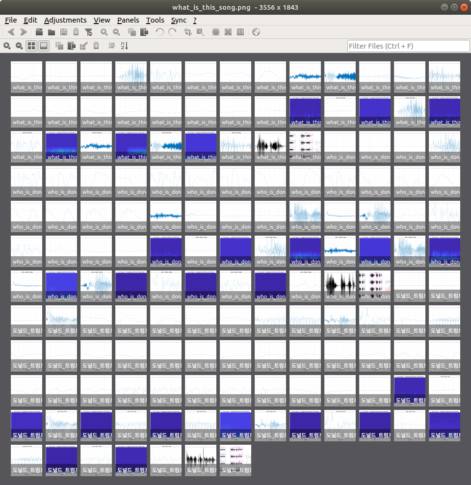

* Rev.1: 2020-06-23 (Tue)
* Draft: 2019-07-05 (Fri)

# How to Install Nomacs, an Image Viewer Program
## What is Nomacs?
Nomacs is a popular image viewer program for Linux. 

```
Ubuntu's Basic Image Viewer < Nomacs < Gimp
```

It has more functionalities than Ubuntu's basic image viewer, but it's not as complex or heavy as Gimp, Linux alternative to Adobe Photoshop. Nomacs is light-weight, but provides useful functions to edit images. Format conversion, resize the resolution, rotation, crop, and so on. It also supports a command-line command `nomacs` which can be powerful when it's used right.

For details, refer to the following links.
```
* Google search: ubuntu linux image viewer
* [Top 11 Image Viewers for Ubuntu and other Linux](https://itsfoss.com/image-viewers-linux/)
* [10 Feature Rich Image Viewers for Linux](https://linoxide.com/linux-how-to/image-viewers-linux/)
```
## Install Nomacs
```bash
$ sudo add-apt-repository ppa:nomacs/stable
$ sudo apt update
$ sudo apt install nomacs -y
```

## Verify the installation
```bash
$ nomacs
```


## Snapshot
This is a snapshot of Nomacs after opening multiple image files. The option is `Panels > Thumbnail Preview (Shift+T)`. I was able to feel the productivity boost compared to the basic image viewer.



## References
* [[Linux] 이미지 뷰어 프로그램 Nomacs](https://blog.naver.com/aimldl/221595457917)
