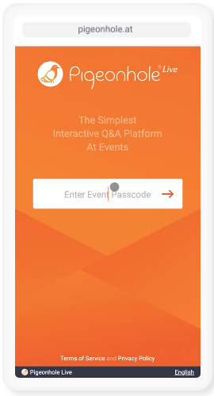
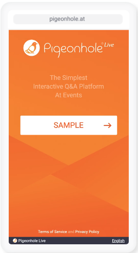
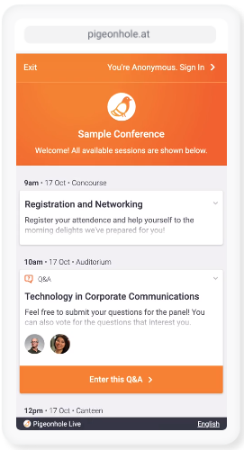
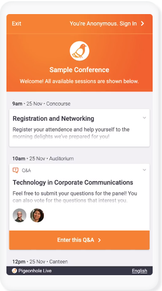
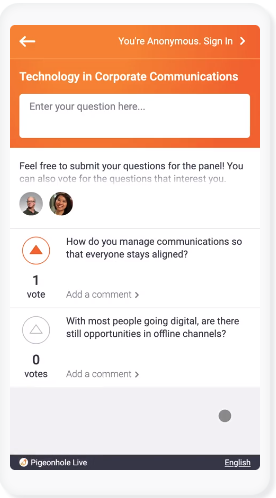
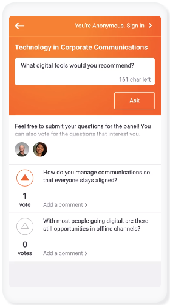
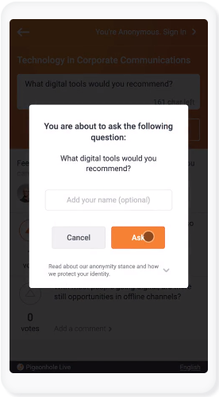
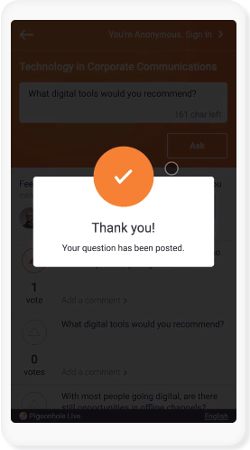

* Draft: 2020-12-30 (Wed)

# 참가자가 비젼홀 라이브를 사용하는 방법

## 1. [pigeonhole.at](https://www.pigeonhole.at/)에 접속

PC 혹은 모바일에서 웹브라우저를 통해 [pigeonhole.at](https://www.pigeonhole.at/)에 접속합니다.

## 2. 이벤트에 로그인

주최자로부터 전달받은 이벤트 패스코드(Event passcode)를 입력해서 이벤트에 로그인합니다. 아래 예에는 `SAMPLE`이 이벤트 패스코드입니다.

로그인되면 아래와 같은 화면이 보입니다.

## 3. 이벤트에 참가

참가 가능한 이벤트들이 보입니다. 이 중에 참가하고 싶은 이벤트 (또는 세션)에 참가합니다. 질문을 올릴 수 있습니다.

질문을 하려면 `Enter this Q&A`를 클릭합니다.

`Q&A`페이지의 화면 예시입니다.

`Enter your question here...`에 질문을 입력하고 `Ask`를 클릭합니다.

질문을 올릴지 확인하는 화면입니다. `Ask`를 클릭하면

`Thank you!`로 질문이 잘 올라갔음을 알 수 있습니다.

보다 자세한 내용은 [How Pigeonhole Live works (영문)](https://pigeonholelive.com/how-it-works/#how=audience)를 참고하세요.