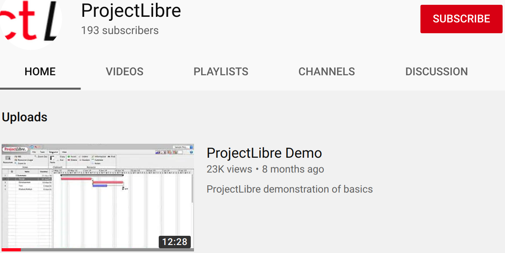
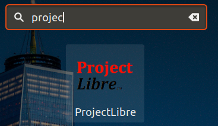
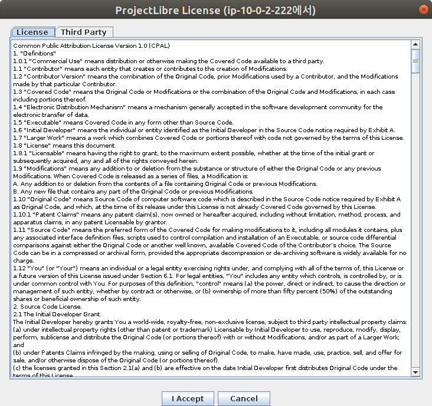
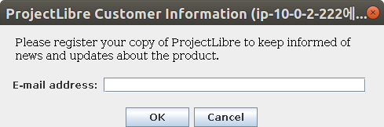
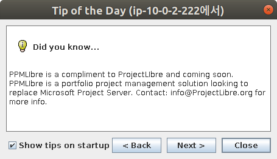

##### aimldl/computing_environments/projectlibre/README.md

## [ProjectLibre](https://www.projectlibre.com/)
Project Management software: alternative to Microsoft Project.

## Introduction
[projectlibre](https://www.projectlibre.com/) is a multi-platform open source project management software. It is the most popular Microsoft project alternative for Ubuntu.

* Google search: Microsoft project alternative for ubuntu
* [5 of the Best Microsoft Project Alternatives for Linux](https://www.maketecheasier.com/microsoft-project-alternatives-for-linux/), Apr. 28, 2017, Ada Ivanova.
  * ProjectLibre. 
  
  > It’s compatible with Microsoft Project 2003, 2007 and 2010. Some of the features it offers are Gantt chart, earned value costing, PERT Charts, RBS Chart, network diagram, WBS/RBS charts, resource histograms, etc. Its authors claim it’s a Microsoft Project replacement, but I am not sure this applies to the free community edition or the paid version.
  
  * TaskJuggler.
  * OpenProject.
  * Plan by Calligra.
  * Planner.

[ProjectLibre Demo](https://youtu.be/9xwR4JCBaIU) [12:27]

[ProjectLibre Youtube Channel](https://www.youtube.com/channel/UCpvll2xkdgLkj9cWQ2hm4PA)


## Download
Go to SourceForge [download link](https://sourceforge.net/projects/projectlibre/files/latest/download) on the web browser and the download will start in 5 seconds.

## Install
```bash
$ sudo dpkg -i projectlibre_1.9.1-1.deb 
Selecting previously unselected package projectlibre.
(Reading database ... 222696 files and directories currently installed.)
Preparing to unpack projectlibre_1.9.1-1.deb ...
Unpacking projectlibre (1.9.1-1) ...
Setting up projectlibre (1.9.1-1) ...
Processing triggers for mime-support (3.60ubuntu1) ...
Processing triggers for shared-mime-info (1.9-2) ...
$
```
## Run
On terminal, run:
```bash
$ projectlibre &
```
On GUI, search and launch projectlibre as follows.


When ProjectLibre is launched for the first time,







The program is launched successfully.
